# Informe de resultados — Series de tiempo de viajeros internacionales a Guatemala

**Universidad del Valle de Guatemala**
**Facultad de Ingeniería**
**Departamento de Ciencias de la Computación**
**CC3084 – Data Science**
**Semestre II – 2026**

Este informe reúne el análisis de las **cuatro series mensuales** construidas
para el laboratorio: la serie **total** de viajeros internacionales
(`notebooks/analisis_serie_total_internacional.ipynb`) y las tres series por
**vía de ingreso** — Aérea, Terrestre y Marítima
(`notebooks/vias_de_ingreso.ipynb`). Se organiza siguiendo los cuatro bloques
de la rúbrica del laboratorio (análisis de la serie, estacionariedad,
generación de modelos y predicción), aplicados a cada una de las series.

---

## 1. Series analizadas

### 1.1 Serie total internacional

Se construyó a partir de los registros clasificados como **Turista** o
**Excursionista**, excluyendo la etiqueta de país **Guatemala** (residentes
que reingresan al país). Ambos filtros responden a un problema de
comparabilidad temporal: la fuente cambia de metodología en 2023 y, sin
filtrarlos, la serie mezclaría universos distintos (`Cruceristas` deja de
reportarse desde 2023, `Viajero` se reclasifica y pierde ~70% de nivel, y la
etiqueta `Guatemala` desaparece por completo desde enero de 2023). El
resultado es una serie mensual de 210 observaciones, de enero de 2009 a junio
de 2026.

### 1.2 Series por vía de ingreso

Se analizaron tres series mensuales de ingreso de viajeros a Guatemala según
la vía utilizada: **Aérea, Terrestre y Marítima**, cada una con las mismas
210 observaciones mensuales. Para Aérea y Terrestre se usó el mismo criterio
de comparabilidad (Turista y Excursionista). En la vía Marítima se encontró
una limitación metodológica: desde 2017 existen registros marítimos, pero
dejaron de aparecer bajo las categorías Turista y Excursionista. Por ello, la
serie Marítima se construyó con todos los tipos de viajero, para no sustituir
datos existentes por ceros artificiales; esto permite analizar su
comportamiento durante todo el período, pero implica que sus volúmenes no son
completamente comparables con los de Aérea y Terrestre, ni con la serie total
(que sí aplica el filtro Turista/Excursionista de forma estricta).

**Resumen descriptivo:**

| Serie | Media mensual | Desviación estándar | Mínimo | Máximo | Meses con cero |
|---|---:|---:|---:|---:|---:|
| Total internacional | 156,388.20 | 74,176.33 | 0.00 | 365,573.02 | 5 |
| Aérea | 90,568.66 | 27,855.30 | 489.00 | 158,463.00 | 0 |
| Terrestre | 131,391.68 | 60,815.99 | 5,240.00 | 291,272.07 | 0 |
| Marítima | 5,851.34 | 6,708.80 | 0.00 | 29,506.00 | 27 |

Las cuatro series comparten el mismo patrón general: crecimiento antes de
2020, una caída fuerte durante la pandemia y una recuperación posterior que,
en todos los casos, retoma la trayectoria previa al choque. Diciembre fue el
mes con mayor flujo promedio en las tres vías.

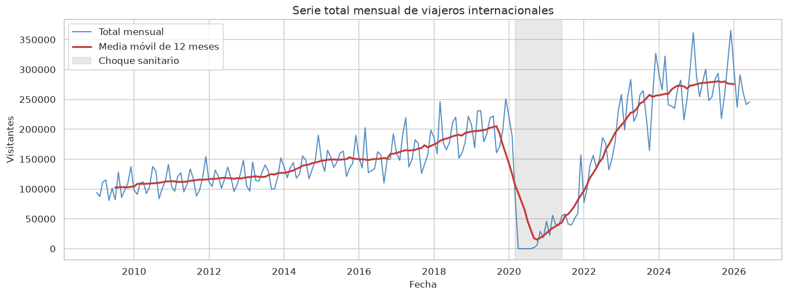

---

## 2. División en entrenamiento y prueba

La partición se hizo de forma **cronológica**, no aleatoria, para evitar
fuga de información: el 70% inicial de los 210 meses para entrenamiento y el
30% final para prueba. El mismo punto de corte se aplicó a las **cuatro
series**.

| Conjunto | Período | Meses | Porcentaje |
|---|---|---:|---:|
| Entrenamiento | Enero 2009 – marzo 2021 | 147 | 70% |
| Prueba | Abril 2021 – junio 2026 | 63 | 30% |

En el caso de Marítima, después de corregir su construcción, el conjunto de
prueba contiene 52 meses con valores positivos y 11 meses en cero, por lo que
ya no queda compuesto artificialmente solo por ceros. En la serie total,
cinco meses del entrenamiento (abril–agosto de 2020) quedan en cero por el
cierre de fronteras.

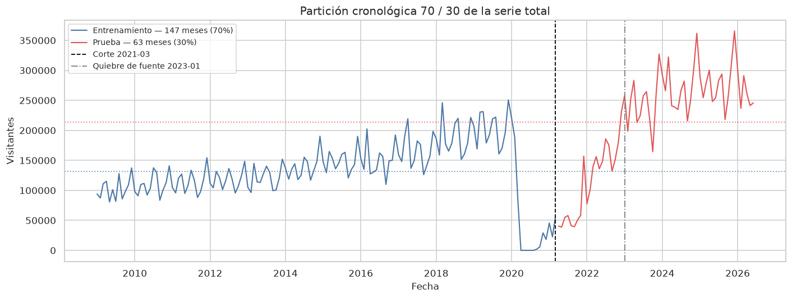

---

## 3. Análisis de las series de tiempo

Para cada serie se revisa su gráfico y componentes, si presenta
estacionalidad (y qué implica) y si presenta tendencia (y qué significa).

### 3.1 Serie total internacional

La serie muestra una tendencia de crecimiento sostenido, interrumpida por el
colapso del turismo durante la emergencia sanitaria de 2020 (cinco meses en
cero) y seguida de una recuperación que retoma la misma trayectoria previa.
La descomposición aditiva (período 12) separa tendencia, estacionalidad y
residuo; el residuo se mantiene estable durante casi todo el período y se
dispara únicamente durante el choque, lo que confirma que se trata de un
evento atípico y no de un cambio estructural del proceso generador.

- **Estacionalidad:** sí presenta. El rezago 12 es, de forma sistemática, el
  único rezago relevante tanto en la ACF como en la PACF de la serie
  transformada, con picos en marzo y diciembre y un valle en septiembre
  (amplitud estacional equivalente al 51% de la media de la serie). Esto
  implica que el modelo debe incorporar un componente estacional explícito
  (una diferencia estacional D = 1 con período 12 y un término MA estacional
  Q = 1); ignorarlo dejaría sin explicar una parte recurrente y sustancial de
  la variación mes a mes.
- **Tendencia:** sí presenta. La fuerza de tendencia (Hyndman &
  Athanasopoulos) es de 0.80 sobre el entrenamiento completo, claramente
  dominante frente a la estacionalidad, y equivale a un crecimiento
  interanual aproximado del 7% sobre la ventana pre-choque. Esto significa
  que la serie no fluctúa alrededor de un nivel fijo, sino que crece de forma
  sostenida en el tiempo salvo por el quiebre puntual de 2020; por eso el
  modelo final incorpora un término constante que representa esa tasa de
  crecimiento.

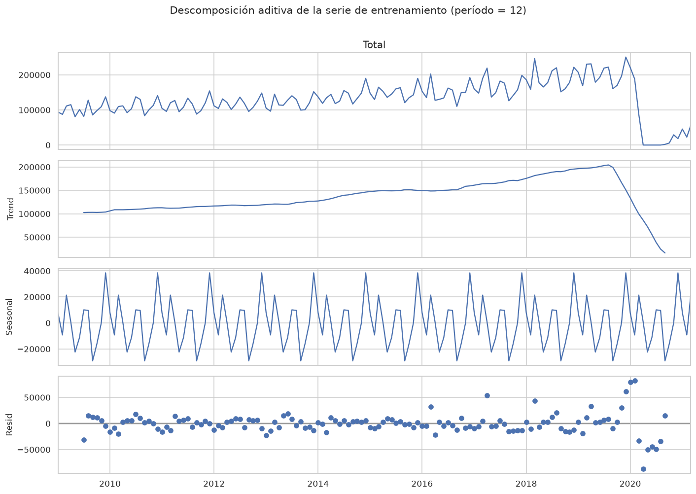

### 3.2 Serie Aérea

- **Estacionalidad:** presenta una estacionalidad **moderada**, con fuerza de
  0.384. Es un componente presente pero no dominante: el flujo aéreo depende
  del mes del año, con diciembre como el mes de mayor volumen, pero en menor
  medida que las otras dos vías.
- **Tendencia:** presenta una tendencia **importante**, con fuerza de 0.613,
  y una pendiente mensual relativa de 0.43% antes de 2020. Significa que el
  turismo aéreo venía en expansión sostenida antes de la pandemia, aunque de
  forma más moderada que la vía terrestre.

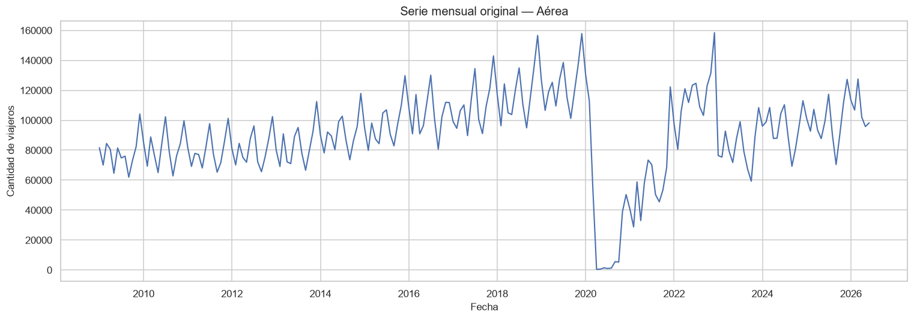

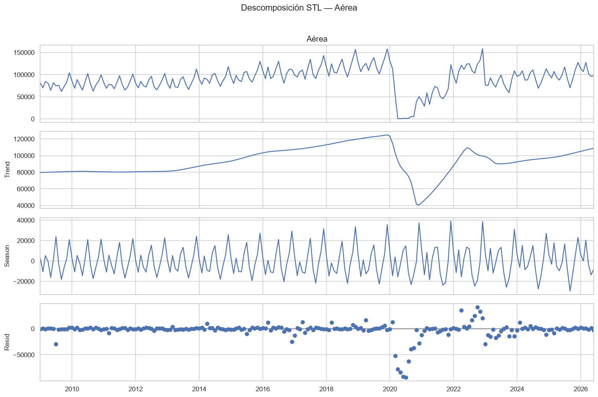

### 3.3 Serie Terrestre

- **Estacionalidad:** presenta una estacionalidad **moderada**, con fuerza de
  0.409, similar a la de Aérea.
- **Tendencia:** presenta la tendencia **más fuerte de las tres vías**, con
  un valor de 0.818 y la mayor pendiente mensual relativa antes de la
  pandemia (0.87%). Esto significa que el ingreso terrestre fue el canal con
  mayor crecimiento estructural en el largo plazo, previo al choque de 2020.

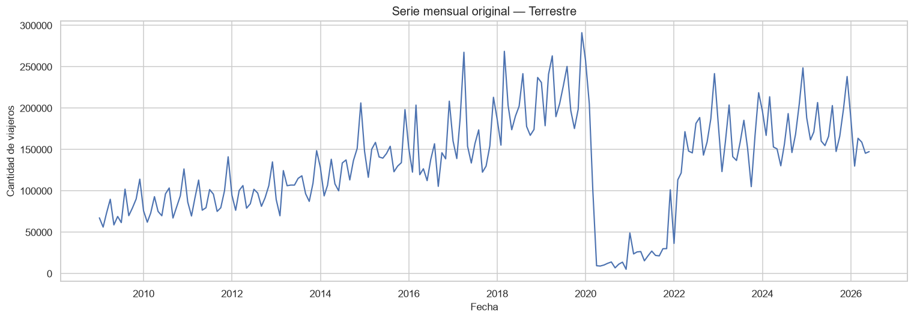

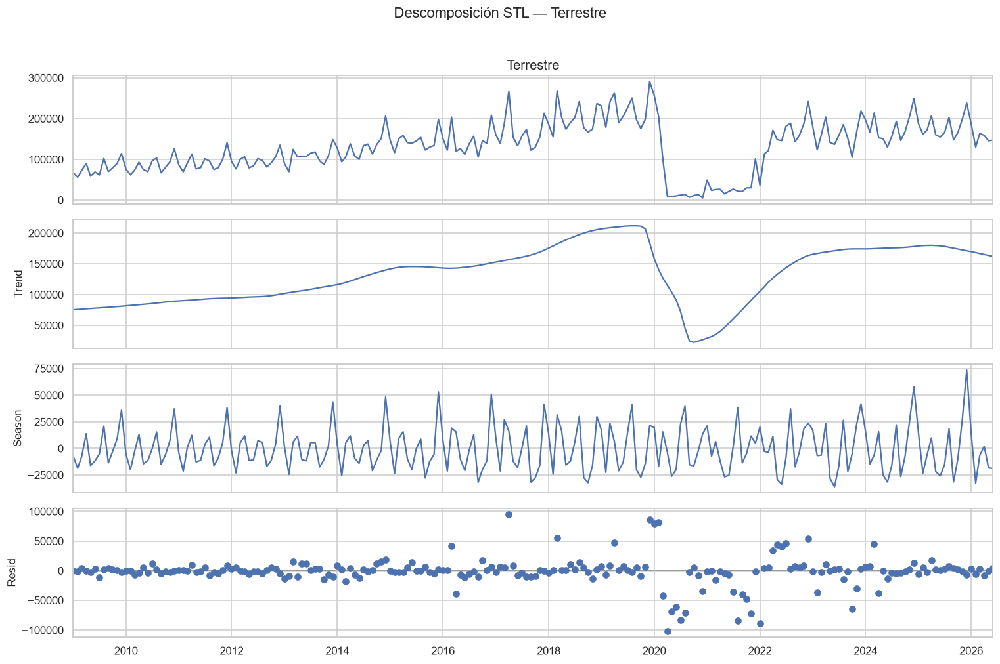

### 3.4 Serie Marítima

- **Estacionalidad:** presenta la **mayor fuerza estacional** de las cuatro
  series, con un valor de 0.641. Implica que el flujo marítimo depende en
  mayor medida del mes del año que el resto de vías, y que un modelo sin
  componente estacional explicaría mal su comportamiento.
- **Tendencia:** presenta una tendencia **moderada**, con fuerza de 0.576 y
  una pendiente mensual relativa de 0.44% antes de 2020, similar a la de
  Aérea. También es la serie con mayor variabilidad relativa (coeficiente de
  variación de 1.15) y con un comportamiento considerablemente más irregular,
  en parte por la limitación de datos descrita en la sección 1.2.

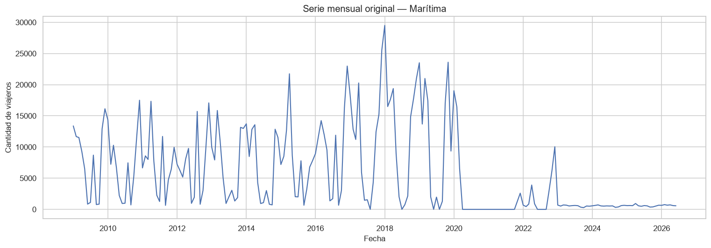

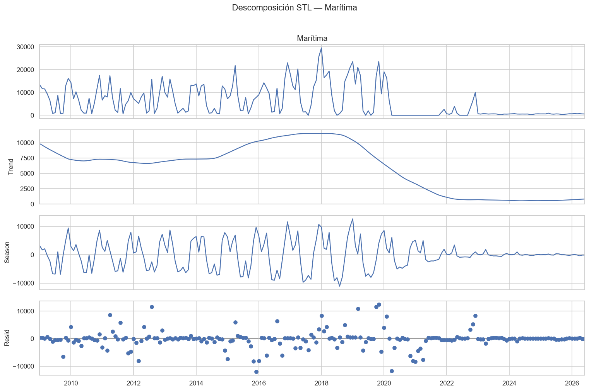

---

## 4. Determinación de estacionariedad

Para cada serie se evalúa si es estacionaria en varianza (aplicando una
transformación si no lo es) y si es estacionaria en media (con ACF y la
prueba ADF), determinando cuántas diferenciaciones se necesitan.

### 4.1 Serie total internacional

**Varianza.** No es estacionaria en varianza: al dividir el entrenamiento en
tercios, la desviación estándar crece de forma aproximadamente proporcional
al nivel de la serie (correlación media–desviación de 0.887), característica
propia de un proceso multiplicativo. Se aplicó una **transformación
logarítmica `log1p`** (y no `log` simple, porque hay meses con valor cero);
tras la transformación la desviación por tercios queda prácticamente
constante.

**Media.** Tampoco es estacionaria en media: la media móvil de 12 meses
varía entre 14,908 y 205,144 visitantes, la ACF en nivel decae muy
lentamente (32 de 36 rezagos significativos) y la prueba ADF no rechaza la
raíz unitaria salvo en una especificación puntual, mientras KPSS tampoco
confirma estacionariedad. Se determinó que se necesita **una diferenciación
estacional (D = 1, s = 12)**; se comprobó explícitamente, mediante una
escalera de diferenciación evaluada con ADF/KPSS, que añadir además una
diferencia regular (d = 1) sobre-diferencia la serie (la desviación aumenta
en vez de bajar), por lo que se descartó y se mantuvo **d = 0** con término
constante.

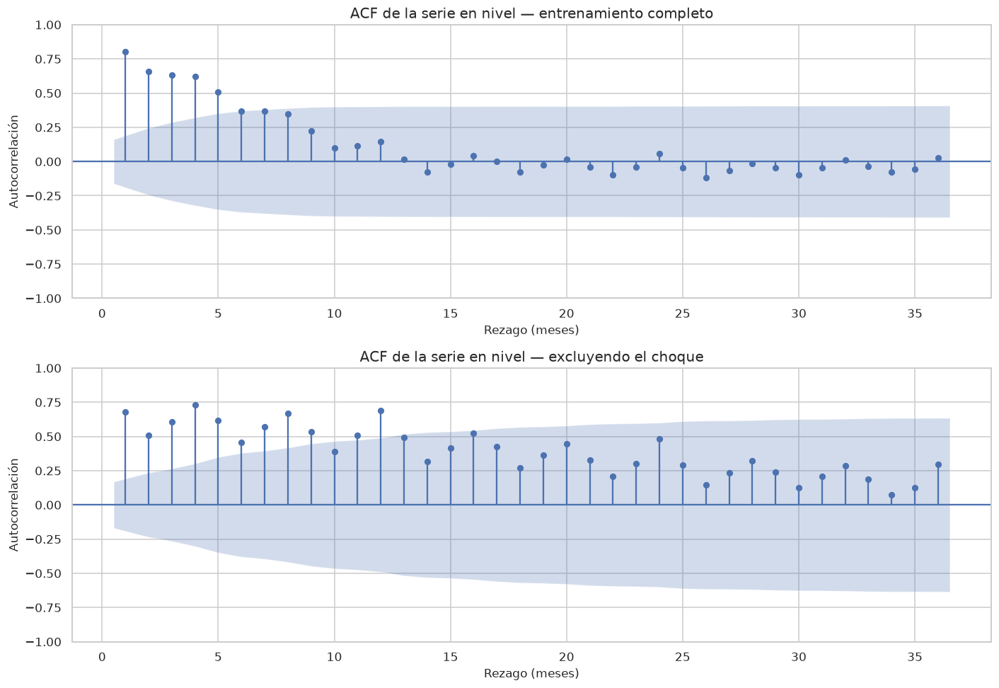

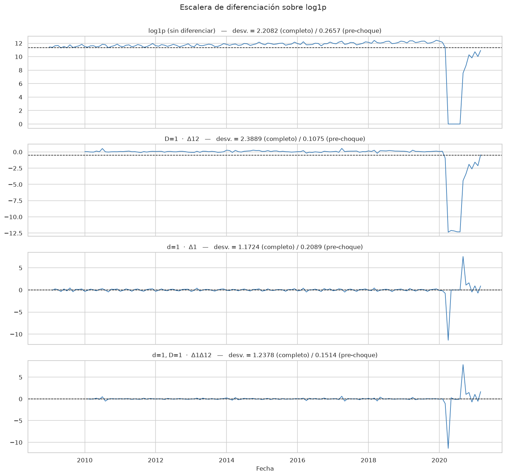

### 4.2 Serie Aérea

**Varianza.** La transformación logarítmica no mejoró la estabilidad de la
varianza, por lo que la serie se conservó en su escala original.

**Media.** La prueba ADF aplicada a la serie original produjo un valor p de
0.15, por lo que no se consideró estacionaria en media. Para alcanzar
estacionariedad se aplicó **una diferencia regular (d = 1, D = 0)**; después
de diferenciar, la prueba ADF produjo un valor p cercano a cero, confirmando
la estacionariedad.

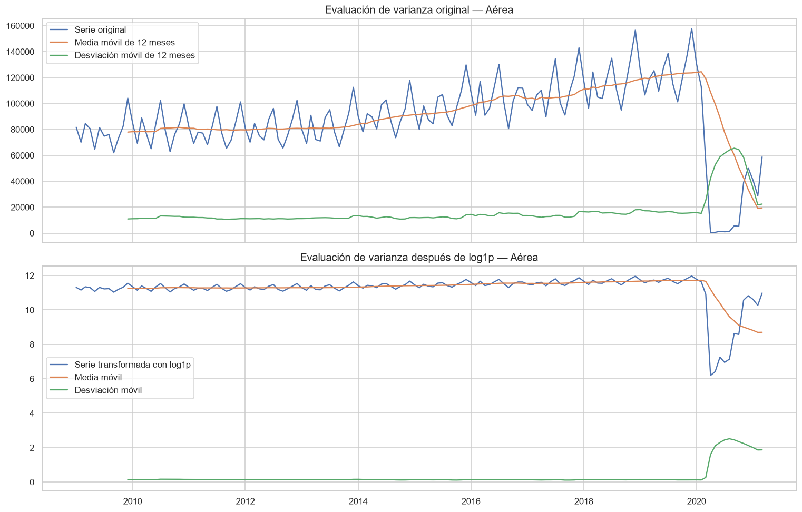

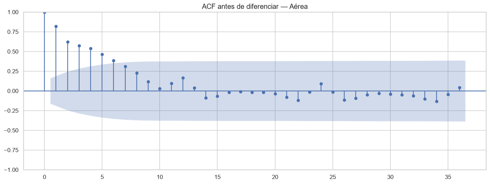

### 4.3 Serie Terrestre

**Varianza.** Al igual que en Aérea, la transformación logarítmica no
produjo una mejora suficiente en la estabilidad de la varianza, por lo que
se conservó la escala original.

**Media.** La prueba ADF sobre la serie original produjo un valor p de 0.24,
indicando que no era estacionaria. Se aplicó **una diferencia regular
(d = 1, D = 0)**; después de diferenciar, la prueba ADF produjo un valor p de
0.01, confirmando la estacionariedad en media.

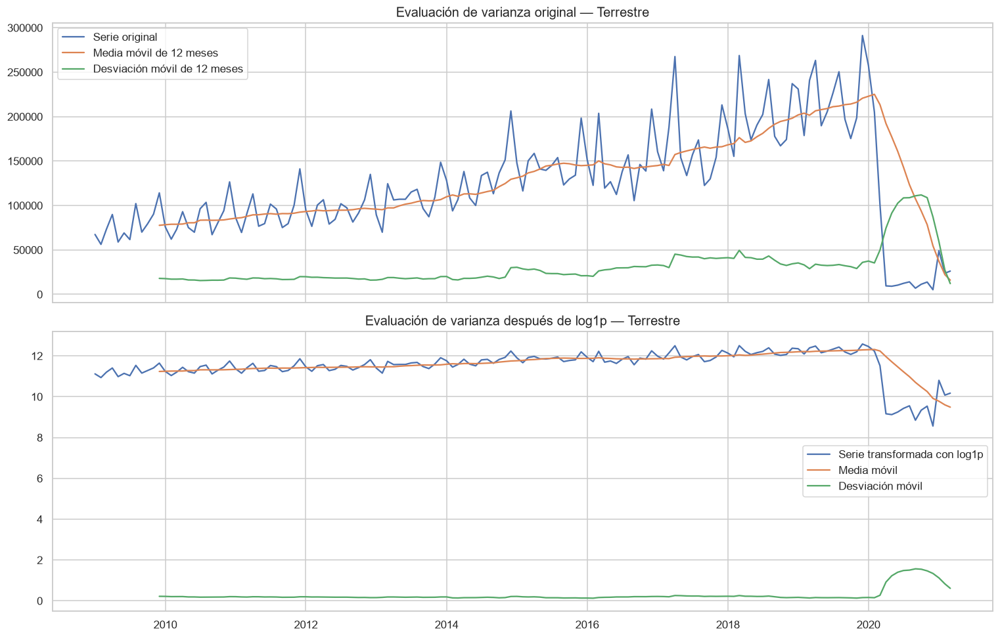

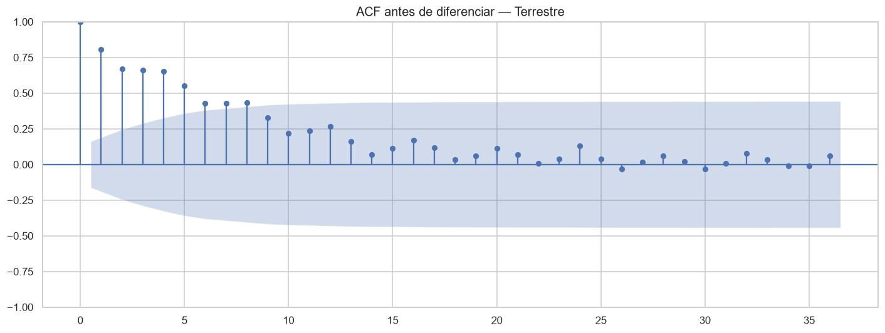

### 4.4 Serie Marítima

**Varianza.** A diferencia de Aérea y Terrestre, la relación entre el nivel
de la serie y su variabilidad fue alta, por lo que se aplicó la
transformación **log1p**.

**Media.** La prueba ADF de la serie transformada produjo un valor p de
1.00, por lo que fue necesario aplicar **dos diferencias regulares**: los
valores seleccionados fueron **d = 2, D = 0**. Después de diferenciar, el
valor p de la prueba ADF fue cercano a cero. Es, de las cuatro series, la que
requirió mayor grado de diferenciación.

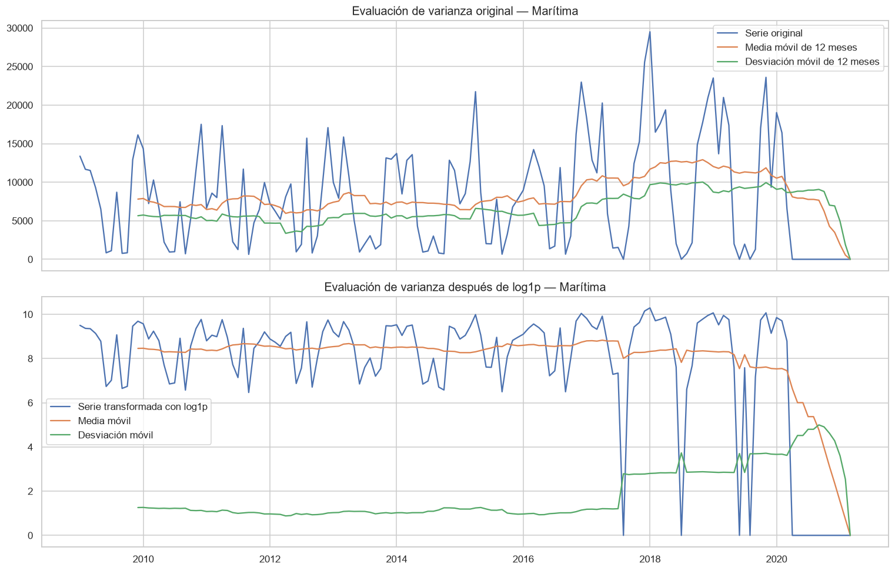

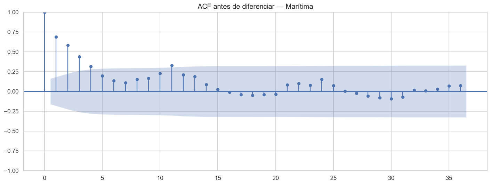

---

## 5. Generación de modelos

Para cada serie se identifican p, d, q a partir de la ACF y la PACF, se
explican los modelos elegidos (incluidos los propuestos automáticamente), se
generan los cuatro algoritmos solicitados y se comparan por residuos,
métricas de error, AIC y BIC.

### 5.1 Serie total internacional

**Identificación de p, d, q vía ACF y PACF.** Sobre la serie ya transformada
(log1p + diferencia estacional), ni la ACF ni la PACF muestran rezagos
significativos en el corto plazo (1 a 6), por lo que la parte no estacional
queda vacía: **p = 0, q = 0**. El único rezago relevante es el 12, presente
en ambas funciones; como la ACF corta en seco en el rezago 24 mientras la
PACF decae de forma gradual, la regla de Box-Jenkins identifica un
componente de medias móviles estacional: **P = 0, Q = 1**. Con **D = 1** y
d = 0, el modelo resultante es un **SARIMA(0,0,0)(0,1,1)₁₂ con constante**,
llamado M1 en el notebook.

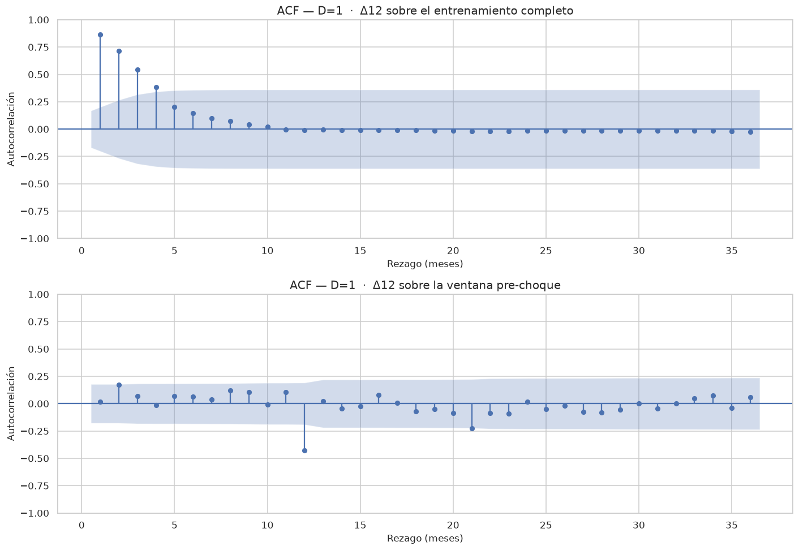

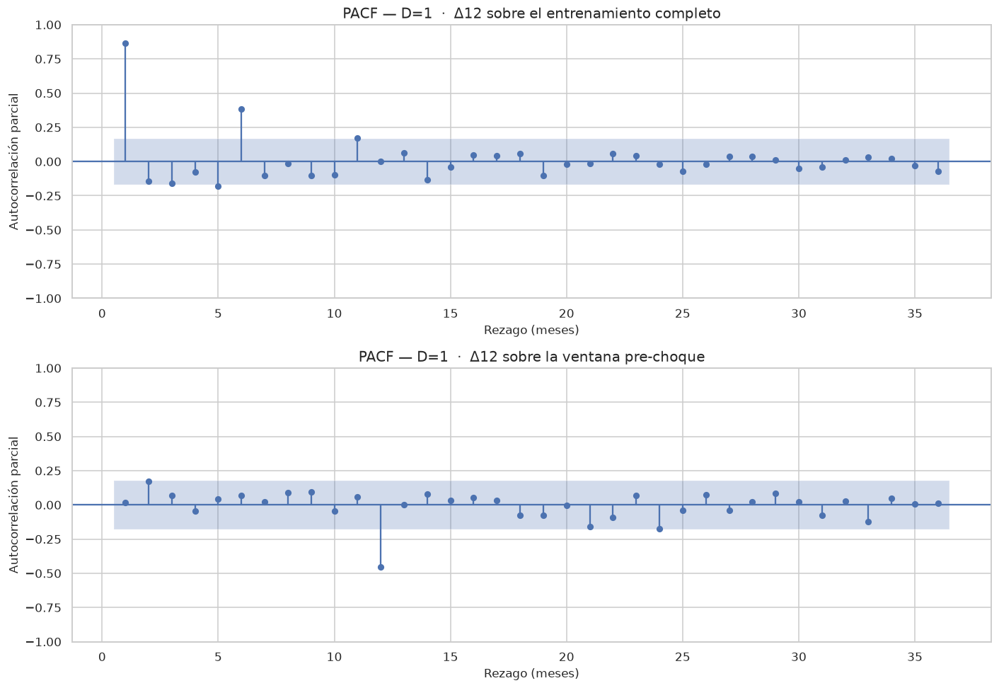

**Explicación de la elección de parámetros, incluidos los automáticos.**
Además de M1, se ajustó una malla automática de 36 combinaciones de órdenes
alrededor de esa propuesta y un modelo "airline" (0,1,1)(0,1,1)₁₂ clásico
(M3), para contrastar la lectura manual contra una búsqueda exhaustiva. La
malla confirma de forma independiente la parte estacional (0,1,1)₁₂ en los
cinco mejores órdenes; el mejor por AIC agrega dos términos autorregresivos
(M2, orden (2,0,0)(0,1,1)₁₂), con una mejora de apenas 4.9 puntos de AIC
sobre M1 — evidencia débil frente al costo de dos parámetros adicionales —,
por lo que por parsimonia se prefiere M1. También se comprobó que el ajuste
depende críticamente de la ventana de entrenamiento: sobre el entrenamiento
completo (que incluye el choque) ningún coeficiente estacional resulta
significativo, mientras que sobre la ventana pre-choque (2009-01 a 2020-02)
los tres coeficientes de M1 son significativos (p < 0.001).

**Modelos generados con los distintos algoritmos.** Se generaron seasonal
naive (línea base), suavizamiento exponencial simple y Holt-Winters (aditivo
y amortiguado), cada uno sobre la ventana de entrenamiento completa y sobre
la ventana pre-choque. *Nota:* Prophet no estaba disponible en el entorno de
ejecución; como el enunciado admite cualquiera de las alternativas, se
implementaron en su lugar las tres restantes.

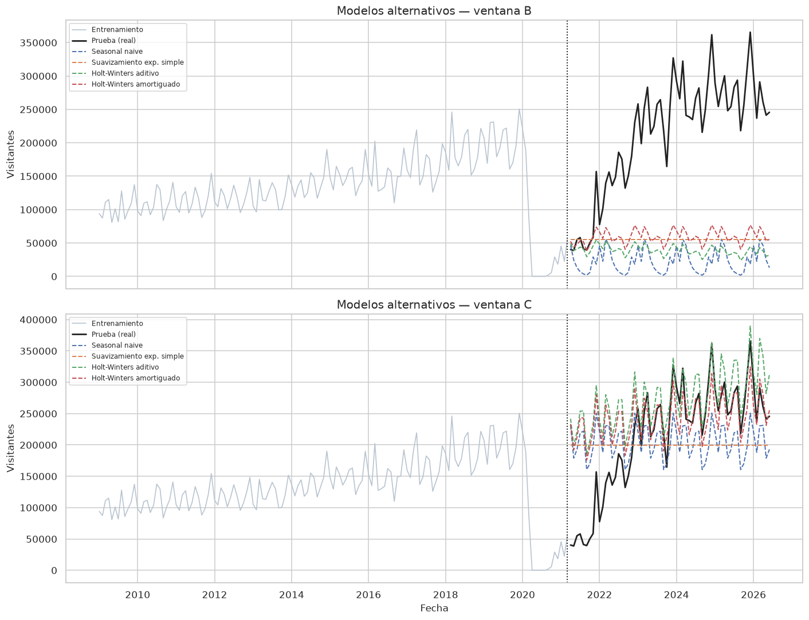

**Comparación por residuos, métricas de error, AIC y BIC.** Los residuos de
los tres SARIMA sobre la ventana completa fallan la prueba de
heterocedasticidad y muestran curtosis muy por encima de lo esperado en una
distribución normal; sobre la ventana pre-choque los tres pasan Ljung-Box, la
heterocedasticidad ya no se rechaza y la curtosis baja a un rango razonable.
El AIC y el BIC solo se compararon dentro de la familia SARIMA: AIC prefiere
a M2 y BIC a M3, con M1 muy cerca de ambos; las diferencias son pequeñas y no
discriminan de forma concluyente dentro de la muestra. Frente a Holt-Winters
y seasonal naive, la comparación se hizo exclusivamente con métricas de
error sobre el conjunto de prueba, no con AIC/BIC.

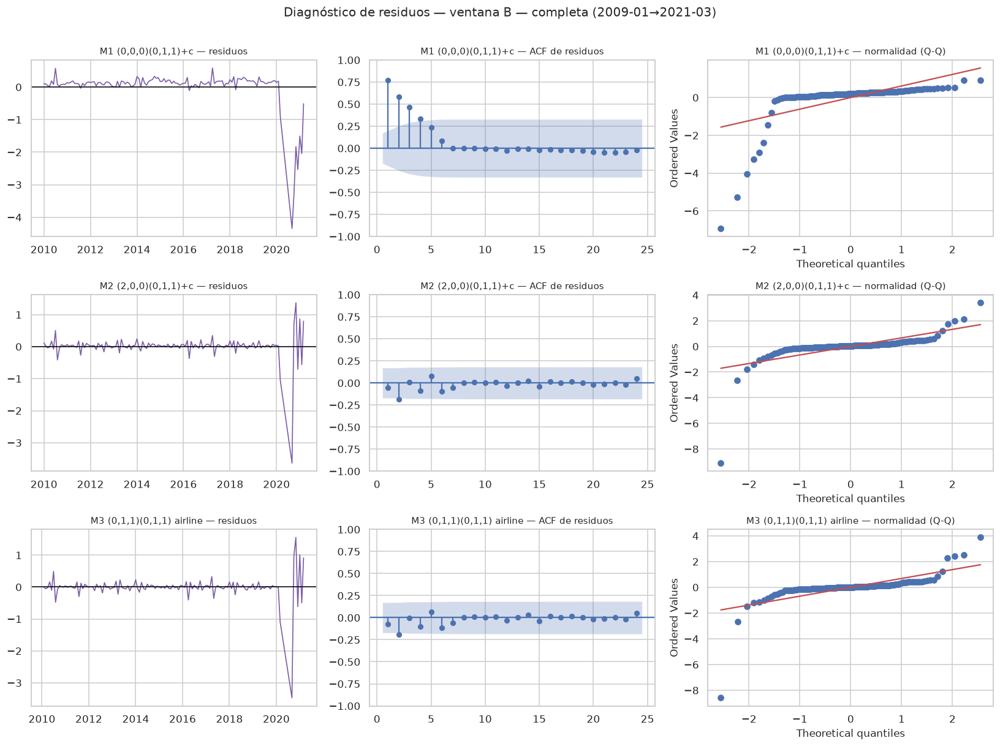

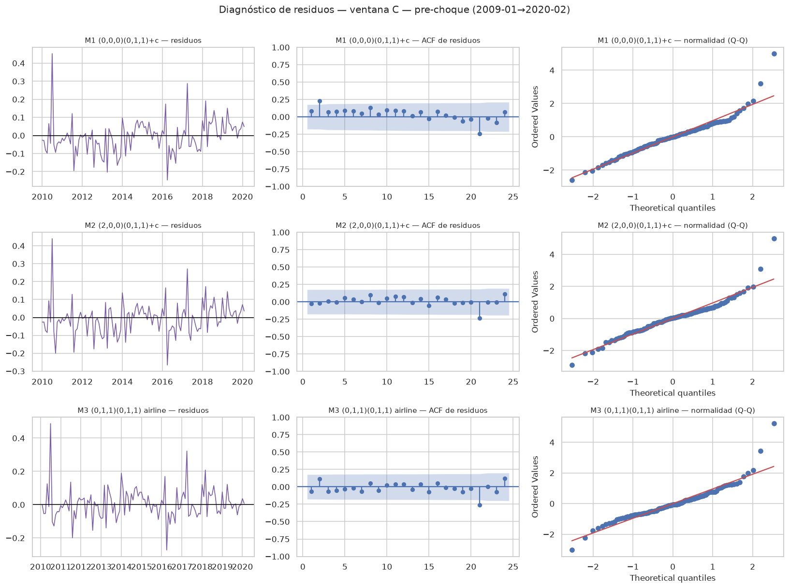

### 5.2 Serie Aérea

La función de autocorrelación parcial sugirió **p = 2**, mientras que la
función de autocorrelación sugirió **q = 2**, sobre la serie diferenciada
(d = 1). A partir de estos resultados se compararon diferentes modelos
ARIMA y SARIMA cercanos. El mejor candidato de esta familia fue:

**SARIMA (0,1,2)(1,0,1,12)**

Este modelo obtuvo un AIC de 2,869.86, un BIC de 2,884.24 y un valor p de
Ljung-Box de 0.65 en entrenamiento, lo que indica que sus residuos no
conservaron autocorrelación significativa dentro del conjunto usado para
ajustarlo.

También se generaron los modelos Prophet, Holt-Winters, suavizamiento
exponencial y Seasonal Naive. Los resultados sobre el conjunto de prueba
fueron:

| Modelo | MAE | RMSE |
|---|---:|---:|
| Suavizamiento exponencial | 36,970.60 | 42,141.22 |
| Prophet | 41,271.36 | 45,655.27 |
| Holt-Winters | 43,072.93 | 47,051.02 |
| Seasonal Naive | 75,512.73 | 79,339.80 |
| ARIMA/SARIMA | 74,524.43 | 79,593.05 |

El mejor resultado fue obtenido por **suavizamiento exponencial**, con los
menores valores de MAE y RMSE. Sin embargo, sus residuos de prueba
conservaron autocorrelación significativa, por lo que el modelo todavía dejó
patrones temporales sin explicar completamente.

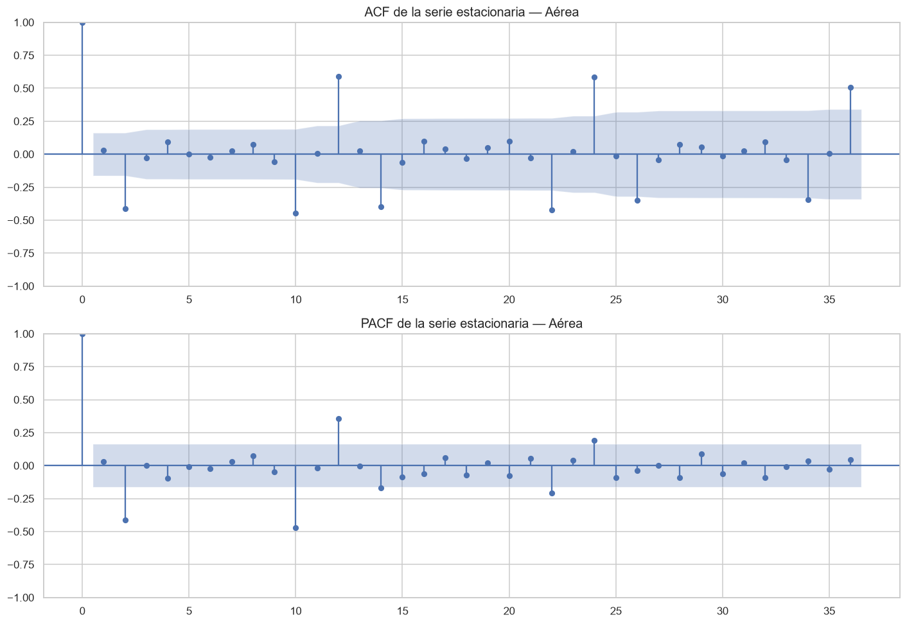

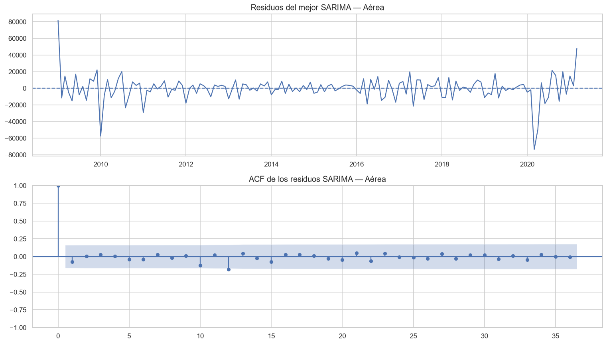

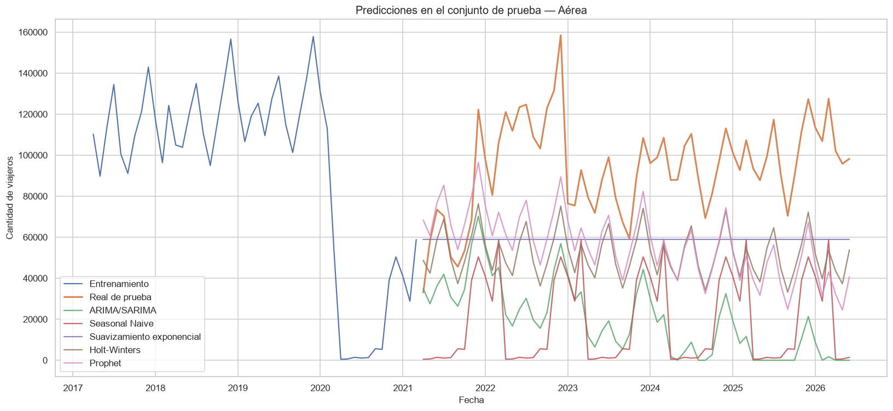

### 5.3 Serie Terrestre

La PACF sugirió **p = 3**, mientras que la ACF sugirió **q = 2**. Después de
comparar diferentes combinaciones, el mejor modelo de la familia ARIMA/SARIMA
fue:

**SARIMA (0,1,2)(1,0,1,12)**

Este modelo obtuvo un AIC de 3,091.31, un BIC de 3,105.69 y un valor p de
Ljung-Box de 0.55 en entrenamiento, por lo que sus residuos de entrenamiento
no mostraron autocorrelación significativa.

Los modelos comparados en prueba presentaron los siguientes resultados:

| Modelo | MAE | RMSE |
|---|---:|---:|
| Prophet | 47,713.21 | 57,657.61 |
| Suavizamiento exponencial | 121,715.64 | 134,136.23 |
| Holt-Winters | 128,421.20 | 139,161.45 |
| Seasonal Naive | 132,209.04 | 144,274.98 |
| ARIMA/SARIMA | 147,398.53 | 158,502.92 |

El mejor modelo fue **Prophet**, con una diferencia amplia respecto de los
demás algoritmos. Este resultado sugiere que su capacidad para representar
cambios de tendencia fue más adecuada para una serie afectada por el choque
de 2020 y la recuperación posterior. A pesar de obtener los menores errores,
sus residuos de prueba conservaron autocorrelación significativa.

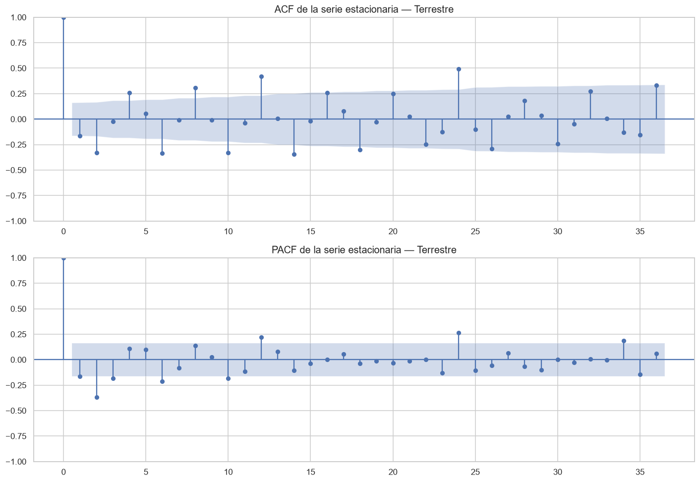

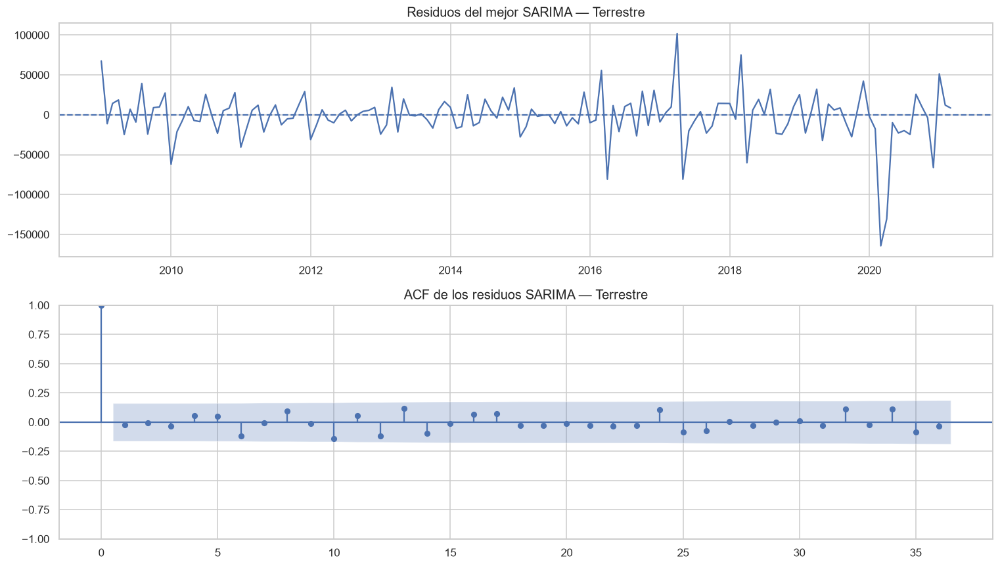

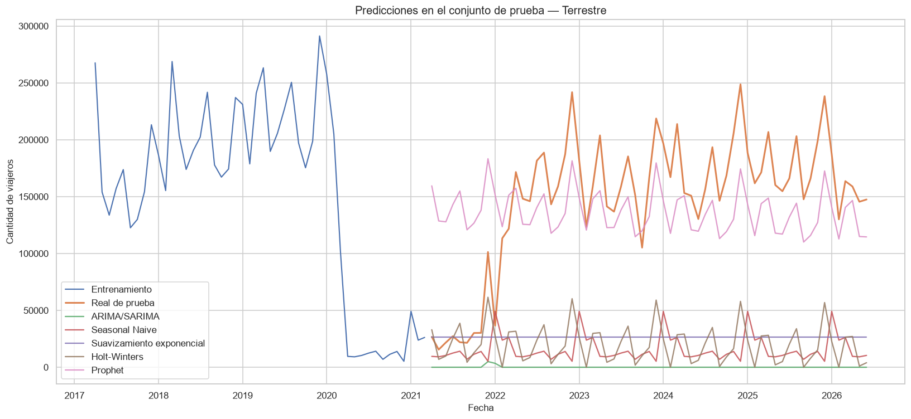

### 5.4 Serie Marítima

La PACF sugirió **p = 3** y la ACF sugirió **q = 2**. El mejor candidato
ARIMA/SARIMA fue:

**SARIMA (0,2,2)(1,0,1,12)**

Este modelo obtuvo un AIC de 551.92, un BIC de 566.26 y un valor p de
Ljung-Box de 0.07 en entrenamiento. Entre los candidatos evaluados, fue uno
de los que combinó valores bajos de AIC y BIC con residuos sin autocorrelación
significativa al nivel de 5%.

Los resultados de prueba fueron:

| Modelo | MAE | RMSE |
|---|---:|---:|
| Holt-Winters | 902.62 | 1,685.06 |
| Suavizamiento exponencial | 858.37 | 1,731.93 |
| Seasonal Naive | 858.37 | 1,731.93 |
| ARIMA/SARIMA | 858.37 | 1,731.93 |
| Prophet | 7,272.58 | 8,587.77 |

Aunque varios modelos obtuvieron un MAE ligeramente menor, **Holt-Winters**
presentó el menor RMSE, un sesgo relativamente bajo y residuos de prueba sin
autocorrelación significativa (Ljung-Box p = 0.19), por lo que fue
seleccionado como el modelo más adecuado para esta serie. Sus errores no
deben compararse directamente con los de Aérea y Terrestre, debido a la
diferencia de escala y a la limitación metodológica de su construcción.

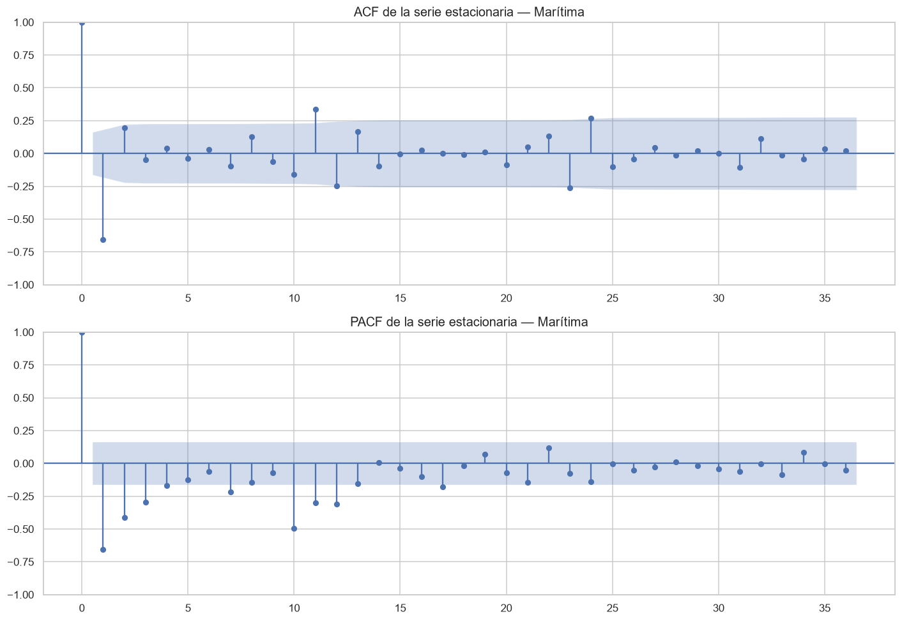

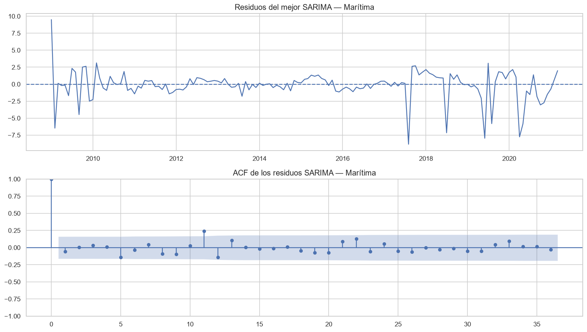

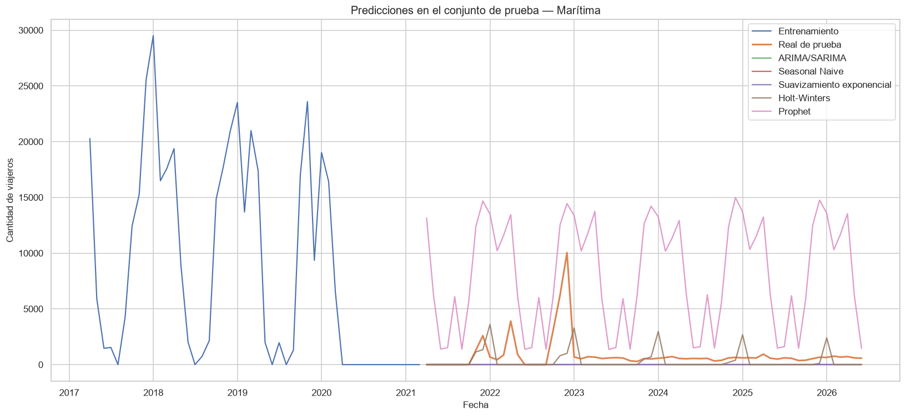

### 5.5 Comparación de los modelos seleccionados

| Serie | Mejor modelo | MAE | RMSE | Autocorrelación en residuos de prueba |
|---|---|---:|---:|---|
| Total internacional | Holt-Winters amortiguado (ventana pre-choque) | 53,568.42 | 75,695.20 | No significativa |
| Aérea | Suavizamiento exponencial | 36,970.60 | 42,141.22 | Sí |
| Terrestre | Prophet | 47,713.21 | 57,657.61 | Sí |
| Marítima | Holt-Winters | 902.62 | 1,685.06 | No significativa |

*Nota de comparabilidad:* la serie total no se evaluó con el mismo
procedimiento que las tres vías. Su comparación descarta explícitamente todo
modelo peor que su seasonal naive y contrasta dos ventanas de entrenamiento
(completa y pre-choque), mientras que las vías se ajustaron sobre una única
ventana de 147 meses. Los RMSE de la tabla no deben leerse como una carrera
directa entre las cuatro series, sino como el resumen de cuál algoritmo
ganó en cada una.

El análisis demuestra que **no existe un único algoritmo que funcione mejor
para todas las series**: cada una necesitó un modelo diferente de acuerdo
con su tendencia, estacionalidad, variabilidad y presencia de cambios
estructurales. AIC y BIC se usaron principalmente para comparar candidatos
ARIMA/SARIMA y modelos de suavizamiento cuando estaban disponibles; Prophet
y Seasonal Naive se compararon sobre todo mediante los errores en el
conjunto de prueba y el comportamiento de los residuos.

---

## 6. Predicción con los modelos generados

Los conjuntos de entrenamiento y prueba ya se describieron en la sección 2 y
son los mismos para las cuatro series. Aquí se resume qué tan bien predice
cada modelo seleccionado y cómo se comparan entre sí.

### 6.1 Serie total internacional

El desempeño depende casi por completo de la ventana de entrenamiento, más
que del algoritmo elegido: los modelos entrenados con toda la serie
(incluyendo el choque) quedan anclados en el piso pandémico y nunca alcanzan
el nivel real del conjunto de prueba; su mejor RMSE es 174,266. Los modelos
entrenados sobre la ventana pre-choque, en cambio, sí capturan el nivel y la
trayectoria correctos, con RMSE entre 75,695 y 81,574 entre los que superan
al seasonal naive. Vistos por sub-período, en 2021 (piso pandémico) los
modelos pre-choque fallan (MAPE superior al 290%), pero a partir de 2023 la
serie observada entra en la banda de confianza del 95% de estos modelos y no
vuelve a salir; para 2024-2026, ya con la serie normalizada, el mejor modelo
alcanza un MAPE de apenas 8.7%.

Sobre el conjunto de prueba, cualquier modelo entrenado en la ventana
completa resulta peor que el seasonal naive de esa misma ventana y se
descarta. El mejor resultado global es **Holt-Winters amortiguado sobre la
ventana pre-choque**, seguido muy de cerca por el SARIMA **M1
(0,0,0)(0,1,1)₁₂ con constante**, también sobre la ventana pre-choque, la
misma especificación identificada manualmente. Ambos reproducen con
precisión la forma del ciclo anual desde 2023 en adelante.

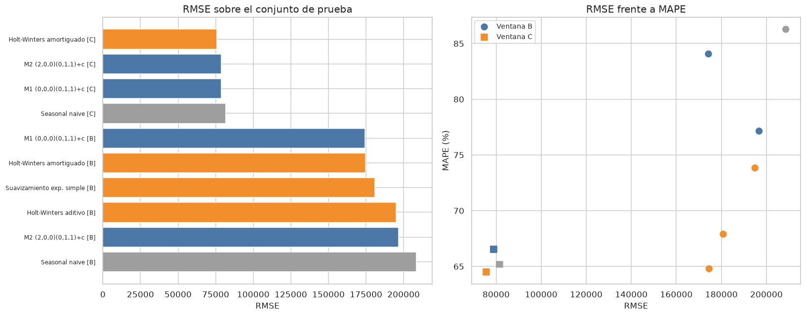

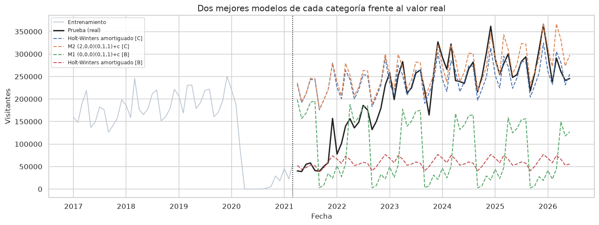

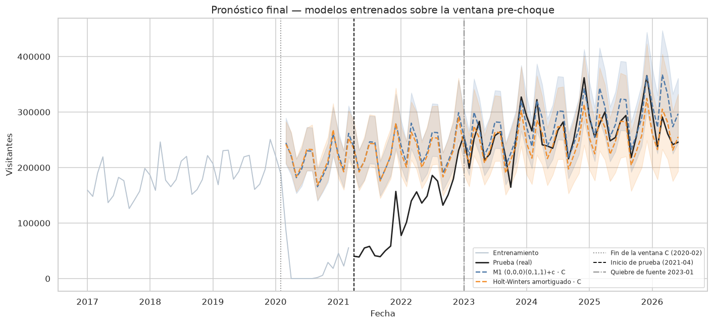

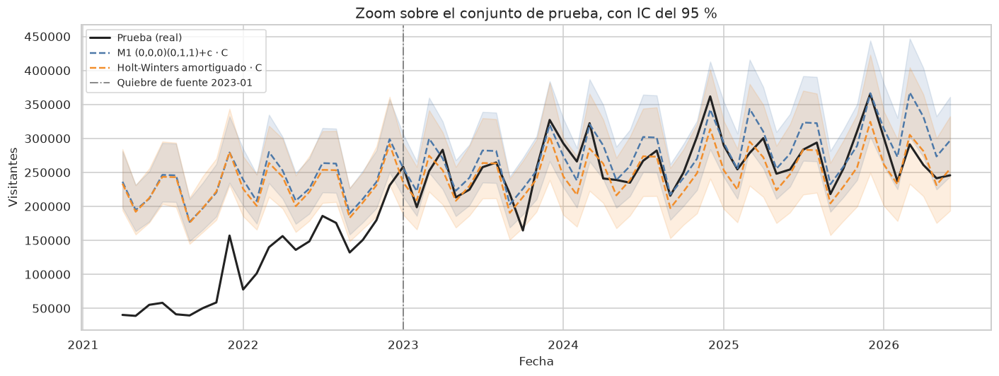

### 6.2 Series por vía de ingreso

Los modelos se ajustaron con las 147 observaciones de entrenamiento y se
evaluaron sobre 63 meses que no participaron en su estimación. La
comparación se realizó mediante MAE, RMSE, sesgo promedio y la prueba de
Ljung-Box aplicada a los residuos.

Para **Aérea**, el suavizamiento exponencial presentó el mejor desempeño de
prueba. Sin embargo, el RMSE de 42,141.22 representa un error relevante
frente a una media mensual de 90,568.66. Además, los residuos conservaron
autocorrelación, por lo que el modelo no capturó completamente la
recuperación posterior a la pandemia.

Para **Terrestre**, Prophet obtuvo el menor error, con un RMSE de 57,657.61.
Frente a una media mensual de 131,391.68, el error sigue siendo
considerable, pero fue claramente inferior al de los demás algoritmos. La
autocorrelación restante en los residuos indica que todavía quedaron
patrones por explicar.

Para **Marítima**, Holt-Winters obtuvo un RMSE de 1,685.06 frente a una
media mensual de 5,851.34. Sus residuos no conservaron autocorrelación
significativa, lo que indica que capturó de mejor forma la estructura
temporal disponible en el conjunto de prueba. Aun así, la predicción
marítima debe considerarse exploratoria debido a los cambios metodológicos
de la serie.

En general, los modelos permiten aproximar el comportamiento de los ingresos
migratorios, pero no deben utilizarse como predicciones exactas: la
pandemia produjo un quiebre estructural importante y el período de prueba
incluye una recuperación distinta del comportamiento observado en buena
parte del entrenamiento. Por ello, los pronósticos deben actualizarse
periódicamente con nueva información.

---

## 7. Análisis comparativo de las series

| Serie | Fuerza estacional | Fuerza de tendencia | Coeficiente de variación | Pendiente mensual relativa antes de 2020 | Cambio 2020 frente a 2019 |
|---|---:|---:|---:|---:|---:|
| Aérea | 0.384 | 0.613 | 0.31 | 0.43% | −72.80% |
| Terrestre | 0.409 | 0.818 | 0.46 | 0.87% | −75.23% |
| Marítima | 0.641 | 0.576 | 1.15 | 0.44% | −67.89% |

*La serie total no se incluye en esta tabla porque su fuerza de tendencia y
estacionalidad se calcularon con una metodología distinta (por ventana,
antes y después de excluir el choque — ver sección 3.1); no son
directamente comparables punto a punto con estos valores.*

**¿Cuál vía presenta mayor estacionalidad?** La vía **Marítima** presentó la
mayor fuerza estacional, con un valor de 0.641. Esto indica que su flujo
depende en mayor medida del mes del año. Aérea y Terrestre también
presentaron patrones estacionales, pero con menor intensidad.

**¿Cuál vía presenta mayor tendencia de crecimiento?** La vía **Terrestre**
presentó la tendencia más fuerte, con un valor de 0.818, y la mayor
pendiente mensual relativa antes de la pandemia (≈0.87%). Aérea presentó una
pendiente relativa de 0.43% y Marítima de 0.44%.

**¿Cuál vía presenta mayor volatilidad?** La vía **Marítima** presentó la
mayor volatilidad relativa, con un coeficiente de variación de 1.15,
considerablemente superior al de Terrestre (0.46) y Aérea (0.31). La
elevada dispersión marítima puede estar relacionada tanto con la naturaleza
de este flujo como con los cambios metodológicos documentados.

**¿Cuál vía fue más afectada por la pandemia?** La vía **Terrestre**
presentó la mayor caída entre 2019 y 2020, con una reducción de 75.23%. La
vía Aérea disminuyó 72.80% y Marítima 67.89%. Estos resultados muestran que
las restricciones de movilidad afectaron especialmente los ingresos por
fronteras terrestres.

**Comparación general.** Aérea fue la serie menos volátil y presentó un
comportamiento relativamente más estable. Terrestre mostró el mayor
crecimiento previo a la pandemia, pero también la caída porcentual más
fuerte en 2020. Marítima presentó la mayor estacionalidad y volatilidad,
además de cambios de clasificación que reducen su comparabilidad directa. La
serie total, al ser una agregación de las vías bajo el criterio
Turista/Excursionista (que excluye la reconstrucción especial de Marítima),
refleja sobre todo la dinámica combinada de Aérea y Terrestre: por eso su
fuerza de tendencia (0.80) es la más alta de las cuatro series, cercana a la
de Terrestre.

---

## 8. Descubrimientos útiles para INGUAT

1. **Diciembre es el mes con mayor flujo promedio en las tres vías.** Este
   patrón puede utilizarse para anticipar una mayor demanda de personal,
   información turística, transporte y atención en puntos de ingreso.

2. **La vía Terrestre tiene el mayor crecimiento de largo plazo.** Antes de
   la pandemia presentó la pendiente relativa más alta, por lo que puede
   representar un canal prioritario para acciones dirigidas a visitantes
   regionales.

3. **Terrestre también fue la vía más sensible a la pandemia.** La reducción
   de 75.23% demuestra que los flujos fronterizos terrestres pueden verse
   especialmente afectados por restricciones de movilidad y cierres
   fronterizos.

4. **Aérea presenta la menor volatilidad relativa.** Su comportamiento más
   estable permite construir proyecciones con menor variación, aunque la
   recuperación posterior a 2020 todavía generó errores importantes.

5. **Marítima requiere una revisión de calidad y consistencia de datos.** Los
   cambios en la clasificación desde 2017 dificultan la comparación
   histórica. Sería conveniente mantener definiciones homogéneas y
   documentar claramente cualquier cambio en las categorías.

6. **La ventana de entrenamiento importa más que el algoritmo.** El análisis
   de la serie total muestra que cualquier modelo entrenado con datos que
   incluyen el fondo de la pandemia queda anclado a ese nivel y nunca
   recupera la trayectoria real, sin importar el algoritmo usado; entrenar
   con datos previos al choque, aunque sean menos, produjo pronósticos muy
   superiores. Esta lección es aplicable a cualquier vía que se quiera
   remodelar en el futuro tras un evento disruptivo.

7. **Los modelos deben actualizarse con frecuencia.** Los residuos de Aérea
   y Terrestre conservaron autocorrelación en prueba, lo que muestra que
   todavía existen patrones no capturados. La incorporación de nuevos meses
   puede mejorar los parámetros y reducir el error.

8. **No debe utilizarse el mismo modelo para todas las series.** Suavizamiento
   exponencial fue mejor para Aérea, Prophet para Terrestre, Holt-Winters
   para Marítima y Holt-Winters amortiguado (sobre la ventana pre-choque)
   para el total. Esto demuestra la necesidad de una estrategia de
   pronóstico diferenciada por serie.

9. **Las predicciones deben acompañarse de intervalos y escenarios.** Debido
   a la pandemia, la recuperación y los cambios metodológicos, es más
   prudente interpretar los pronósticos como rangos de planificación y no
   como valores exactos. El modelo final de la serie total, con datos
   previos al choque, describe la realidad de 2024-2026 con un error
   cercano al 9%, lo que confirma que el turismo volvió a su trayectoria de
   crecimiento estructural previa a la pandemia.

---

## 9. Conclusiones generales

Las cuatro series analizadas comparten un mismo patrón de fondo —crecimiento
antes de 2020, colapso durante la pandemia y recuperación posterior que
retoma la trayectoria previa— pero difieren en la intensidad de su
estacionalidad, su tendencia y su volatilidad, y requirieron tratamientos
estadísticos específicos. Aérea mostró una estacionalidad moderada, una
tendencia importante y la menor volatilidad relativa. Terrestre presentó la
tendencia de crecimiento más fuerte y el mayor impacto de la pandemia.
Marítima fue la más estacional y volátil, con resultados condicionados por
cambios metodológicos en la clasificación de los viajeros. La serie total,
que agrega Aérea y Terrestre bajo el criterio de comparabilidad, resultó ser
la de tendencia más dominante de las cuatro.

Las transformaciones y diferenciaciones permitieron alcanzar estacionariedad
antes de ajustar los modelos: Aérea y Terrestre no necesitaron transformación
logarítmica y alcanzaron estacionariedad con una diferencia regular; Total y
Marítima sí necesitaron `log1p`, con una diferencia estacional en el caso de
Total y dos diferencias regulares en el caso de Marítima, la que requirió
mayor grado de diferenciación de las cuatro.

Los parámetros ARIMA/SARIMA fueron propuestos mediante ACF, PACF y pruebas
de estacionariedad, y posteriormente se compararon diferentes candidatos con
AIC, BIC y diagnóstico de residuos. Además, se evaluaron variantes de
Holt-Winters, suavizamiento exponencial y Seasonal Naive bajo el mismo
conjunto de prueba en las cuatro series, y Prophet en las tres vías (no
disponible en el entorno usado para la serie total).

El mejor modelo fue distinto para cada serie: suavizamiento exponencial para
Aérea, Prophet para Terrestre, Holt-Winters para Marítima y Holt-Winters
amortiguado —entrenado sobre la ventana previa al choque sanitario— para la
serie total, con el SARIMA M1(0,0,0)(0,1,1)₁₂+c como alternativa casi
equivalente. Los resultados confirman que la selección de algoritmo debe
hacerse según las características de cada serie y no de forma genérica. No
obstante, la autocorrelación presente en los residuos de Aérea y Terrestre
indica que sus predicciones todavía pueden mejorarse, mientras que Marítima
y Total sí alcanzaron residuos de prueba sin autocorrelación significativa.

Finalmente, los modelos pueden apoyar la planificación de INGUAT,
especialmente para anticipar meses de mayor flujo, identificar vías con
crecimiento importante y evaluar la sensibilidad ante choques externos. Su
uso debe complementarse con actualizaciones frecuentes, con una mejora en la
consistencia del registro marítimo, y con la lección más general de este
análisis: ante un choque estructural como la pandemia, conviene contrastar
explícitamente modelos entrenados antes y después del evento, en vez de
asumir que usar toda la información disponible es siempre la mejor opción.
