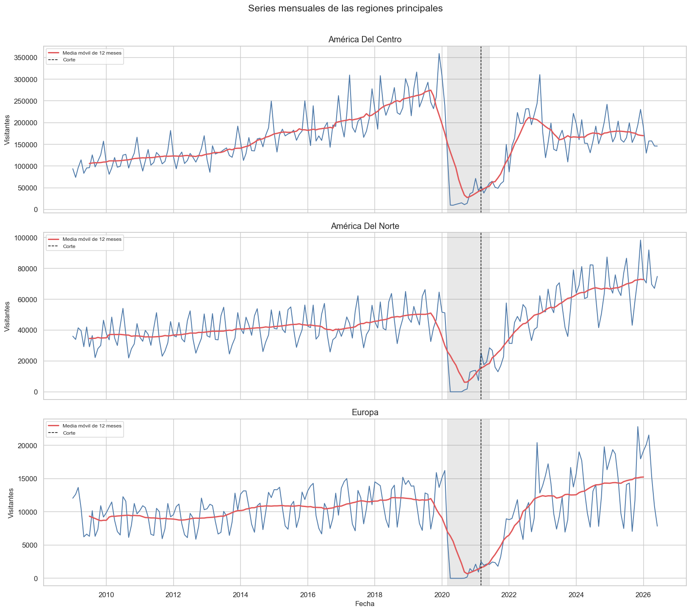
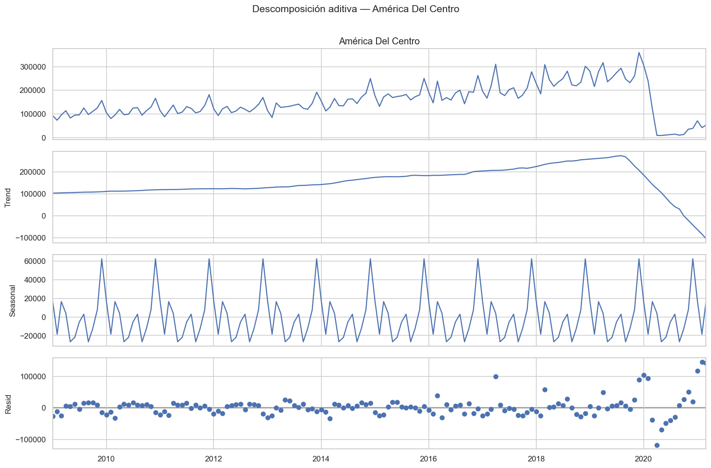
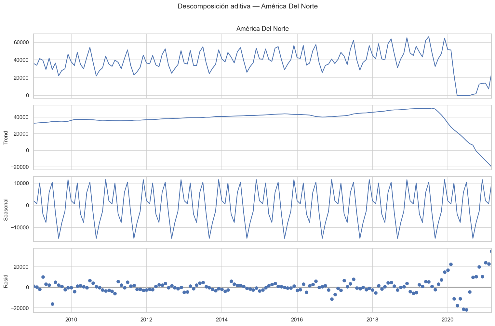
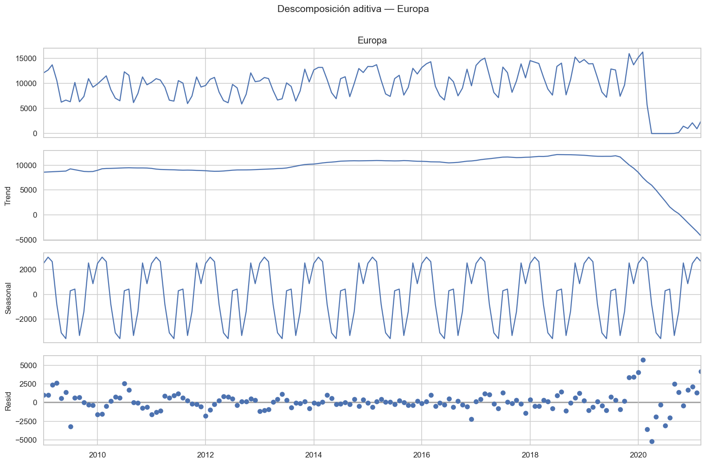
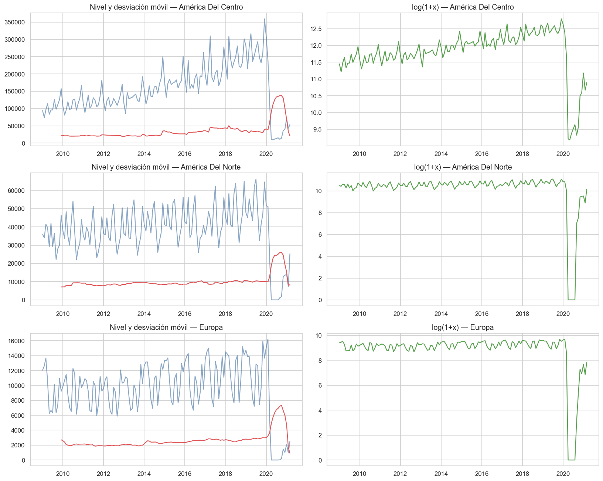
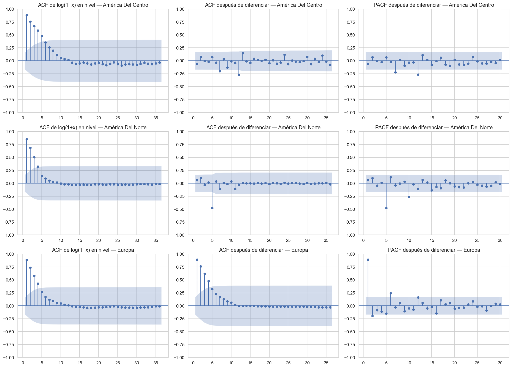
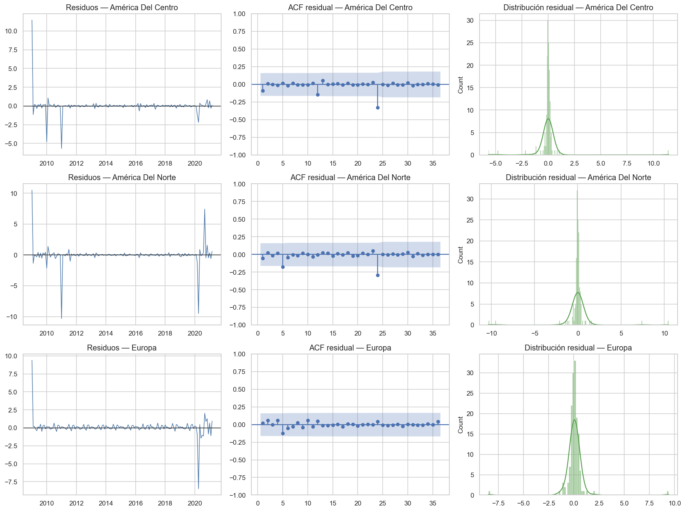
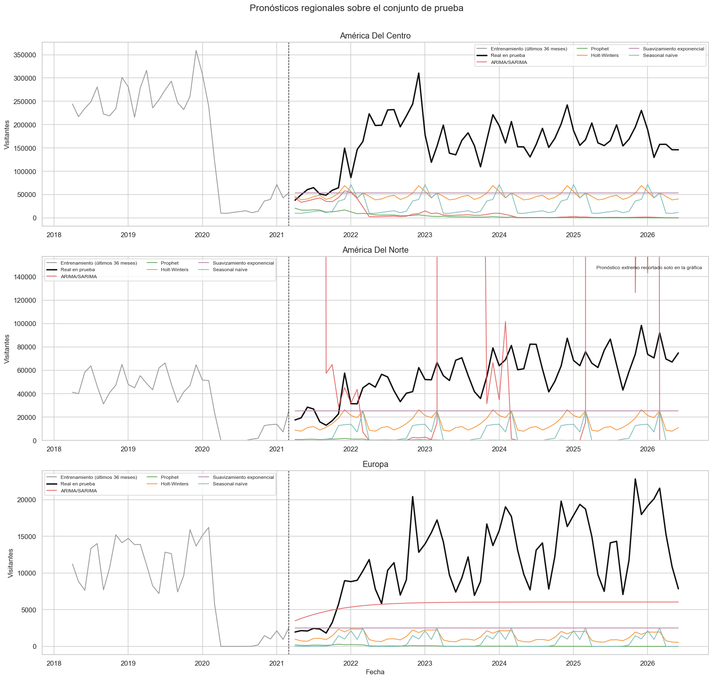

# Análisis de series de tiempo por regiones geográficas

## 1. Introducción

Este informe presenta el análisis de las tres regiones geográficas con mayor volumen acumulado de visitantes internacionales a Guatemala:

- América Del Centro
- América Del Norte
- Europa

Las regiones fueron seleccionadas de acuerdo con el total acumulado de todo el período disponible, no a partir de un año particular. Para mantener comparabilidad temporal se consideraron únicamente las categorías Turista y Excursionista. La categoría Viajero presenta un cambio metodológico desde 2023 y los cruceristas dejaron de registrarse en esta fuente a partir de ese año, por lo que incluirlos habría introducido cambios de medición ajenos al comportamiento turístico.

El período completo comprende enero de 2009 a junio de 2026. La división se realizó respetando el orden temporal, con el 70 % inicial para entrenamiento y el 30 % final para prueba. De esta manera no se utilizó información futura para estimar los modelos.

## 2. Cobertura de las series

**Tabla 1. Cobertura temporal de las series regionales**

| Región | Inicio de entrenamiento | Fin de entrenamiento | Inicio de prueba | Fin de prueba | Frecuencia | Meses de entrenamiento | Meses de prueba | Meses faltantes |
|---|---:|---:|---:|---:|---|---:|---:|---:|
| América Del Centro | 2009-01 | 2021-03 | 2021-04 | 2026-06 | Mensual | 147 | 63 | 0 |
| América Del Norte | 2009-01 | 2021-03 | 2021-04 | 2026-06 | Mensual | 147 | 63 | 0 |
| Europa | 2009-01 | 2021-03 | 2021-04 | 2026-06 | Mensual | 147 | 63 | 0 |

La Tabla 1 muestra que las tres series tienen la misma cobertura, frecuencia mensual y ausencia de meses faltantes. Esta estructura permite realizar comparaciones directas entre regiones. El conjunto de entrenamiento termina en marzo de 2021 y el de prueba comienza en abril de 2021, por lo que una parte considerable de la recuperación posterior a la pandemia queda fuera del período utilizado para ajustar los modelos.

**Figura 1. Comportamiento mensual de las tres regiones geográficas**

La Figura 1 muestra un crecimiento sostenido antes de 2020, oscilaciones que se repiten dentro de cada año y una caída extraordinaria desde marzo de 2020. La línea suavizada corresponde a la media móvil de doce meses. Esta media permite observar el cambio de nivel de largo plazo sin que las variaciones mensuales oculten la tendencia.

América Del Centro presenta el mayor volumen y una fuerte relación con el ingreso terrestre. América Del Norte y Europa tienen menores niveles, pero una mayor dependencia de la conectividad aérea. En las tres series la caída de 2020 representa una ruptura estructural y no una fluctuación estacional normal.

## 3. Descomposición de las series

Las series se descompusieron en cuatro elementos:

- Serie observada
- Tendencia
- Estacionalidad anual
- Residuo

Se utilizó una periodicidad de doce meses. La fuerza de tendencia y la fuerza de estacionalidad toman valores entre cero y uno. Un valor alto indica que el componente explica una proporción importante de la variación frente al residuo.

**Tabla 2. Fuerza de los componentes durante el período de entrenamiento**

| Región | Fuerza de tendencia | Fuerza de estacionalidad | Mes estacional máximo | Mes estacional mínimo |
|---|---:|---:|---:|---:|
| América Del Centro | 0.77 | 0.36 | Diciembre | Septiembre |
| América Del Norte | 0.64 | 0.57 | Diciembre | Septiembre |
| Europa | 0.81 | 0.76 | Febrero | Junio |

La Tabla 2 indica que Europa presenta la mayor fuerza de tendencia, con 0.81, y la mayor fuerza estacional dentro del entrenamiento, con 0.76. América Del Centro también tiene una tendencia importante, pero su patrón estacional aparece menos regular debido a la magnitud del choque ocurrido en 2020. América Del Norte ocupa una posición intermedia.

El mes estacional más fuerte para América Del Centro y América Del Norte es diciembre, mientras que el valor mínimo se observa en septiembre. Europa alcanza su componente estacional máximo en febrero y el mínimo en junio.

**Figura 2. Descomposición de América Del Centro**

En América Del Centro se observa un crecimiento pronunciado antes de 2020. La caída pandémica se refleja principalmente en la tendencia y en el residuo, porque no corresponde a una variación que se repita cada año.

**Figura 3. Descomposición de América Del Norte**

América Del Norte presenta una tendencia creciente más moderada y un ciclo anual más claro que América Del Centro. El residuo aumenta de forma considerable durante la ruptura de 2020.

**Figura 4. Descomposición de Europa**

Europa muestra el patrón estacional más regular dentro del entrenamiento y una tendencia claramente cambiante. Al igual que en las otras regiones, la pandemia produce una desviación que no puede explicarse mediante la estacionalidad normal.

## 4. Estacionariedad en varianza y transformación

Una serie estacionaria en varianza mantiene una dispersión aproximadamente constante en el tiempo. Para estudiar esta condición se comparó la media móvil con la desviación estándar móvil, se calculó el coeficiente de variación de cada mitad del entrenamiento y se estimó el parámetro de Box-Cox.

**Tabla 3. Diagnóstico de estabilidad de la varianza**

| Región | Correlación entre media y desviación móvil | Lambda Box-Cox | CV primera mitad | CV segunda mitad | Escala utilizada para modelar |
|---|---:|---:|---:|---:|---|
| América Del Centro | 0.15 | 0.88 | 0.24 | 0.46 | log(1+x) |
| América Del Norte | -0.34 | 1.53 | 0.22 | 0.45 | log(1+x) |
| Europa | -0.23 | 1.68 | 0.23 | 0.49 | log(1+x) |

La relación entre la media y la desviación móvil es débil. Además, los parámetros de Box-Cox no se aproximan a cero. Por ello no existe evidencia suficiente para afirmar que la transformación logarítmica sea estrictamente necesaria para estabilizar la varianza.

Sin embargo, los coeficientes de variación son claramente mayores en la segunda mitad, principalmente por la ruptura de 2020. Se utilizó la transformación log(1+x) como decisión conservadora de modelado, porque reduce la influencia de los valores extremos, representa cambios relativos y permite regresar a una escala no negativa. Esta decisión no equivale a afirmar que la varianza obligaba a transformar.

**Figura 5. Comparación entre las series originales y la transformación logarítmica**

La Figura 5 permite observar que la transformación comprime las diferencias de escala y reduce el dominio visual de los valores más altos. La ruptura pandémica sigue siendo visible, pero su magnitud relativa resulta más manejable para el ajuste estadístico.

## 5. Estacionariedad en media

La estacionariedad en media implica que el nivel esperado de la serie no cambia sistemáticamente con el tiempo. Se utilizaron dos fuentes de evidencia:

1. La función de autocorrelación, que permite observar si la dependencia con los valores anteriores desaparece rápidamente o permanece durante varios rezagos.
2. La prueba Dickey-Fuller aumentada, cuya hipótesis nula establece que existe una raíz unitaria. Un valor p menor que 0.05 permite rechazar esa hipótesis.

**Tabla 4. Resultados principales de la prueba Dickey-Fuller aumentada**

| Región | p en nivel | p en log(1+x) | p con primera diferencia | p con diferencia estacional | p con ambas diferencias | d | D |
|---|---:|---:|---:|---:|---:|---:|---:|
| América Del Centro | 0.21 | 0.20 | 0.04 | 0.97 | <0.001 | 1 | 1 |
| América Del Norte | 0.01 | 0.16 | 0.05 | 0.94 | <0.001 | 1 | 1 |
| Europa | 0.12 | 0.28 | 0.11 | <0.001 | <0.001 | 0 | 1 |

Las decisiones se tomaron sobre la escala log(1+x), que es la utilizada en los modelos. Aunque América Del Norte presenta un valor p bajo en la escala original, deja de rechazar la raíz unitaria después de aplicar el logaritmo. Por esta razón se estudió la diferenciación sobre la escala transformada.

**Tabla 5. Persistencia de la autocorrelación y diferenciación aplicada**

| Región | ACF rezago 1 | ACF rezago 3 | ACF rezago 6 | p de ADF en log-nivel | d | D | p después de diferenciar |
|---|---:|---:|---:|---:|---:|---:|---:|
| América Del Centro | 0.88 | 0.67 | 0.35 | 0.20 | 1 | 1 | <0.001 |
| América Del Norte | 0.85 | 0.51 | 0.09 | 0.16 | 1 | 1 | <0.001 |
| Europa | 0.89 | 0.58 | 0.17 | 0.28 | 0 | 1 | <0.001 |

### 5.1 América Del Centro

La autocorrelación comienza en 0.88 en el primer rezago y disminuye gradualmente hasta 0.35 en el sexto. Esta persistencia indica que el nivel de cada mes depende fuertemente de los meses anteriores y que la media no permanece constante. El valor p de 0.20 en el log-nivel confirma que no se puede rechazar la raíz unitaria.

Una primera diferencia ordinaria reduce el valor p a 0.04, por lo que resulta suficiente para obtener estacionariedad en media. También se utilizó una diferencia estacional de doce meses para eliminar el patrón anual. En consecuencia se evaluaron modelos con d igual a uno y D igual a uno.

### 5.2 América Del Norte

La autocorrelación del primer rezago es 0.85 y disminuye a través de los siguientes rezagos. Este comportamiento muestra persistencia temporal. El valor p del log-nivel es 0.16 y no permite rechazar la raíz unitaria.

La primera diferencia se encuentra aproximadamente en el límite de 0.05. La combinación de una diferencia ordinaria y una diferencia estacional rechaza claramente la raíz unitaria. Por ello se utilizaron d igual a uno y D igual a uno.

### 5.3 Europa

Europa presenta una autocorrelación de 0.89 en el primer rezago y una disminución gradual. El valor p del log-nivel es 0.28. Una primera diferencia ordinaria todavía produce un valor p de 0.11, por lo que esa transformación no es suficiente.

La diferencia estacional de doce meses produce un valor p menor que 0.001. Por tanto, Europa necesita D igual a uno, pero no una diferencia ordinaria adicional. El valor de d seleccionado fue cero.

**Figura 6. ACF en nivel, ACF transformada y PACF transformada**

La primera columna de la Figura 6 muestra la ACF del log-nivel. Las autocorrelaciones iniciales altas y su disminución gradual aportan evidencia visual de una media cambiante. La segunda y tercera columnas muestran la ACF y PACF después de diferenciar. La persistencia prolongada desaparece y los valores p de ADF quedan por debajo de 0.05.

## 6. Selección de los modelos ARIMA y SARIMA

Los valores de p y q se exploraron entre cero y dos. Los primeros rezagos de ACF y PACF justificaron usar órdenes pequeños y parsimoniosos. También se evaluaron términos estacionales con periodicidad doce.

Los modelos se compararon utilizando AIC, BIC y la prueba de Ljung-Box sobre los residuos. AIC y BIC favorecen un buen ajuste con penalización por complejidad. Para Ljung-Box, un valor p superior a 0.05 indica que no existe evidencia de autocorrelación residual significativa en el rezago evaluado.

**Tabla 6. Modelos ARIMA o SARIMA seleccionados con el conjunto de entrenamiento**

| Región | Modelo seleccionado | AIC | BIC | p de Ljung-Box en rezago 12 | Convergió |
|---|---|---:|---:|---:|---|
| América Del Centro | SARIMA(1,1,1)(1,1,0)[12] | 50.59 | 61.78 | 0.84 | Sí |
| América Del Norte | SARIMA(1,1,1)(1,1,0)[12] | 382.00 | 393.18 | 0.75 | Sí |
| Europa | ARIMA(1,0,1) | 360.86 | 372.76 | 0.87 | Sí |

Para América Del Centro se seleccionó SARIMA(1,1,1)(1,1,0)[12]. Su valor p de Ljung-Box fue 0.84, por lo que los residuos no mostraron dependencia serial significativa.

En América Del Norte se seleccionó la misma estructura estacional. El valor p de Ljung-Box fue 0.75. No obstante, durante la evaluación fuera de muestra el modelo produjo una trayectoria explosiva. Este resultado demuestra que buenos diagnósticos dentro del entrenamiento no garantizan estabilidad en un horizonte largo que contiene un cambio estructural.

Para Europa se eligió ARIMA(1,0,1). Algunos candidatos estacionales presentaron menores valores de BIC, pero conservaron autocorrelación residual significativa. El modelo ARIMA seleccionado alcanzó un valor p de Ljung-Box de 0.87 y produjo el mejor desempeño predictivo para esta región.

**Figura 7. Diagnóstico de los residuos de los modelos seleccionados**

La Figura 7 muestra la trayectoria temporal, la autocorrelación y la distribución de los residuos. Los valores de Ljung-Box superiores a 0.05 respaldan que los modelos seleccionados no dejan una estructura temporal clara sin explicar dentro del entrenamiento.

## 7. Comparación de métodos y predicción

Para cada región se compararon cinco enfoques:

- Mejor ARIMA o SARIMA seleccionado con entrenamiento
- Prophet
- Holt-Winters con tendencia amortiguada y estacionalidad anual
- Suavizamiento exponencial simple
- Seasonal naïve

La comparación fuera de muestra se realizó con MAE y RMSE. MAE representa el error absoluto promedio en número de visitantes. RMSE penaliza más fuertemente los errores grandes.

Los valores AIC y BIC se presentan únicamente para ARIMA o SARIMA. No es correcto utilizarlos para ordenar todos los algoritmos porque Prophet, Holt-Winters, suavizamiento exponencial y seasonal naïve no comparten la misma función de verosimilitud ni la misma parametrización.

**Tabla 7. Comparación de modelos sobre el conjunto de prueba**

| Región | Modelo | MAE | RMSE | AIC | BIC | Posición por RMSE |
|---|---|---:|---:|---:|---:|---:|
| América Del Centro | Suavizamiento exponencial | 108,285 | 120,341 | — | — | 1 |
| América Del Centro | Holt-Winters | 113,415 | 124,214 | — | — | 2 |
| América Del Centro | Seasonal naïve | 134,400 | 144,899 | — | — | 3 |
| América Del Centro | ARIMA/SARIMA | 150,584 | 163,920 | 50.59 | 61.78 | 4 |
| América Del Centro | Prophet | 156,597 | 166,857 | — | — | 5 |
| América Del Norte | Suavizamiento exponencial | 32,194 | 36,725 | — | — | 1 |
| América Del Norte | Holt-Winters | 40,797 | 44,976 | — | — | 2 |
| América Del Norte | Seasonal naïve | 49,974 | 53,533 | — | — | 3 |
| América Del Norte | Prophet | 55,626 | 59,244 | — | — | 4 |
| América Del Norte | ARIMA/SARIMA | 5.69 × 10²² | 2.63 × 10²³ | 382.00 | 393.18 | 5 |
| Europa | ARIMA/SARIMA | 6,420 | 7,824 | 360.86 | 372.76 | 1 |
| Europa | Suavizamiento exponencial | 9,292 | 10,695 | — | — | 2 |
| Europa | Holt-Winters | 10,378 | 11,563 | — | — | 3 |
| Europa | Seasonal naïve | 11,076 | 12,135 | — | — | 4 |
| Europa | Prophet | 11,676 | 12,887 | — | — | 5 |

**Tabla 8. Mejor modelo predictivo de cada región**

| Región | Mejor modelo | MAE | RMSE |
|---|---|---:|---:|
| América Del Centro | Suavizamiento exponencial | 108,285 | 120,341 |
| América Del Norte | Suavizamiento exponencial | 32,194 | 36,725 |
| Europa | ARIMA(1,0,1) | 6,420 | 7,824 |

El suavizamiento exponencial simple obtuvo los menores errores para América Del Centro y América Del Norte. Su ventaja se explica por el contexto del corte temporal. El entrenamiento termina cerca del período de menor actividad y el conjunto de prueba contiene una recuperación con un nivel distinto. Los modelos con tendencias y componentes más complejos extrapolaron patrones que no representaron adecuadamente la reapertura.

En Europa, ARIMA(1,0,1) obtuvo el menor MAE y RMSE. El modelo capturó mejor la dependencia de corto plazo sin producir la inestabilidad observada en el SARIMA de América Del Norte.

**Figura 8. Pronósticos sobre el conjunto de prueba**

La Figura 8 compara los valores reales con los pronósticos. En América Del Norte la proyección SARIMA excede ampliamente la escala de los datos y fue recortada únicamente en la visualización para conservar la legibilidad. Las métricas de la Tabla 7 se calcularon con los valores completos, sin recorte.

No existe un modelo universalmente superior para todas las regiones. El mejor método depende de la escala, del comportamiento histórico y de la forma en que cada región respondió a la ruptura de 2020.

## 8. Comparación estadística entre regiones

La fuerza estacional, el crecimiento y la volatilidad se estimaron con el período enero de 2009 a diciembre de 2019. Esta decisión evita que la pandemia distorsione las características estructurales. El impacto se calculó comparando 2020 con 2019 y la recuperación comparando 2024 con 2019.

**Tabla 9. Comparación de estacionalidad, crecimiento, volatilidad e impacto pandémico**

| Región | Fuerza estacional pre-2020 | Crecimiento anual compuesto 2009-2019 | Volatilidad interanual pre-2020 | Impacto 2020 frente a 2019 | Recuperación 2024 frente a 2019 |
|---|---:|---:|---:|---:|---:|
| América Del Centro | 0.69 | 9.83 % | 14.49 % | -74.43 % | -34.87 % |
| América Del Norte | 0.89 | 3.81 % | 11.98 % | -74.14 % | 33.56 % |
| Europa | 0.88 | 2.33 % | 12.74 % | -71.83 % | 17.98 % |

### 8.1 Región con mayor estacionalidad

América Del Norte presenta la mayor fuerza estacional antes de la pandemia, con 0.89. Europa se encuentra muy cerca, con 0.88. América Del Centro alcanza 0.69. Estos valores difieren de la Tabla 2 porque la Tabla 9 excluye la ruptura de 2020 y representa mejor el comportamiento estacional normal.

### 8.2 Región con mayor tendencia de crecimiento

América Del Centro presenta el mayor crecimiento anual compuesto entre 2009 y 2019, con 9.83 %. América Del Norte creció 3.81 % y Europa 2.33 %. Por tanto, América Del Centro era el mercado regional con la expansión más acelerada antes de la pandemia.

### 8.3 Región con mayor volatilidad

América Del Centro también presenta la mayor volatilidad interanual antes de 2020, con una desviación de 14.49 %. Europa registra 12.74 % y América Del Norte 11.98 %. El crecimiento más rápido de Centroamérica estuvo acompañado por variaciones relativas más amplias.

### 8.4 Región más afectada por la pandemia

América Del Centro fue la más afectada, con una caída de 74.43 % entre 2019 y 2020. América Del Norte disminuyó 74.14 % y Europa 71.83 %. Las diferencias son pequeñas, lo que confirma que el choque fue generalizado.

La recuperación posterior no fue uniforme. En 2024 América Del Norte superó su nivel de 2019 en 33.56 % y Europa lo superó en 17.98 %. América Del Centro permaneció 34.87 % por debajo. Esta última comparación puede estar influida por cambios en la medición y en la composición de los movimientos terrestres, por lo que debe interpretarse junto con la definición consistente de visitantes utilizada en el análisis.

## 9. Hallazgos útiles para la toma de decisiones

1. **La conectividad debe planificarse por región.** América Del Centro depende principalmente de accesos terrestres, mientras que América Del Norte y Europa requieren capacidad aérea y coordinación con aerolíneas.

2. **La estacionalidad permite anticipar recursos.** Los meses de mayor actividad pueden utilizarse para planificar personal, señalización, transporte y capacidad en los puntos de entrada. Los meses de menor actividad son adecuados para mantenimiento y campañas que reduzcan la concentración estacional.

3. **La recuperación debe compararse con 2019.** Una tasa de crecimiento alta después de 2020 puede representar únicamente un rebote desde una base muy baja. El nivel de 2019 ofrece una referencia más útil para evaluar recuperación real.

4. **Los modelos deben reentrenarse periódicamente.** La recuperación modificó los niveles históricos y algunos modelos ajustados cerca de la pandemia produjeron pronósticos inestables. El caso de América Del Norte demuestra que los diagnósticos internos deben complementarse con evaluación fuera de muestra.

5. **MAE y RMSE responden a necesidades distintas.** MAE aproxima el error operativo promedio, mientras que RMSE identifica modelos vulnerables a errores excepcionalmente grandes. Ambas métricas deben monitorearse.

6. **No debe imponerse el mismo modelo a todas las regiones.** El suavizamiento exponencial funcionó mejor para América Del Centro y América Del Norte, mientras que ARIMA funcionó mejor para Europa.

7. **La promoción puede priorizar mercados con comportamientos diferentes.** América Del Centro mostró el mayor crecimiento antes de la pandemia, pero también la mayor volatilidad y la recuperación más débil frente a 2019. América Del Norte y Europa superaron sus niveles de referencia en 2024.

## 10. Conclusiones

Las tres series regionales presentan tendencia, estacionalidad anual, dependencia temporal y una ruptura profunda durante la pandemia. Por ello no podían analizarse como fluctuaciones alrededor de una media constante.

La ACF y la prueba Dickey-Fuller aumentada mostraron que América Del Centro y América Del Norte requerían una diferencia ordinaria y una diferencia estacional. Europa alcanzó estacionariedad mediante la diferencia estacional, sin requerir una diferencia ordinaria adicional.

Los modelos SARIMA seleccionados para América Del Centro y América Del Norte presentaron residuos adecuados dentro del entrenamiento. Sin embargo, el modelo norteamericano generó un pronóstico explosivo en la prueba, demostrando la importancia de validar fuera de muestra. El suavizamiento exponencial simple fue finalmente el mejor método para América Del Centro y América Del Norte. ARIMA(1,0,1) fue el mejor para Europa.

En términos comparativos, América Del Norte presentó la estacionalidad más fuerte antes de 2020. América Del Centro mostró el mayor crecimiento, la mayor volatilidad y la mayor caída durante la pandemia. En 2024, América Del Norte y Europa habían superado sus niveles de 2019, mientras que América Del Centro todavía se encontraba por debajo.

Los resultados respaldan una planificación turística diferenciada por región, el seguimiento de la recuperación frente a niveles prepandemia y la actualización frecuente de los modelos conforme se incorporen nuevos datos.

## Anexo A. Candidatos ARIMA y SARIMA evaluados

**Tabla A1. Comparación de candidatos para América Del Centro**

| Modelo | AIC | BIC | p de Ljung-Box |
|---|---:|---:|---:|
| SARIMA(1,1,1)(1,1,0)[12] | 50.59 | 61.78 | 0.84 |
| SARIMA(0,1,1)(0,1,1)[12] | 58.69 | 67.05 | <0.01 |
| SARIMA(1,1,1)(0,1,1)[12] | 60.62 | 71.77 | <0.01 |
| SARIMA(2,1,1)(0,1,1)[12] | 61.79 | 75.73 | <0.01 |
| SARIMA(1,1,2)(0,1,1)[12] | 63.08 | 76.97 | <0.01 |
| ARIMA(0,1,1) | 83.48 | 89.42 | 1.00 |
| ARIMA(1,1,0) | 83.82 | 89.78 | 1.00 |
| ARIMA(1,1,1) | 84.89 | 93.79 | 0.98 |
| ARIMA(2,1,1) | 83.40 | 95.28 | 0.98 |

**Tabla A2. Comparación de candidatos para América Del Norte**

| Modelo | AIC | BIC | p de Ljung-Box |
|---|---:|---:|---:|
| SARIMA(1,1,2)(0,1,1)[12] | 373.44 | 387.33 | 0.01 |
| SARIMA(0,1,1)(0,1,1)[12] | 381.90 | 390.26 | 0.04 |
| SARIMA(2,1,1)(0,1,1)[12] | 377.16 | 391.10 | 0.01 |
| SARIMA(1,1,1)(1,1,0)[12] | 382.00 | 393.18 | 0.75 |
| SARIMA(1,1,1)(0,1,1)[12] | 383.44 | 394.59 | 0.02 |
| ARIMA(0,1,1) | 433.63 | 439.57 | 0.44 |
| ARIMA(1,1,0) | 435.59 | 441.55 | 0.45 |
| ARIMA(1,1,1) | 435.41 | 444.32 | 0.35 |
| ARIMA(2,1,1) | 433.05 | 444.93 | 0.18 |

**Tabla A3. Comparación de candidatos para Europa**

| Modelo | AIC | BIC | p de Ljung-Box |
|---|---:|---:|---:|
| SARIMA(1,0,1)(0,1,1)[12] | 313.84 | 325.02 | <0.01 |
| SARIMA(1,0,1)(1,1,0)[12] | 315.61 | 326.83 | <0.01 |
| SARIMA(2,0,1)(0,1,1)[12] | 313.18 | 327.16 | 0.02 |
| SARIMA(1,0,2)(0,1,1)[12] | 313.64 | 327.58 | <0.01 |
| ARIMA(1,0,1) | 360.86 | 372.76 | 0.87 |
| ARIMA(2,0,1) | 359.80 | 374.68 | 0.20 |
| ARIMA(1,0,0) | 366.63 | 375.58 | 0.71 |
| SARIMA(0,0,1)(0,1,1)[12] | 418.43 | 426.81 | <0.01 |
| ARIMA(0,0,1) | 471.67 | 480.60 | <0.01 |

Los candidatos de los anexos convergieron correctamente. La selección no se basó únicamente en el menor BIC. También se exigió que los residuos no conservaran autocorrelación significativa. Esta condición explica por qué algunos modelos con BIC menor fueron descartados.
