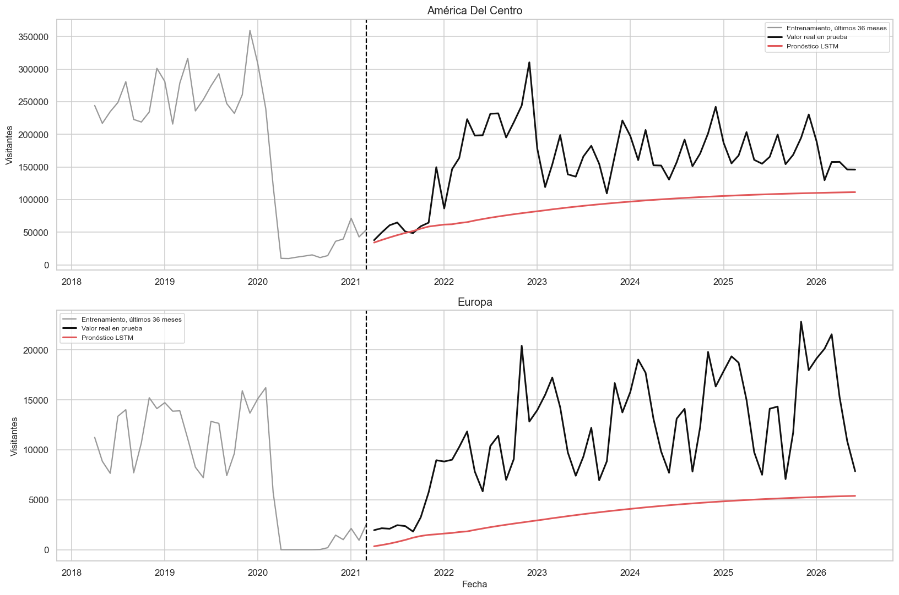
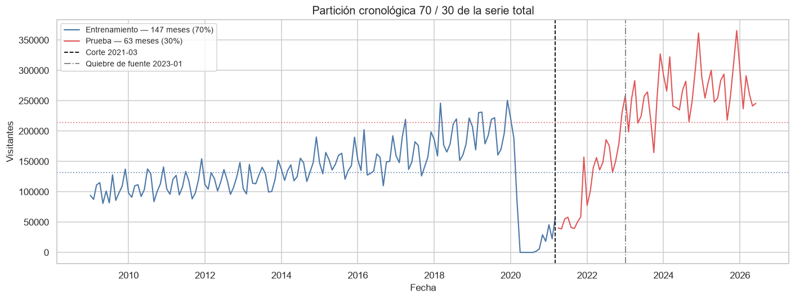
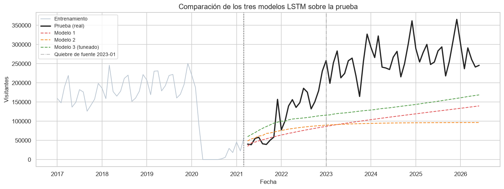
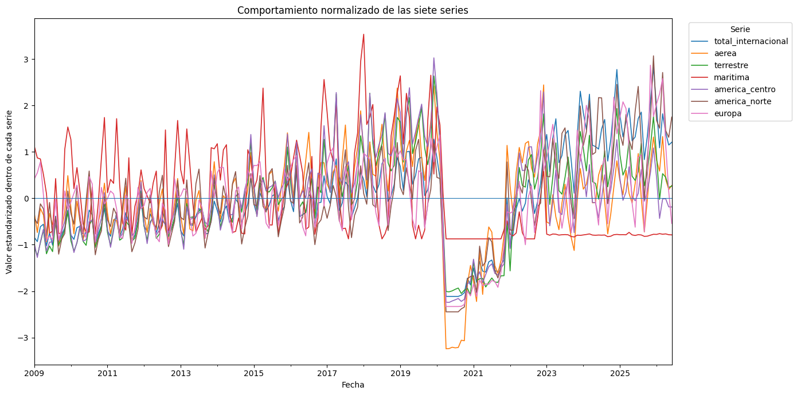
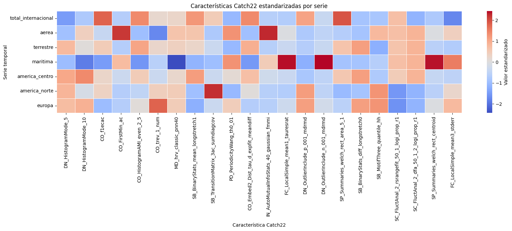
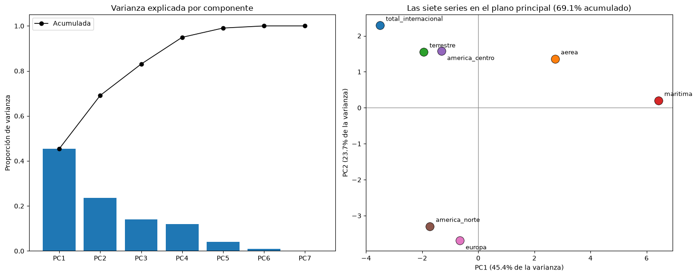
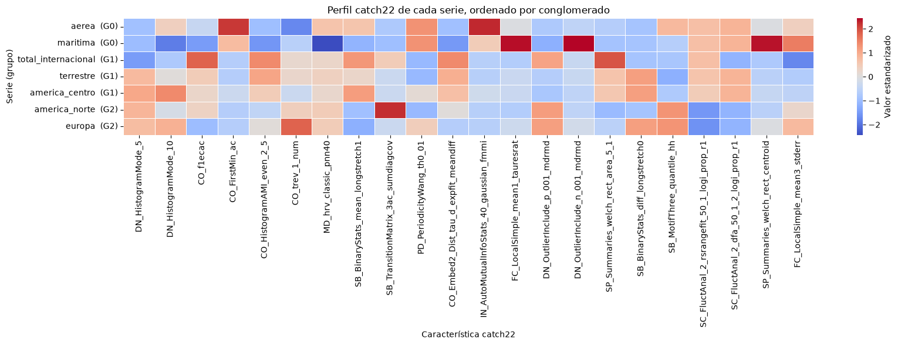
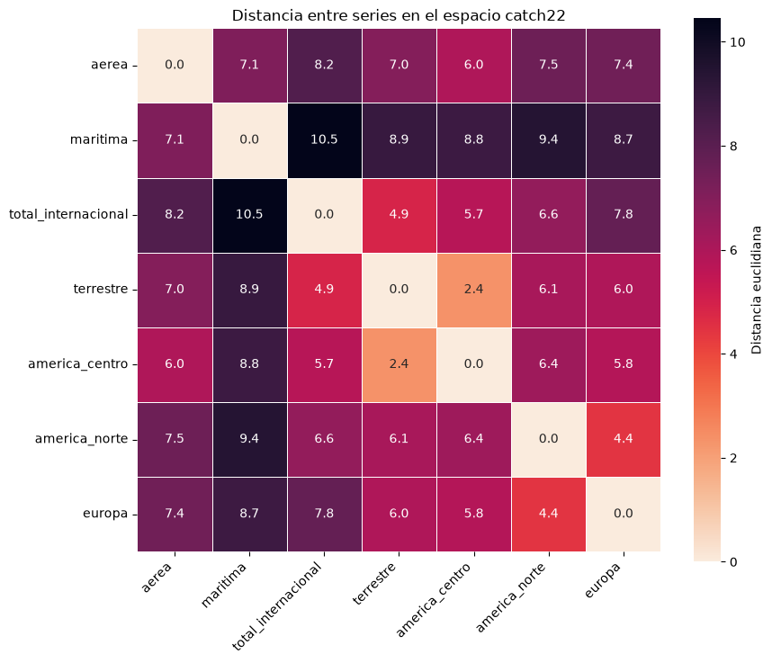
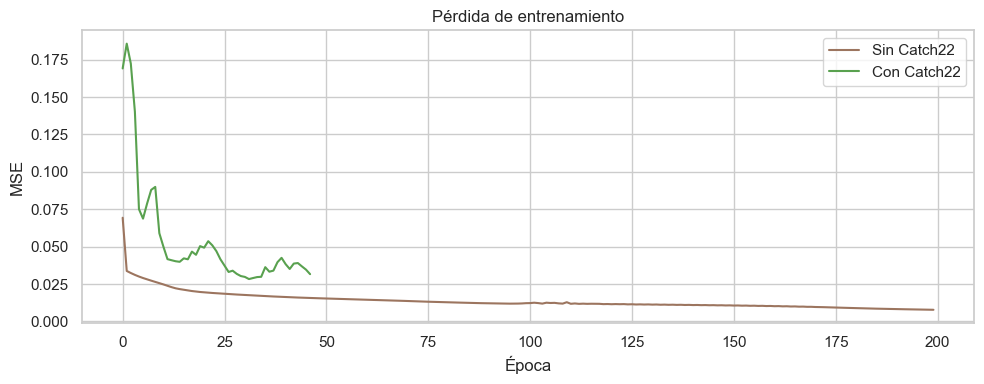
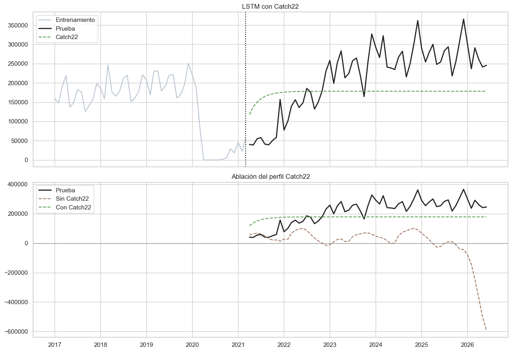

# Informe narrativo — Laboratorio 2: Deep Learning y Catch22

> **Universidad del Valle de Guatemnala**

> VIANKA CASTRO -23201
> SEBASTIÁN GARCÍA -22291
> RICARDO GODÍNEZ -23247

Este documento recorre, en el orden en que se trabajaron, los cinco notebooks
de `L02_DL_series/notebooks/`. La idea es contar la historia completa del
laboratorio de principio a fin: primero el Ejercicio 1 (modelar con LSTM las
series ya construidas en el Laboratorio 1 y compararlas contra los modelos
clásicos), y después el Ejercicio 2 (caracterizar esas mismas series con
Catch22, agruparlas por similitud, e incorporar esas características a un
nuevo modelo LSTM). En su mayoría se reutiliza el texto que el propio equipo
escribió en las celdas markdown de cada notebook.

---

## Notebook 01 — `01_lstm_series_geograficas.ipynb`

Este notebook arranca retomando, a modo de referencia, el análisis completo
del Laboratorio 1: calidad de datos, comportamiento temporal, composición
geográfica, vías y fronteras de ingreso, y el ajuste de modelos clásicos
(ARIMA/SARIMA, Prophet, Holt-Winters, suavizamiento exponencial simple y
seasonal naïve) sobre las tres vías de ingreso y las tres regiones con mayor
volumen. Esa parte queda explícitamente marcada como "laboratorio anterior
para comparación" y no se desarrolla aquí en detalle — lo que interesa
narrar es lo que viene después, que es el trabajo nuevo del Laboratorio 2.

### Ejercicio 1 — Modelos LSTM

> Se seleccionan las series de América Del Centro y Europa. La primera
> representa la región con mayor volumen, crecimiento y volatilidad antes de
> la pandemia. Europa permite contrastar el desempeño de LSTM con la región
> donde ARIMA había obtenido el mejor resultado en el análisis anterior.
>
> La comparación conserva exactamente la división cronológica utilizada
> anteriormente: enero de 2009 a marzo de 2021 para entrenamiento y abril de
> 2021 a junio de 2026 para prueba.

**1.1 — Conjuntos de entrenamiento y prueba.**

> El conjunto de prueba permanece completamente aislado durante el tuneo.
> Los últimos 24 meses del entrenamiento se emplean como validación
> cronológica. Esta validación incluye el comienzo de la pandemia y permite
> seleccionar parámetros sin consultar los 63 meses de prueba.
>
> La partición no se realiza de forma aleatoria, porque mezclar meses
> pasados y futuros produciría fuga de información. El escalador también se
> ajusta únicamente con la porción utilizada para entrenar cada modelo.

**1.2 — Configuraciones y tuneo de parámetros.**

> Se evalúan cuatro configuraciones por región. El tuneo modifica la
> longitud de la ventana, el número de unidades, la profundidad de la red,
> dropout, tasa de aprendizaje y tamaño de lote.
>
> Cada observación de entrada contiene únicamente meses anteriores. La
> salida corresponde al siguiente mes. Durante la validación, el pronóstico
> se genera recursivamente para reproducir el uso real del modelo en un
> horizonte de varios meses.

El criterio detrás de cada hiperparámetro quedó documentado así:

> - **Ventanas de 12 y 24 meses.** Una ventana de 12 meses permite que la
>   red observe un ciclo anual completo. La ventana de 24 meses permite
>   comparar el comportamiento de dos ciclos, aunque reduce la cantidad de
>   ejemplos disponibles para entrenar.
> - **32 y 64 unidades LSTM.** Treinta y dos unidades representan un modelo
>   relativamente pequeño. Sesenta y cuatro unidades aumentan la capacidad
>   para aprender relaciones más complejas, pero también incrementan el
>   riesgo de sobreajuste.
> - **Una y dos capas.** Una capa ofrece una arquitectura sencilla. Dos
>   capas permiten aprender representaciones temporales más profundas,
>   aunque requieren regularización y más datos.
> - **Dropout entre 0.00 y 0.30.** Su objetivo es reducir el sobreajuste,
>   especialmente en las configuraciones con más unidades o capas.
> - **Learning rate de 0.0010 y 0.0005.** El valor 0.0010 permite una
>   actualización moderada de los pesos. El valor 0.0005 se utiliza en la
>   arquitectura más profunda para actualizaciones más pequeñas y estables.
> - **Batch de 8 y 16.** Se utilizaron lotes pequeños porque el conjunto
>   contiene solamente 147 meses de entrenamiento.
>
> El espacio de búsqueda se mantuvo deliberadamente pequeño. Probar
> demasiadas combinaciones con una serie corta puede terminar ajustando los
> parámetros al período de validación en lugar de identificar una
> estructura que se generalice.
>
> Los últimos 24 meses del conjunto de entrenamiento se reservaron como
> validación cronológica. Para cada configuración se pronosticaron esos 24
> meses de forma recursiva. El modelo con menor RMSE de validación fue
> seleccionado para cada región.

El resultado del tuneo: **América del Centro** eligió la configuración
LSTM-C (ventana 12, 32 unidades, 2 capas, dropout 0.20, lr 0.0010, batch 8,
RMSE de validación ≈ 116,282) y **Europa** eligió LSTM-A (ventana 12, 32
unidades, 1 capa, dropout 0.00, lr 0.0010, batch 8, RMSE de validación ≈
5,737).

**1.3 — Predicción con los mejores modelos.**

> Después del tuneo, cada arquitectura seleccionada se reentrena con los
> 147 meses del conjunto de entrenamiento. Se utiliza el número de épocas
> que produjo la menor pérdida de validación, con un mínimo fijo de cinco
> épocas para evitar un ajuste insuficiente al incorporar todo el
> entrenamiento. Esta regla se establece antes de consultar la prueba. La
> predicción de los 63 meses de prueba se realiza de forma recursiva, es
> decir, cada pronóstico se incorpora a la ventana utilizada para predecir
> el mes siguiente.

**1.4 — Comparación y respuestas.**

> La comparación con el laboratorio anterior se realiza dentro de cada
> serie y sobre el mismo conjunto de prueba. Se utilizan MAE y RMSE en
> unidades originales. Para decidir cuál serie fue predicha mejor se
> utiliza nRMSE y sMAPE, porque los errores absolutos de regiones con
> escalas distintas no son directamente comparables.

| Región             | Modelo anterior           | MAE anterior | RMSE anterior | MAE LSTM  | RMSE LSTM | Mejora MAE  | Mejora RMSE |
| ------------------ | ------------------------- | ------------ | ------------- | --------- | --------- | ----------- | ----------- |
| América del Centro | Suavizamiento exponencial | 108,284.61   | 120,341.06    | 73,245.90 | 87,153.20 | **+32.36%** | **+27.58%** |
| Europa             | ARIMA(1,0,1)              | 6,420.06     | 7,823.86      | 8,185.98  | 9,371.32  | −27.51%     | −19.78%     |

| Región             | nRMSE  | sMAPE   | MASE estacional |
| ------------------ | ------ | ------- | --------------- |
| América del Centro | 54.11% | 53.82%  | 1.79            |
| Europa             | 79.88% | 103.88% | 4.70            |

Con esas métricas comparables entre escalas, América del Centro resultó la
serie predicha relativamente mejor por la LSTM. El criterio de decisión y su
matiz quedaron así:

> El mejor modelo LSTM de cada serie se selecciona con la validación interna
> y no con el conjunto de prueba. La comparación final utiliza exactamente
> los mismos meses de prueba y las mismas métricas del laboratorio anterior.
> Esta igualdad de condiciones permite atribuir la diferencia observada al
> método de modelado y no a un cambio en los datos evaluados.
>
> Un resultado inferior de LSTM no implica que las redes recurrentes sean
> inadecuadas en general. Estas series contienen únicamente 147 meses para
> entrenamiento y una ruptura estructural cerca del final. Las LSTM suelen
> beneficiarse de conjuntos más extensos y de variables externas, por
> ejemplo conectividad aérea, restricciones de movilidad, indicadores
> económicos y calendarios de eventos.

---

## Notebook 02 — `02_lstm_serie_total.ipynb`

Con el mismo enfoque del notebook anterior, pero ahora sobre la **serie
total internacional**, este notebook construye la serie desde cero a partir
de la base cruda y entrena tres configuraciones de LSTM distintas.

### 1. Carga de los datos y construcción de la serie

Antes de modelar se resuelven dos quiebres de comparabilidad de la fuente:

> Se aplican **dos** filtros, ambos por comparabilidad temporal y no por
> criterio conceptual. La fuente cambia de metodología en 2023 y sin estos
> filtros la serie mezclaría universos distintos:
>
> 1. **`Tipo de Viajero` ∈ {Turista, Excursionista}.** Se excluyen
>    `Cruceristas` (deja de reportarse desde 2023) y `Viajero` (se
>    reclasifica y pierde ~70% de nivel en 2023). Ninguno de los dos
>    quiebres corresponde a un cambio real del turismo.
> 2. **`País` ≠ `Guatemala`.** La etiqueta `Guatemala` (residentes que
>    reingresan al país) representa entre 34% y 48% del total hasta 2022 y
>    **desaparece por completo desde enero de 2023**, sin ser reabsorbida
>    por ninguna otra agrupación.

Con esos filtros aplicados, la serie mensual queda con 210 observaciones
(enero 2009 a junio 2026), reindexada a frecuencia mensual regular.

### 2. División 70–30 de los datos (en orden cronológico)

> Al tratarse de una serie de tiempo, la partición **no puede ser
> aleatoria**: se toma el 70% inicial de los meses para entrenamiento y el
> 30% final para prueba. Mezclar meses futuros en el entrenamiento
> produciría fuga de información y una evaluación optimista.

La partición resultó en 147 meses de entrenamiento y 63 de prueba, con la
particularidad de que la media del conjunto de prueba es notablemente más
alta que la de los últimos 12 meses de entrenamiento — el modelo tiene que
atravesar un cambio de régimen.

### 3. Preparación de la serie para LSTM

> A diferencia de un SARIMA, una LSTM no recibe la serie directamente: hay
> que convertirla en un problema de aprendizaje supervisado.
>
> 1. **Escalado.** Las compuertas de una LSTM usan activaciones
>    `sigmoid`/`tanh`, que saturan fuera de un rango acotado, así que
>    conviene llevar la serie a `[0, 1]` con `MinMaxScaler`. El escalador se
>    ajusta **solo con entrenamiento** — usar la prueba para ajustarlo sería
>    fuga de información.
> 2. **Ventanas deslizantes.** Cada observación de entrada `X` son los
>    `look_back` meses previos, y la salida `y` es el mes siguiente.
> 3. **Pronóstico recursivo.** Para evaluar sobre la prueba se replica lo
>    que hace `SARIMAX.get_forecast()`: se pronostica un paso, esa
>    predicción se realimenta como parte de la ventana de entrada, y así
>    sucesivamente hasta cubrir todo el horizonte. Ningún valor real de la
>    prueba se usa como entrada.

### 4-7. Los tres modelos

> **Modelo 1 — LSTM simple.** Configuración base: una sola capa LSTM de 50
> unidades, ventana de 12 meses (un ciclo estacional completo) y
> optimizador Adam con la tasa de aprendizaje por defecto.

> **Modelo 2 — LSTM apilada con regularización.** Deliberadamente distinta
> del Modelo 1 en varios ejes a la vez: dos capas LSTM apiladas (64 → 32
> unidades) más una capa densa oculta, `Dropout(0.2)` entre capas, ventana
> de 6 meses en vez de 12, y optimizador RMSprop con una tasa de
> aprendizaje menor.

> **Modelo 3 — tuneo automático con `keras_tuner`.** Los Modelos 1 y 2
> fueron dos configuraciones elegidas a mano. Aquí se automatiza la
> búsqueda sobre número de capas, unidades por capa, dropout, tasa de
> aprendizaje y tamaño de lote. La búsqueda no puede evaluarse contra el
> conjunto de prueba — eso sería la misma fuga que evitar mezclar meses
> futuros en el entrenamiento. En su lugar se separan los últimos 24 meses
> del entrenamiento como ventana de validación.

| Modelo                  | Configuración                       | look_back | MAE        | RMSE           | MAPE % |
| ----------------------- | ----------------------------------- | --------- | ---------- | -------------- | ------ |
| Modelo 1 — LSTM simple  | 1 capa (50u), Adam                  | 12        | 111,555.69 | **126,235.75** | 47.48  |
| Modelo 2 — LSTM apilada | 2 capas (64,32u) + dropout, RMSprop | 6         | 124,901.84 | 141,949.69     | 52.97  |
| Modelo 3 — tuneado      | dropout=0.2, lr=0.01, 1 capa (50u)  | 12        | —          | 140,243        | 54.7   |

### 8.1 Lectura de los resultados

> El **Modelo 1** (una sola capa LSTM de 50 unidades, `look_back`=12, Adam)
> es el mejor de los tres pese a ser la configuración más simple.
>
> El **Modelo 2** queda un 12.4% peor en RMSE. Con apenas ~135-141
> secuencias de entrenamiento disponibles, duplicar la profundidad y
> agregar regularización no ayuda — es el patrón clásico de
> sobre-parametrizar una serie corta.
>
> El resultado más informativo es el del **Modelo 3 (tuneado)**:
> `keras_tuner` evaluó 15 combinaciones y escogió una arquitectura casi
> idéntica a la del Modelo 1, pero con `dropout`=0.2 y una tasa de
> aprendizaje diez veces mayor. Esa combinación ganó en la ventana de
> validación interna, pero termina peor en la prueba real — prácticamente
> empatada con el Modelo 2 y por debajo de la configuración manual del
> Modelo 1. La búsqueda automática no es inmune a optimizar para el tramo
> de validación en lugar de generalizar: los últimos 24 meses de
> entrenamiento usados para puntuar los hiperparámetros caen justo sobre el
> quiebre de fuente de 2023, un tramo con una dinámica particular que no
> necesariamente representa el resto del horizonte de prueba.
>
> Entre las tres configuraciones evaluadas, la LSTM simple del Modelo 1 es
> la más adecuada para esta serie. Con una serie de apenas ~147
> observaciones de entrenamiento y un quiebre de metodología a la mitad del
> horizonte de prueba, un modelo de pocos parámetros — sea SARIMA o una
> LSTM de una sola capa — generaliza mejor que arquitecturas más grandes.

---

## Notebook 03 — `03_extraccion_catch22.ipynb`

Con el Ejercicio 1 cerrado, el laboratorio cambia de pregunta: en vez de
pronosticar, se busca **caracterizar y comparar** las series entre sí. Este
notebook es el punto de partida del Ejercicio 2 y responde los incisos
2.1–2.4.

### 1. Idea detrás de Catch22

> Catch22 significa **22 CAnonical Time-series CHaracteristics**. Su
> propósito es transformar una serie temporal completa en un vector corto
> de 22 medidas que resume propiedades dinámicas como autocorrelación,
> predictibilidad, distribución de valores, cambios sucesivos, valores
> atípicos y escalamiento de las fluctuaciones.
>
> Estas 22 características fueron seleccionadas de una biblioteca mucho
> mayor para obtener una representación informativa, poco redundante e
> interpretable, pero mucho más rápida de calcular. Gracias a esta
> representación, series con escalas y comportamientos diferentes pueden
> compararse dentro de un mismo espacio de características.

### 2. Definición de las siete series

> Se reutilizan las decisiones metodológicas del Laboratorio 1:
>
> - **Total internacional:** turistas y excursionistas, excluyendo
>   `País = Guatemala`.
> - **Aérea:** turistas y excursionistas por vía aérea.
> - **Terrestre:** turistas y excursionistas por vía terrestre.
> - **Marítima:** todos los tipos de viajero por vía marítima, según la
>   decisión tomada en L1.
> - **América del Centro, América del Norte y Europa:** turistas y
>   excursionistas clasificados mediante la columna `Región dos`.
>
> Todas las series deben compartir un calendario mensual de enero de 2009 a
> junio de 2026.

Tras cargarlas y validarlas (misma longitud, fechas consecutivas, sin
valores faltantes ni series constantes), así se ven las siete series una
vez normalizadas solo para comparar su forma:

### 4-5. Extracción y estandarización

> Se ejecuta catch22 una vez por serie. El resultado se organiza en una
> matriz donde cada fila representa una serie temporal y cada columna una
> característica.
>
> Las 22 características tienen rangos diferentes. Por ello se aplica
> `StandardScaler` a la matriz completa, columna por columna. La
> estandarización se realiza **después** de extraer catch22 y antes de
> cualquier PCA, clustering o análisis de distancias.

> El mapa de calor permite verificar visualmente que las siete series
> presentan perfiles diferentes. La interpretación formal de grupos,
> distancias y componentes principales corresponde al notebook posterior de
> agrupamiento.

### 6-7. Guardado y resultado

> Se guardan tres archivos: `series_mensuales.csv` (calendario común y las
> siete series), `catch22_features.csv` (matriz original de 7 × 22) y
> `catch22_features_scaled.csv` (matriz estandarizada de 7 × 22).
>
> Se construyeron siete series mensuales con 210 observaciones cada una.
> Para cada serie se calcularon exactamente 22 características catch22,
> produciendo una matriz de **7 filas × 22 columnas**. Los tres CSV
> quedaron listos para el análisis posterior de PCA, clustering,
> correlaciones y distancias.

---

## Notebook 04 — `04_agrupamiento_series.ipynb`

Con la matriz de características lista, este notebook es el corazón
analítico del Ejercicio 2: responde los incisos 2.5 a 2.13, combinando cinco
análisis comparativos con la interpretación de cada uno.

> **¿Qué series de tiempo se parecen entre sí cuando se las representa
> mediante sus 22 características catch22, y qué revela esa similitud que
> no era visible en el análisis exploratorio tradicional?**
>
> Todos los análisis comparativos de este notebook se realizan sobre la
> **matriz estandarizada** de 7 × 22. Usar la matriz sin escalar haría que
> las características con rangos más amplios dominaran las distancias y las
> componentes principales.

### Componentes principales

> El PCA proyecta la matriz estandarizada sobre un número reducido de
> componentes que concentran la mayor parte de la varianza. Con siete
> series y veintidós características hay más variables que observaciones,
> por lo que el número máximo de componentes con varianza no nula es
> **seis**.

> Podemos ver que para el eje horizontal (que es el PC1) que es la que nos
> ayuda a ver que tan bien se porta la serie. En la derecha podemos ver las
> series que se portan de manera más fluctuante, como lo es la vía
> marítima que gracias al laboratorio pasado pudimos ver que era la vía de
> entrada con más matices y un frenado. Luego la vía aérea se ve que no es
> tan sencilla de predecir pero eso lo atribuimos a que fue la vía que más
> se vio afectada durante la emergencia sanitaria del 2020. De igual manera
> los visitantes de Europa son los que más fluctúan por las mismas razones.
> Las series que se mantienen más predecibles son la cantidad de visitantes
> internacionales y la vía más fácil de interpretar es la vía terrestre.
>
> El eje vertical nos indica si las series mantienen su promedio o se
> despegan mucho de este. Podemos ver que los visitantes internacionales,
> la vía terrestre, aérea y los visitantes de Centroamérica son los que se
> mantienen sobre su promedio. Mientras que los visitantes de América del
> Norte y Europa fluctúan mucho.

### Agrupamiento

> Se aplica un algoritmo de agrupamiento sobre la matriz estandarizada para
> obtener una partición explícita de las series. Con solo siete
> observaciones el rango razonable es estrecho: valores de _k_ entre 2 y 4.

El coeficiente de silueta llevó a elegir **k=3**: Grupo 0 = {aérea,
marítima}, Grupo 1 = {total_internacional, terrestre, américa_centro},
Grupo 2 = {américa_norte, europa}.

> Gracias a este agrupamiento podemos ver cuáles series son las que más se
> relacionan gracias a sus características de Catch22. El grupo más
> correlacionado es el de la serie de la vía terrestre y los visitantes de
> América del Centro. Lo que tiene sentido ya que es más común que los
> visitantes que quedan en una ubicación geográfica muy cercana entren por
> la vía terrestre. Luego el grupo de América del Norte y Europa. Estos
> posiblemente fueron agrupados por cómo se comportan de manera similar al
> momento de que sus habitantes visitan Guatemala. Y por último el total
> internacional y terrestre nos dice que la mayoría de personas
> internacionales que llegan a Guatemala lo hacen por la vía terrestre.

### Mapa de calor de características

> Gracias al mapa de calor nos deja ver lo que caracteriza a cada grupo.
>
> 1. El grupo 1 (total internacional, terrestre y américa del centro) son
>    series con tendencia clara y buena memoria. El pasado ayuda a predecir
>    el futuro de estas.
> 2. El grupo conformado por américa del norte y europa suben y bajan sin
>    quedarse en un lado fijo. Son más desordenadas y sus rachas son
>    cortas.
> 3. Aéreo y marítimo no tienen un perfil común, se agruparon por descarte.

### Matriz de correlaciones entre características

Con solo siete series como observaciones, la correlación entre pares de
características es inestable — sirve para detectar redundancia gruesa, no
para afirmar relaciones precisas. Aun así, algunos pares resultaron casi
redundantes (r ≈ 0.99), por ejemplo dos formas distintas de medir "cuánto
tarda una serie en olvidar" (`IN_AutoMutualInfoStats_40_gaussian_fmmi` vs.
`CO_FirstMin_ac`, r=0.993).

### Mapa de distancias entre series

> La matriz muestra tres niveles de cercanía:
>
> 1. 2.36 — terrestre con américa_centro. Están casi al doble de cerca que
>    cualquier otra pareja.
> 2. 4.4 a 4.9 — américa_norte con europa, y total_internacional con
>    terrestre.
> 3. 7 a 10.5 — todo lo que tenga que ver con marítima, que está a 7 o más
>    de absolutamente todas.
>
> Lo primero tiene una explicación material muy concreta: los
> centroamericanos entran por tierra. Así que terrestre y américa_centro
> son, en buena medida, la misma gente contada de dos maneras distintas. Y
> catch22 lo detecta sin que nadie le haya dicho de dónde viene cada serie.

### Interpretación — incisos 2.6 a 2.13

**Series más similares (2.7).**

> Terrestre y américa_centro son las más relacionadas. Están a 2.36 de
> distancia, cuando la siguiente pareja más cercana (américa_norte con
> europa) está a 4.41 — casi el doble. Y lo importante es que las tres
> evidencias apuntan al mismo lado: son la pareja número 1 tanto midiendo
> en las 22 dimensiones como en el plano del PCA, y además el agrupamiento
> las dejó juntas. Cuando tres métodos distintos coinciden, el resultado es
> sólido. De hecho, el orden completo de las 21 parejas coincide casi
> perfectamente entre los dos criterios (correlación de Spearman de 0.923).

**Características más discriminantes (2.8).**

> Las que más ayudan a diferenciar las series son `CO_Embed2_Dist_tau_d_expfit_meandiff`
> (estructura del recorrido), `CO_HistogramAMI_even_2_5` (cuánto ayuda el
> pasado a predecir), `CO_FirstMin_ac` (cuánto tarda en olvidar),
> `SP_Summaries_welch_rect_area_5_1` (peso del movimiento lento de fondo) e
> `IN_AutoMutualInfoStats_40_gaussian_fmmi`.

**Grupos naturales (2.9).**

> Cada grupo tiene una firma clara: **G1** (total_internacional, terrestre,
> américa_centro) son las predecibles — mucho peso en el movimiento lento
> de fondo, el pasado ayuda bastante a predecir, poco desorden y error de
> pronóstico bajo. **G2** (américa_norte, europa) son las desordenadas pero
> simétricas — alto desorden, valores extremos marcados, oscilan sin
> quedarse de un lado. **G0** (aérea, marítima) es el grupo que no es
> grupo: ciclos largos y periodicidad marcada pero poca información
> compartida con su propio pasado — se repiten pero no son predecibles. G1
> y G2 son grupos de verdad: sus miembros están mucho más cerca entre sí
> que del resto. G0 no.

**Correspondencia con las categorías conocidas (2.10).**

> No. La categoría administrativa casi no dice nada sobre cómo se comporta
> la serie. El índice Rand ajustado entre la categoría y el agrupamiento es
> de 0.140, donde 1 sería coincidencia perfecta y 0 lo que se esperaría por
> puro azar. Ninguna categoría queda intacta: las tres vías se reparten
> entre dos grupos, y las tres regiones también. Las tres vías de ingreso
> son más distintas entre sí que dos series tomadas al azar — tiene sentido
> si lo piensas: aérea, terrestre y marítima son canales con lógicas
> completamente distintas (turismo de larga distancia, flujo fronterizo
> regional, cruceros).

**Series atípicas (2.11).**

> Marítima es la más atípica, sin discusión. Es la primera en las dos
> medidas: su vecino más cercano está a 7.08 (cuando el promedio ronda 4.4)
> y está a 6.84 del centro de todas. Pero hay un segundo caso más
> interesante: aérea tiene una silueta de −0.00 — está justo en la
> frontera, confirmación cuantitativa de que G0 no es un grupo real.
>
> Lo que hace atípica a una serie es tener meses en cero, no ser volátil.
> La correlación con la volatilidad es apenas 0.39, mientras que con los
> meses en cero llega a 0.69. Marítima tiene 27 meses en cero de 210 — un
> 13% del período — y eso le deforma toda la firma.

**Contraste con el Laboratorio 1 (2.12).**

> Las regiones sí difieren, y la razón es que en el Lab 1 la estacionalidad
> se calculó excluyendo 2020, y aquí se usó el período completo. La
> pandemia destruye más de la mitad de la estacionalidad medible: el
> patrón anual sigue ahí, pero 2020 mete tanto ruido que las medidas
> estándar dejan de verlo.
>
> Y ahora lo importante: correlacionando cada descriptor clásico con los
> ejes del PCA de catch22, el primer eje del PCA resultó ser, literalmente,
> la fuerza de tendencia al revés (correlación −1.00). Catch22 redescubrió
> por su cuenta el descriptor más importante del análisis clásico, sin que
> nadie se lo dijera, partiendo solo de 22 medidas automáticas. Y hay más
> estructura: la estacionalidad y la autocorrelación anual viven en el
> tercer eje, no en los dos primeros — por eso el plano bidimensional no
> las muestra.

**Hallazgos nuevos (2.13).**

> **Hallazgo 1** — Catch22 agrupa distinto que el análisis clásico.
> Repitiendo el agrupamiento solo con los seis descriptores tradicionales
> el resultado es otro (Rand ajustado de 0.140 entre ambos). El análisis
> clásico aísla a marítima por su volatilidad; catch22 la agrupa con aérea
> y en cambio separa total_internacional de las vías.
>
> **Hallazgo 2** — Cuatro características miden algo que el análisis
> clásico no ve: `SB_BinaryStats_diff_longstretch0`, `DN_HistogramMode_5`,
> `SB_MotifThree_quantile_hh` y `CO_trev_1_num` tienen correlación baja con
> todos los descriptores tradicionales, y entre las cuatro aportan el
> 17.2% del peso de los ejes del PCA.
>
> **Hallazgo 3** — La asimetría entre subidas y bajadas. `CO_trev_1_num`
> es la única característica que aparece entre las que mejor separan a los
> grupos y entre las que el análisis clásico no captura. Mide si una serie
> sube de forma distinta a como baja — algo que ni la descomposición, ni
> la ACF, ni el coeficiente de variación registran, porque todos son
> simétricos por construcción. Es información genuinamente nueva y además
> discrimina.

---

## Notebook 05 — `05_lstm_catch22.ipynb`

El último notebook cierra el laboratorio uniendo los dos ejercicios: usa las
características Catch22 del notebook 03 para enriquecer una LSTM que
pronostica la serie total, y compara el resultado contra el mejor modelo
del notebook 02.

> Se modela `total_internacional` y se compara con el mejor LSTM obtenido
> previamente para esa misma serie: el Modelo 1 del notebook 2. Se conserva
> el corte 70/30, una ventana de 12 meses, una LSTM de 50 unidades y Adam.
> Una ablación global sin Catch22 separa el efecto de usar siete series del
> aporte de las 22 características.
>
> La comparación se realiza con el mejor modelo de la serie total, no con
> el menor RMSE absoluto entre todas las series. Los errores de América del
> Centro, Europa y la serie total no son comparables directamente porque
> sus escalas son diferentes.

### 1. Datos y diseño

> Cada fila Catch22 describe una serie completa, no un mes. Se usa una
> **LSTM global**: cada muestra contiene 12 rezagos de una de las siete
> series y su firma Catch22 repetida en esos pasos. La entrada enriquecida
> tiene 23 canales (valor + 22 características); la repetición aporta
> contexto estático, no una variable mensual.

Esto da 945 muestras de entrenamiento (7 series × 135 ventanas cada una).
Se entrenaron dos modelos: uno sin Catch22 (ablación, 200 épocas, pérdida
final 0.0078) y otro con Catch22 (47 épocas con early stopping, pérdida
final 0.0316).

### 2. Pronóstico recursivo y comparación

> Como en el notebook 2, los 63 meses se pronostican recursivamente: cada
> predicción se realimenta y ningún valor real futuro entra como rezago. La
> referencia es el **Modelo 1**, seleccionado en el notebook 2 como el
> mejor LSTM de `total_internacional`: MAE 111,555.69; RMSE 126,235.75;
> MAPE 47.48%.
>
> Los modelos geográficos del notebook 1 no se usan como referencia porque
> predicen series distintas. Aunque América del Centro obtuvo un RMSE
> absoluto menor, comparar esos valores directamente sería incorrecto
> debido a las diferencias de escala.

| Modelo                                  | Ajuste   | Entradas                | MAE        | RMSE          | MAPE % |
| --------------------------------------- | -------- | ----------------------- | ---------- | ------------- | ------ |
| Global + Catch22                        | 7 series | 12 rezagos + 22 Catch22 | 79,014.63  | **89,244.22** | 56.65  |
| LSTM base total — Modelo 1 (notebook 2) | 1 serie  | 12 rezagos              | 111,555.69 | 126,235.75    | 47.48  |
| Global sin Catch22 (ablación)           | 7 series | 12 rezagos              | 214,230.22 | 268,277.54    | 90.73  |

### Conclusión y limitaciones

> Catch22 reduce MAE y RMSE frente al mejor LSTM previamente obtenido para
> la misma serie total, mientras que el MAPE empeora. Por tanto, el
> resultado es mixto y no representa una mejora uniforme en todas las
> métricas. La ablación muestra además que el aporte no procede solo de
> aumentar las ventanas.
>
> - **Elección de la referencia:** se utiliza el Modelo 1 del notebook 2
>   porque tanto ese modelo como la nueva LSTM con Catch22 pronostican
>   `total_internacional`. Los LSTM geográficos son resultados válidos para
>   sus propias series, pero no son una referencia directa para este
>   objetivo.
> - **Perfil transductivo:** la prueba no ajusta pesos ni se usa como
>   rezago, pero el vector Catch22 resume la serie completa; las métricas
>   pueden ser optimistas.
> - **Comparación:** frente al modelo base cambian Catch22 y el
>   entrenamiento global. La ablación permite observar por separado el
>   comportamiento del diseño global sin las características.

En números: el modelo global con Catch22 reduce RMSE en 29.3% y MAE en
29.2% frente al Modelo 1 del notebook 2, pero empeora el MAPE en 19.3%. Y
frente a la ablación sin Catch22 (mismo diseño global, sin las 22
características), la reducción de RMSE es de 66.7% — la mayor parte de la
mejora viene específicamente de la firma Catch22, no solo de entrenar con
las siete series a la vez.

---

## Cierre

El laboratorio recorrió dos preguntas distintas sobre las mismas series de
visitantes internacionales a Guatemala. El **Ejercicio 1** (notebooks 01 y 02) puso a competir LSTM contra los modelos clásicos del Laboratorio 1,
serie por serie: la LSTM ganó en América del Centro y en la serie total,
pero perdió contra ARIMA en Europa — un resultado que depende de cuánta
historia tiene cada serie y de qué tan cerca del quiebre estructural cae el
conjunto de prueba, no de que un enfoque sea universalmente mejor que el
otro. El **Ejercicio 2** (notebooks 03 a 05) cambió el objetivo de
pronosticar a caracterizar: Catch22 permitió comparar las siete series en
un mismo espacio de 22 dimensiones, reveló que la cercanía geográfica
(terrestre con américa_centro) pesa más que la categoría administrativa
(vía de ingreso o región), y que esa misma firma, incorporada como
información adicional a una LSTM global, mejora sustancialmente el
pronóstico de la serie total frente a entrenar sin ella — aunque no de
manera uniforme en todas las métricas.
