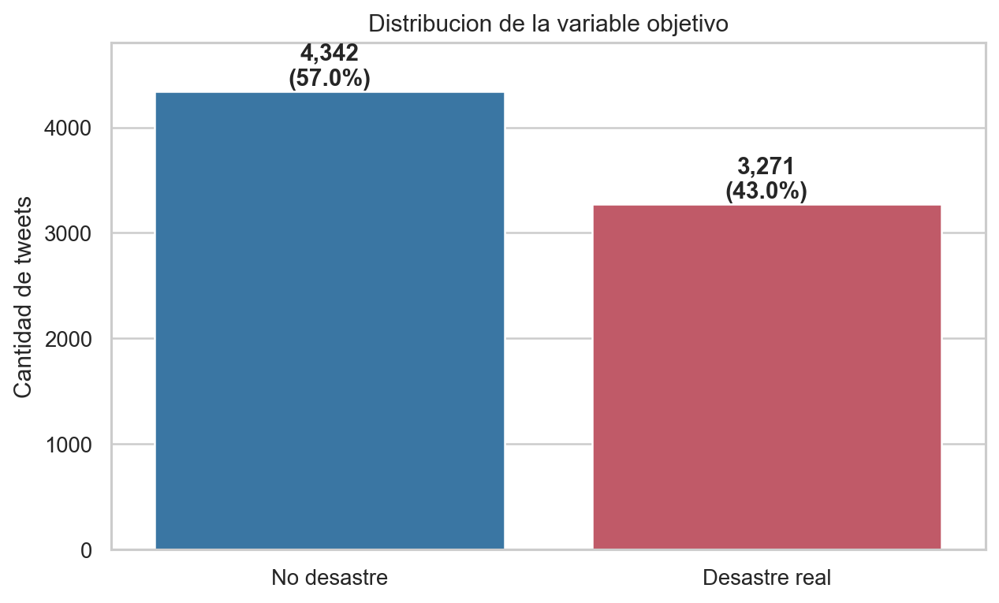
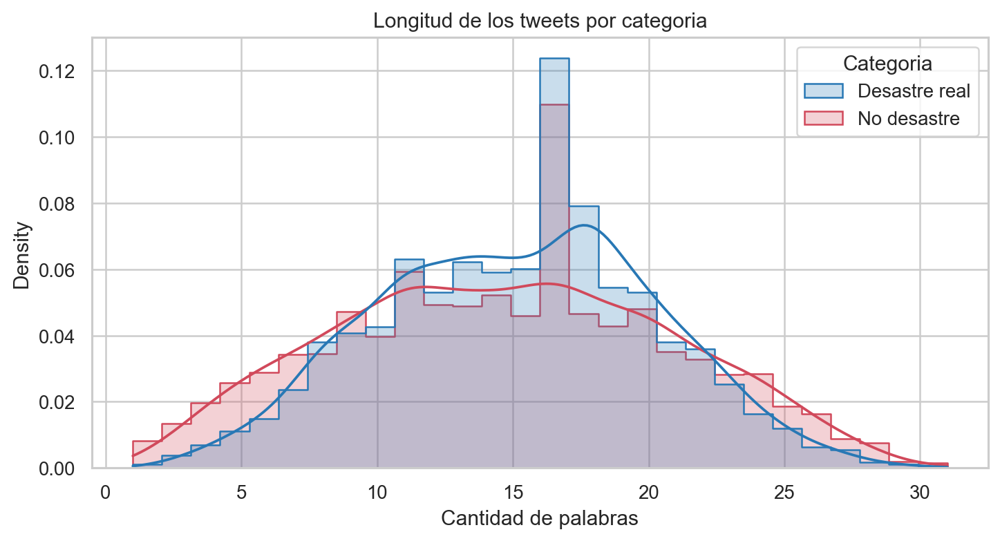
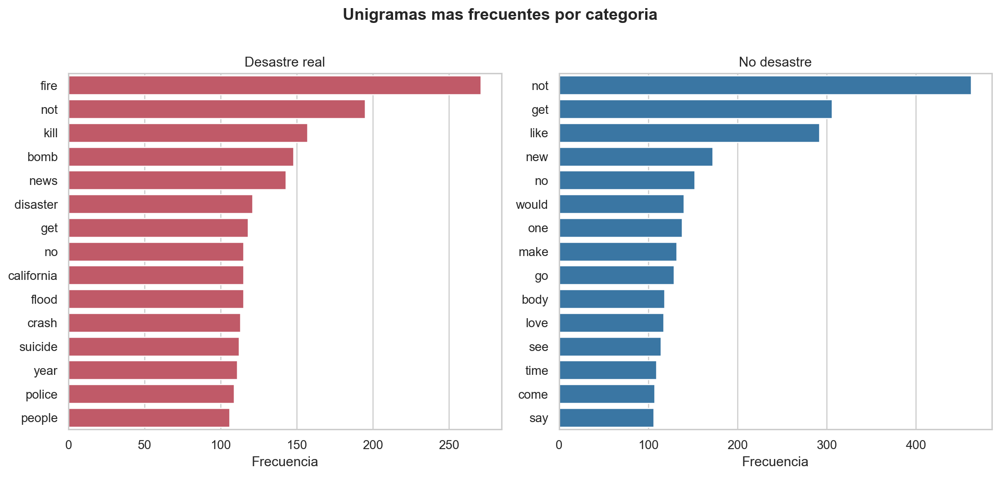
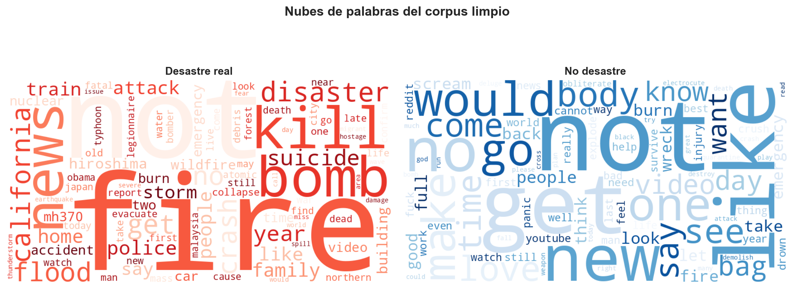
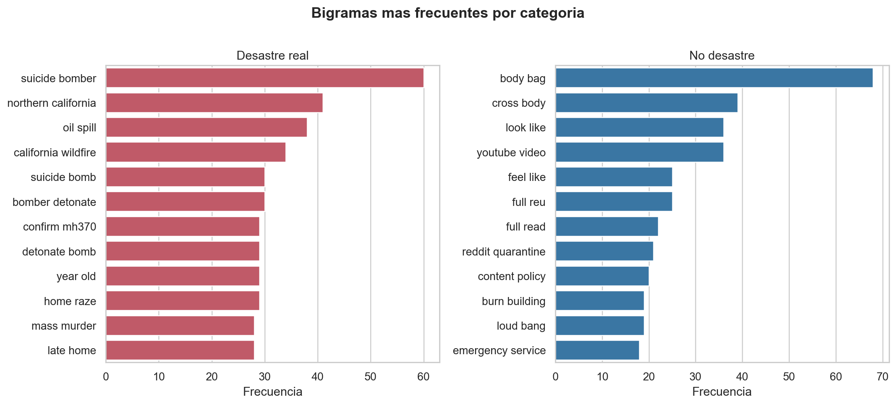
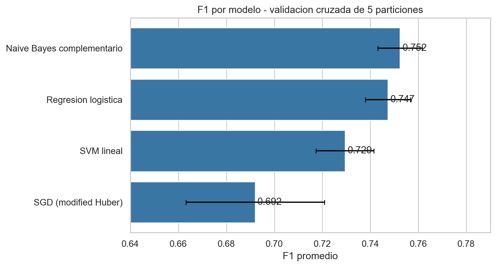
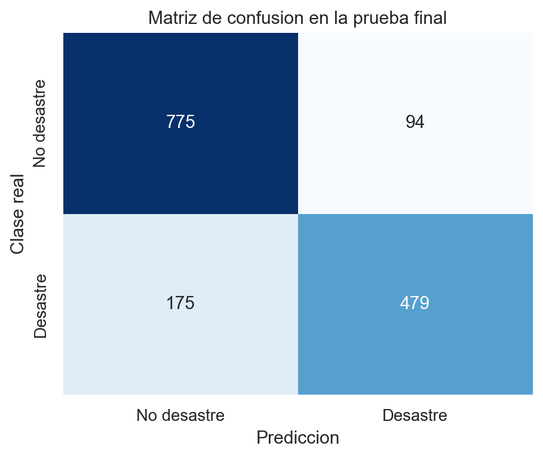
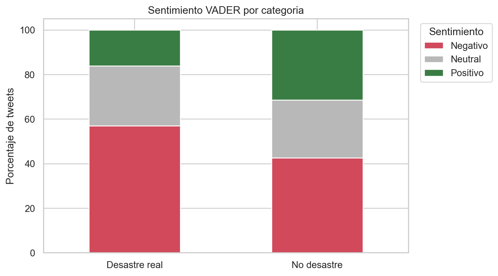
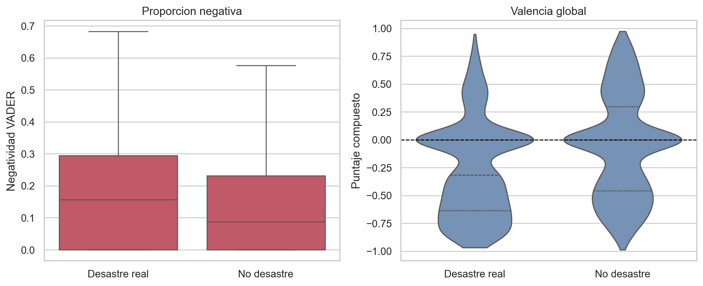
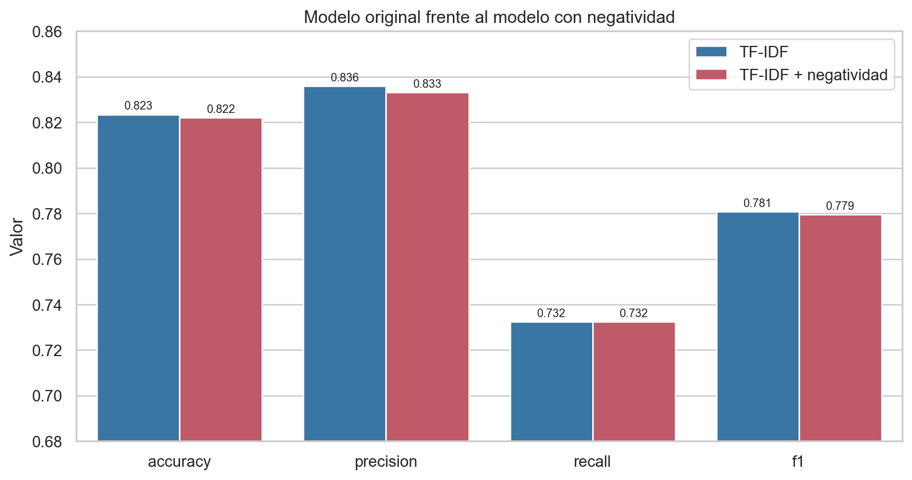

# Laboratorio 5: clasificación de tweets usando minería de texto

**CC3084 - Data Science · Laboratorio 5**  
**Universidad del Valle de Guatemala · Semestre II, 2026**

> Vianka Castro - 23201
>
> Ricardo Godinez - 23247
>
> Sebastian Bustamante - 22291

**Dataset:** *Natural Language Processing with Disaster Tweets* (Kaggle)  
**Repositorio:** <https://github.com/Vann06/Data-Science>  
**Fecha:** 28 de agosto de 2026

## Resumen ejecutivo

Se analizaron **7,613 tweets etiquetados**, de los cuales 3,271 (43.0%) corresponden a desastres reales. Se construyó un pipeline reproducible de normalización, limpieza, tokenización, eliminación de *stopwords*, lematización y generación de n-gramas. El mejor clasificador fue **Naive Bayes complementario**, con F1 medio de 0.752 en validación cruzada y F1 de 0.781 en la prueba final. VADER mostró mayor negatividad en tweets de desastre real, aunque agregar esa variable al clasificador cambió el F1 en -0.0013 (-0.16%), por lo que no mejoró el modelo.

## 1. Objetivo y datos

El objetivo fue determinar si el texto de un tweet se refiere a un desastre real (`target=1`) o emplea términos de desastre en un contexto figurado (`target=0`). `train.csv` contiene 7,613 filas y cinco columnas: `id`, `keyword`, `location`, `text` y `target`. `keyword` tiene 61 valores ausentes y `location` tiene 2,533; el texto y la etiqueta no presentan ausencias.

**Figura 1.** Distribución de los tweets por clase. El desbalance 57/43 es moderado; por ello se empleó F1 como métrica principal sin remuestreo.

Se detectaron 179 filas pertenecientes a 69 grupos de texto repetido, incluidos 18 grupos con etiquetas contradictorias. Esta característica se considera una limitación en la evaluación.

**Figura 2.** Los tweets de desastre real tienden a ser ligeramente más extensos, aunque las distribuciones se superponen ampliamente.

## 2. Limpieza y preprocesamiento

El pipeline se implementó en `src/limpieza/` y se ejecutó en `limpieza.ipynb`. El orden fue: (1) conversión a minúsculas y normalización Unicode; (2) expansión de contracciones; (3) eliminación de URL, entidades HTML y emojis; (4) conservación de la palabra de hashtags y menciones mediante flags; (5) sustitución de números por `flagnumero`, distinguiendo `911` con `flagemergencia`; (6) eliminación de puntuación; (7) tokenización con `TweetTokenizer`; (8) eliminación de *stopwords* de NLTK, preservando negaciones; (9) lematización con WordNet y etiqueta gramatical; y (10) generación de unigramas y bigramas.

El sentimiento se calculó posteriormente sobre el texto original, no sobre el texto limpio, porque VADER utiliza puntuación, mayúsculas, negaciones y emoticonos como señales.

| ID | Clase | Texto original | Texto procesado |
|---|---|---|---|
| 1 | Desastre | Our Deeds are the Reason of this #earthquake May ALLAH Forgive us all | deed reason flaghashtag earthquake may allah forgive |
| 4 | Desastre | Forest fire near La Ronge Sask. Canada | forest fire near ronge sask canada |
| 5 | Desastre | All residents asked to 'shelter in place' are being notified by officers. No other evacuation or shelter in place orders are expected | resident ask shelter place notify officer no evacuation shelter place order expect |
| 31 | No desastre | this is ridiculous.... | ridiculous |
| 48 | Desastre | @bbcmtd Wholesale Markets ablaze http://t.co/lHYXEOHY6C | flagmencion bbcmtd wholesale market ablaze |

**Tabla 1.** Ejemplos auditables del texto antes y después del pipeline.

## 3. Análisis exploratorio y frecuencias

**Figura 3.** Los tweets de desastre concentran términos de eventos y cobertura noticiosa, mientras que los no desastres contienen más lenguaje cotidiano o figurado. Palabras presentes en ambas clases, como `fire` o `body`, no son suficientes por sí solas para clasificar.

**Figura 4.** Nubes de palabras del corpus limpio. La separación visual apoya el uso de características léxicas, pero también muestra vocabulario compartido.

## 4. Unigramas, bigramas y contexto

Los bigramas preservan contexto local en expresiones como `suicide bomber`, `oil spill`, `forest fire` y `body bag`. El análisis posterior a la limpieza mostró que alrededor del 86% de los bigramas aparece una sola vez; por ello se utilizó `min_df=2`. La comparación del notebook `analisis_post_limpieza.ipynb` obtuvo F1 de 0.746 con unigramas y 0.750 con unigramas+bigramas; la diferencia de aproximadamente 0.005 no fue significativa (prueba pareada, p = 0.24), pero el costo de pasar de unas 5,322 a 11,918 características fue aceptable.

**Figura 5.** Bigramas más frecuentes después de excluir flags técnicos.

| Bigrama | Frecuencia | Tweets | P(desastre \| bigrama) |
|---|---|---|---|
| body bag | 74 | 73 | 0.08 |
| suicide bomber | 60 | 58 | 1.00 |
| look like | 55 | 55 | 0.35 |
| youtube video | 43 | 43 | 0.16 |
| northern california | 41 | 41 | 1.00 |
| burn building | 41 | 41 | 0.54 |
| cross body | 40 | 40 | 0.03 |
| oil spill | 39 | 37 | 0.97 |
| year old | 35 | 25 | 0.76 |
| california wildfire | 34 | 34 | 1.00 |
| suicide bomb | 33 | 32 | 0.91 |
| mass murder | 33 | 33 | 0.85 |

**Tabla 2.** Frecuencia y probabilidad empírica de desastre de los bigramas más comunes. Estas probabilidades describen asociación en este corpus; no son probabilidades calibradas del clasificador.

## 5. Modelos de clasificación

Se reservó 20% del corpus como prueba final estratificada (1,523 tweets) y se empleó el 80% restante (6,090 tweets) para seleccionar el modelo mediante validación cruzada estratificada de cinco particiones. TF-IDF se mantuvo dentro de cada `Pipeline` para evitar fuga de vocabulario. La representación usó `ngram_range=(1,2)`, `min_df=2`, `max_df=0.98`, frecuencia sublineal y norma L2.

| Modelo | Accuracy | Precision | Recall | F1 | ROC-AUC |
|---|---|---|---|---|---|
| Naive Bayes complementario | 0.800 | 0.804 | 0.708 | 0.752 | 0.853 |
| Regresion logistica | 0.798 | 0.808 | 0.695 | 0.747 | 0.853 |
| SVM lineal | 0.776 | 0.760 | 0.702 | 0.729 | 0.839 |
| SGD (modified Huber) | 0.735 | 0.693 | 0.694 | 0.692 | 0.796 |
| Linea base | 0.570 | 0.000 | 0.000 | 0.000 | 0.500 |

**Tabla 3.** Resultados promedio de validación cruzada. Naive Bayes complementario (`alpha=0.5`) obtuvo el mayor F1.

**Figura 6.** F1 promedio y una desviación estándar entre particiones.

En la prueba final, el modelo seleccionado obtuvo accuracy=0.823, precision=0.836, recall=0.732, F1=0.781 y ROC-AUC=0.869.

**Figura 7.** Matriz de confusión: 775 verdaderos negativos, 94 falsos positivos, 175 falsos negativos y 479 verdaderos positivos.

## 6. Función de clasificación

`clasificar_tweet()` recibe texto sin preprocesar, reutiliza exactamente `src/limpieza/pipeline.py`, transforma el resultado con el TF-IDF ajustado y devuelve la clase legible junto con la probabilidad de desastre. Por ejemplo, *“Breaking: wildfire forces thousands to evacuate their homes”* se clasificó como **Desastre real**, mientras que *“My phone battery died, this is a total disaster lol”* se clasificó como **No desastre**. Esto demuestra por qué es necesario modelar contexto y no limitarse a buscar palabras clave.

## 7. Análisis de sentimiento

Se aplicó VADER al texto original. El puntaje compuesto se clasificó como positivo cuando fue ≥0.05, negativo cuando fue ≤-0.05 y neutral en el intervalo restante.

| Sentimiento | Tweets | Porcentaje |
|---|---|---|
| Negativo | 3707 | 48.7% |
| Neutral | 2013 | 26.4% |
| Positivo | 1893 | 24.9% |

**Tabla 4.** Distribución general del sentimiento: casi la mitad de los tweets se clasificó como negativa.

**Figura 8.** Distribución porcentual de VADER dentro de cada categoría real.

## 8. Tweets más negativos y positivos

| ID | Categoría | Compound | Tweet |
|---|---|---|---|
| 10689 | No desastre | -0.9883 | wreck? wreck wreck wreck wreck wreck wreck wreck wreck wreck wreck wreck wreck? |
| 9172 | Desastre real | -0.9686 | @Abu_Baraa1 Suicide bomber targets Saudi mosque at least 13 dead - Suicide bomber targets Saudi mosque at least 13 dead This is ridiculous |
| 9166 | Desastre real | -0.9623 | Suicide bomber kills 15 in Saudi security site mosque - A suicide bomber killed at least 15 people in an attack on... http://t.co/FY0r9o7Xsl |
| 9137 | Desastre real | -0.9595 | ? 19th Day Since 17-Jul-2015 -- Nigeria: Suicide Bomb Attacks Killed 64 People; Blamed: Boko Haram [L.A. Times/AP] \| http://t.co/O2cdKpSDfp |
| 9159 | Desastre real | -0.9552 | 17 killed in S‰ÛªArabia mosque suicide bombing A suicide bomber attacked a mosque in Aseer south-western Saudi... http://t.co/pMTQhiVsXX |
| 4213 | No desastre | -0.9549 | at the lake *sees a dead fish* me: poor little guy i wonder what happened ashley: idk maybe it drowned wtf ???????? |
| 682 | Desastre real | -0.9538 | illegal alien released by Obama/DHS 4 times Charged With Rape &amp; Murder of Santa Maria CA Woman Had Prior Offenses http://t.co/MqP4hF9GpO |
| 2225 | Desastre real | -0.9524 | Bomb Crash Loot Riot Emergency Pipe Bomb Nuclear Chemical Spill Gas Ricin Leak Violence Drugs Cartel Cocaine Marijuana Heroine Kidnap Bust |
| 9765 | Desastre real | -0.9500 | Bomb head? Explosive decisions dat produced more dead children than dead bodies trapped tween buildings on that day in September there |
| 9940 | Desastre real | -0.9493 | @cspan #Prez. Mr. President you are the biggest terrorist and trouble maker in the world. You create terrorist you sponsor terrorist. |

**Tabla 5.** Diez tweets con menor puntaje compuesto. Ocho pertenecen a desastre real y dos a no desastre.

| ID | Categoría | Compound | Tweet |
|---|---|---|---|
| 10028 | No desastre | 0.9730 | Check out 'Want Twister Tickets AND A VIP EXPERIENCE To See SHANIA? CLICK HERE:' at http://t.co/3GEROQ49o1 I would Love Love Love!! To win |
| 9345 | No desastre | 0.9564 | @thoutaylorbrown I feel like accidents are just drawn to you but I'm happy you've survived all of them. Hope you're okay!!! |
| 8989 | Desastre real | 0.9471 | Today‰Ûªs storm will pass; let tomorrow‰Ûªs light greet you with a kiss. Bask in this loving warmth; let your soul return to bliss. |
| 4541 | No desastre | 0.9423 | @batfanuk we enjoyed the show today. Great fun. The emergency non evacuation was interesting. Have a great run. |
| 4844 | No desastre | 0.9423 | @batfanuk we enjoyed the show today. Great fun. The emergency non evacuation was interesting. Have a great run. |
| 9710 | No desastre | 0.9394 | Maaaaan I love Love Without Tragedy by @rihanna I wish she made the whole song |
| 8994 | No desastre | 0.9376 | Free Ebay Sniping RT? http://t.co/B231Ul1O1K Lumbar Extender Back Stretcher Excellent Condition!! ?Please Favorite &amp; Share |
| 3525 | Desastre real | 0.9356 | @Raishimi33 :) well I think that sounds like a fine plan where little derailment is possible so I applaud you :) |
| 1453 | No desastre | 0.9345 | I'm not a Drake fan but I enjoy seeing him body-bagging people. Great marketing lol. |
| 9386 | No desastre | 0.9344 | @duchovbutt @Starbuck_Scully @MadMakNY @davidduchovny yeah we survived 9 seasons and 2 movies. Let's hope for the good. There's hope ?????? |

**Tabla 6.** Diez tweets con mayor puntaje compuesto. Ocho pertenecen a no desastre y dos a desastre real. Un texto aparece duplicado porque así está presente en el dataset original.

## 9. ¿Los tweets de desastre real son más negativos?

| Categoría | Tweets | Negatividad media | Mediana | Compound medio | % negativos |
|---|---|---|---|---|---|
| No desastre | 4342 | 0.132 | 0.088 | -0.061 | 42.5% |
| Desastre real | 3271 | 0.174 | 0.157 | -0.265 | 56.9% |

**Tabla 7.** Resumen de negatividad por categoría. La diferencia de negatividad media fue +0.0413.

La prueba U de Mann-Whitney unilateral produjo U=8,141,444, p=2e-30 y correlación biserial por rangos=0.146. Existe evidencia de mayor negatividad en los tweets de desastre real, aunque el tamaño del efecto es pequeño.

**Figura 9.** Distribuciones de negatividad y valencia global. La amplia superposición muestra que el sentimiento no sustituye al contenido textual.

## 10. Inclusión de la negatividad en el modelo

Se creó la variable `negatividad` con la proporción negativa de VADER. Para una comparación controlada se conservaron la misma partición, el mismo TF-IDF, el mismo clasificador y los mismos hiperparámetros. La única diferencia fue agregar la columna numérica mediante `ColumnTransformer`.

| Modelo | Accuracy | Precision | Recall | F1 | ROC-AUC |
|---|---|---|---|---|---|
| TF-IDF | 0.823 | 0.836 | 0.732 | 0.781 | 0.869 |
| TF-IDF + negatividad | 0.822 | 0.833 | 0.732 | 0.779 | 0.869 |

**Tabla 8.** Comparación en la misma prueba final. El cambio absoluto en F1 fue -0.0013, equivalente a -0.16%.

**Figura 10.** La negatividad no mejoró ninguna métrica de manera relevante. El recall permaneció igual y F1 disminuyó levemente. TF-IDF ya contiene términos y expresiones relacionados con violencia, muerte, incendios y ataques, por lo que el puntaje agregado aporta información parcialmente redundante.

## 11. Limitaciones y conclusiones

Naive Bayes complementario con TF-IDF de unigramas y bigramas fue el mejor enfoque evaluado. Los bigramas ayudan a interpretar casos ambiguos, pero su ganancia global fue pequeña; filtrar términos únicos tuvo mayor impacto. VADER confirmó que los desastres reales tienden a tener tono más negativo, pero la negatividad no agregó señal predictiva útil al modelo textual.

La principal limitación metodológica son los textos repetidos: 37 filas de prueba tienen un texto crudo idéntico en entrenamiento y 222 coinciden después de limpiar. Esto puede volver ligeramente optimista el rendimiento. En una extensión futura convendría agrupar o deduplicar textos antes de dividir, resolver etiquetas contradictorias y comparar el resultado. VADER también puede fallar ante sarcasmo, lenguaje figurado, noticias citadas y artefactos de codificación.

## Reproducibilidad

El análisis se distribuye en cuatro notebooks: `analisis_exploratorio.ipynb`, `limpieza.ipynb`, `analisis_post_limpieza.ipynb` y `modelado_y_sentimiento.ipynb`; las funciones reutilizables están en `src/`. Se fijó `random_state=42`, se usaron particiones estratificadas y todas las transformaciones aprendidas permanecieron dentro de pipelines. Las dependencias están declaradas en `requirements.txt` y los recursos de VADER se alojan bajo `data/nltk_data`.

## Material preparado para la entrega

| Elemento | Ubicación | Estado |
|---|---|---|
| Informe editable | docs/Laboratorio_5_informe.md | Completo |
| Informe final | docs/Laboratorio_5_informe.pdf | Completo |
| Análisis exploratorio | notebook/analisis_exploratorio.ipynb | Ejecutado |
| Limpieza y n-gramas | notebook/limpieza.ipynb y analisis_post_limpieza.ipynb | Ejecutado |
| Modelos, función y sentimiento | notebook/modelado_y_sentimiento.ipynb | Ejecutado sin errores |
| Código reutilizable | src/ | Disponible |
| Repositorio | github.com/Vann06/Data-Science | Disponible |

**Tabla 9.** Componentes técnicos que respaldan la reproducibilidad y la entrega final.

## Referencias

- Kaggle. *Natural Language Processing with Disaster Tweets*. <https://www.kaggle.com/competitions/nlp-getting-started/data>
- Hutto, C. J., y Gilbert, E. (2014). *VADER: A Parsimonious Rule-based Model for Sentiment Analysis of Social Media Text*. Proceedings of ICWSM.
- Jurafsky, D., y Martin, J. H. *Speech and Language Processing*. <https://web.stanford.edu/~jurafsky/slp3/>
- NLTK Project. *Natural Language Toolkit documentation*. <https://www.nltk.org/>
- scikit-learn developers. *Working with text data* y documentación de `TfidfVectorizer`, `Pipeline` y `ComplementNB`. <https://scikit-learn.org/stable/tutorial/text_analytics/working_with_text_data.html>
- Mueller, A. *wordcloud documentation*. <https://amueller.github.io/word_cloud/>
- Virtanen, P. et al. (2020). *SciPy 1.0: Fundamental Algorithms for Scientific Computing in Python*. Nature Methods, 17, 261-272.
