# Laboratorio 6: cómo fuimos entendiendo la red de participación en YouTube

## De qué se trataba esto

Cuando empezamos este laboratorio teníamos dos archivos, `youtube_videos.csv` y `youtube_comments.csv`, y una pregunta general en la cabeza: ¿cómo se comporta la participación de la gente alrededor de videos de YouTube sobre Guatemala? No sabíamos todavía si íbamos a encontrar una red densa y conectada o algo mucho más disperso. Terminamos encontrando lo segundo, y ese hallazgo terminó marcando casi todo lo que vino después.

El trabajo quedó dividido en tres notebooks que fuimos armando en orden, cada uno construido sobre el anterior:

1. `01_preparacion_y_red_bipartita.ipynb`: carga, limpieza, exploración y la primera red (ejercicios 1 a 4).
2. `02_proyecciones_topologia_y_comunidades.ipynb`: las dos proyecciones de esa red, su topología y la detección de comunidades (ejercicios 5 a 7).
3. `03_centralidad_sentimiento_y_conclusiones.ipynb`: centralidad, puentes, sentimiento y el cierre del laboratorio (ejercicios 8 a 10).

Este informe junta los tres en una sola narrativa, con las gráficas que fuimos generando en el camino, para que se entienda el hilo completo sin tener que saltar entre notebooks.

## 1. Primero entender qué teníamos

Antes de tocar cualquier cosa, cargamos ambos archivos y nos preguntamos qué era exactamente cada fila. `youtube_videos.csv` tenía 293 filas y 20 columnas, cada una era un video. `youtube_comments.csv` tenía 406 filas y 17 columnas, cada una era un comentario principal publicado en algún video.

La llave primaria de videos era `video_id`, y la de comentarios `comment_id`, con `video_id` funcionando como llave foránea para unir ambos conjuntos. Para los autores de los comentarios usamos `author_channel_id` en vez del nombre visible, porque un nombre se puede repetir o cambiar y el identificador no.

La relación entre las piezas la resumimos así:

**Canal → Video → Comentario ← Autor**

Un canal publica varios videos, cada video pertenece a un canal, un autor puede comentar en uno o varios videos, y cada comentario tiene un video y un autor. Además cada video trae una categoría de YouTube, y la variable `source_query` nos recuerda que esos videos no aparecieron solos: llegaron a la muestra porque alguien los buscó con una consulta específica (`guatemala lluvias`, `guatemala noticias`, el handle de un canal, etc.). Eso último terminó siendo importante más adelante: la muestra no es un universo, es el resultado de un procedimiento de búsqueda.

Cuando integramos ambos conjuntos por `video_id` comprobamos que los 406 comentarios (100%) se pudieron asociar a un video, y que no había IDs duplicados en ninguno de los dos archivos. Buena señal para seguir.

## 2. Limpiar sin perder información

Antes de analizar nada tuvimos que revisar qué tan sano estaba el dato. Hicimos un diagnóstico con dimensiones, tipos, faltantes, duplicados, variables constantes y valores atípicos.

Los faltantes se concentraban en pocas columnas: `description` (8.9%), `description_snippet` (8.5%), `published_time` y `view_count_text` (4.4% cada una) en videos, y `viewer_rating` completamente vacía (100%) en comentarios. Encontramos dos variables constantes que no aportaban nada: `is_pinned` (siempre `False`) y `viewer_rating` (siempre nula). Las dejamos identificadas como variables que requerían precaución, junto con `published_time`/`published_text` (son tiempos relativos, no fechas exactas), `channel_name`/`author_name` (nombres visibles que pueden cambiar) y `reply_count` (cuenta cuántas respuestas recibió un comentario, pero no dice quién respondió).

Con el criterio del rango intercuartílico encontramos 49 posibles valores atípicos en `view_count` (cerca del 16.7% de los videos). Decidimos no eliminarlos: un video con millones de vistas puede ser perfectamente real, no necesariamente un error. Lo que sí hicimos fue graficar la distribución en escala logarítmica, porque en escala normal la asimetría era tan fuerte que no se veía nada.

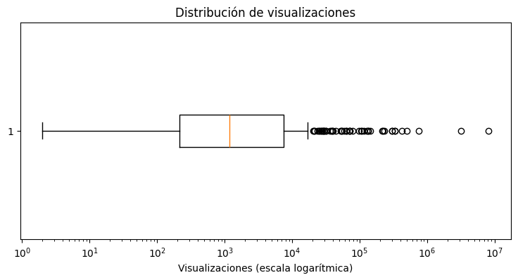

Después normalizamos identificadores sin botar los nombres visibles (los dejamos como atributos descriptivos, no como llave), convertimos `like_count_text` a numérico limpiando comas y valores vacíos, y creamos dos columnas de texto: `texto_original` (intacta, para poder hacer análisis de sentimiento más adelante) y `texto_limpio` (minúsculas, sin URLs, sin puntuación, sin números, con los símbolos `#` y `@` quitados pero conservando la palabra). No aplicamos lematización automática en ese momento porque nos pareció que un modelo de lematización en español podía alterar información relevante sin que lo notáramos, así que lo dejamos documentado como una decisión consciente, no un olvido.

Al final medimos el efecto de la limpieza: 401 textos modificados, 4 quedaron vacíos después de limpiar (los excluimos del análisis textual, aunque seguían disponibles en `texto_original`), y los duplicados subieron de 2 a 9 porque varios comentarios distintos, después de quitarles URLs, emojis y puntuación, terminaron con exactamente el mismo texto limpio (por ejemplo comentarios que solo decían "jajaja" o un emoji repetido).

## 3. Empezar a ver patrones

Con los datos ya limpios pudimos preguntarnos cosas más interesantes. Contamos 293 videos, 97 canales, 406 comentarios y 332 autores distintos. Los canales con más videos en la muestra fueron instituciones de gobierno: Gobierno de la República de Guatemala (32 videos), Municipalidad de Guatemala (27) y Quorum (18).

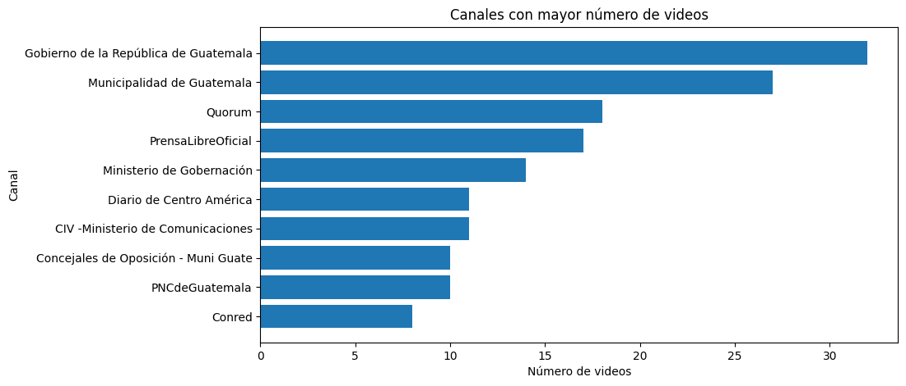

La categoría más común de YouTube fue `News & Politics`, con 138 de los 293 videos, seguida de `People & Blogs` y `Entertainment`. Esto tenía sentido con las consultas de búsqueda que se usaron para armar la muestra, muchas apuntaban directamente a noticias y política guatemalteca.

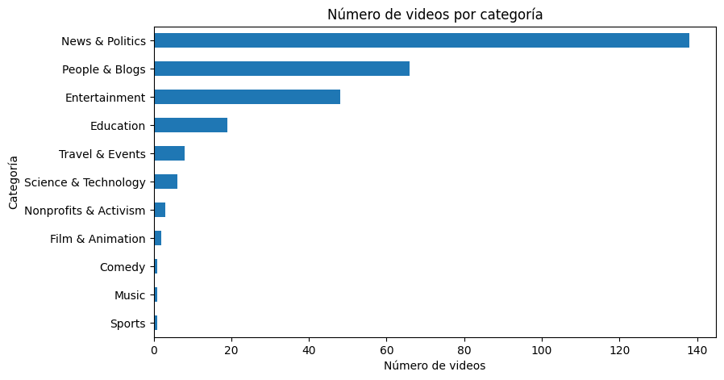

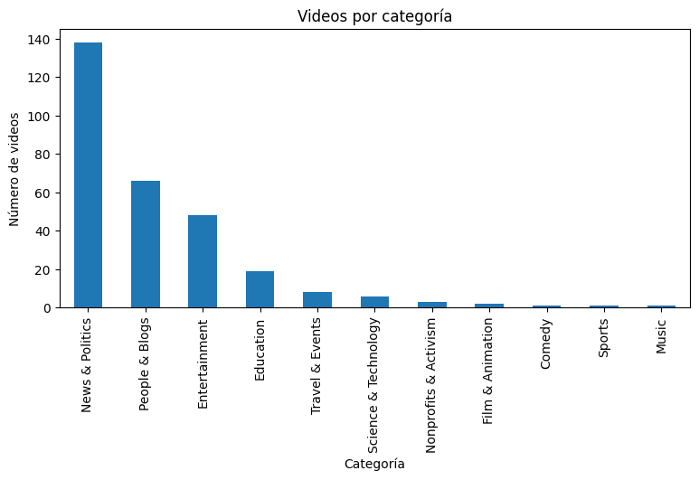

En las palabras más frecuentes de los comentarios (quitando stopwords) aparecieron `pueblo`, `guatemala`, `dinero`, `presidente`, `país`, `trabajo`, `diputados`, `corruptos`, `diputado`, `excelente`, entre otras. Y en los bigramas, cosas como `presidente bernardo`, `bernardo arevalo`, `pacto corruptos`, `dinero pueblo`, que confirmaban que buena parte de la conversación giraba en torno a política y autoridades públicas.

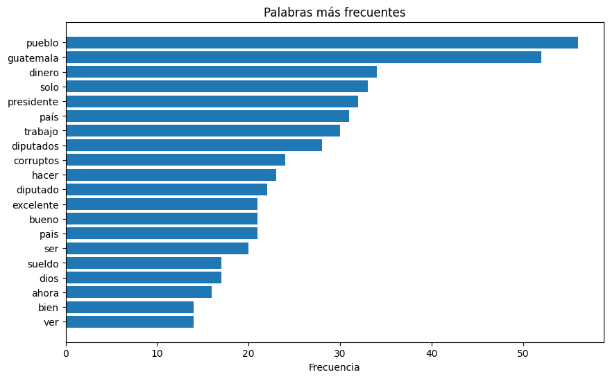

Una de las cosas que más nos llamó la atención fue la concentración: los 10 videos con más comentarios concentraban el 93.6% de todos los comentarios de la muestra, y los 5 canales con más participación concentraban el 96.1%. Un solo video, "Qué rico come tu diputado" (canal Quorum), tenía 161 comentarios de 128 autores únicos, casi el 40% de toda la muestra él solo. Eso ya nos hacía sospechar que cualquier red que construyéramos después iba a estar dominada por muy pocos nodos, y así terminó siendo.

También comparamos vistas contra comentarios, y ahí la relación resultó casi nula: correlación de Pearson de -0.008 y de Spearman de 0.080. Un video puede tener millones de vistas y cero comentarios en nuestra muestra, y otro con muchas menos vistas puede concentrar cientos de comentarios. Usamos Spearman además de Pearson porque la distribución de vistas es tan desigual (un video con más de 8 millones de vistas al lado de otros con apenas cientos) que Pearson se distorsiona fácilmente con esos extremos.

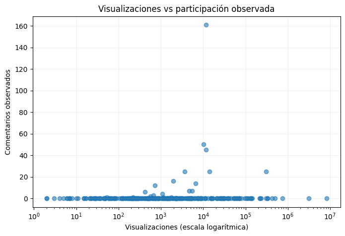

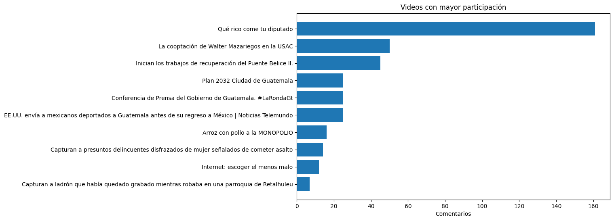

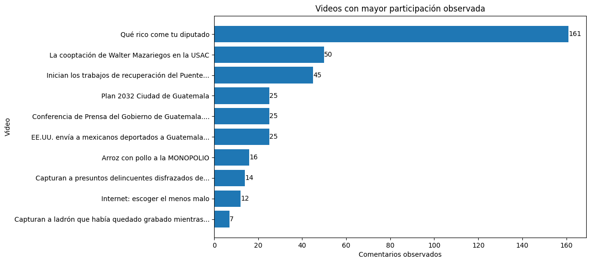

En esta parte respondimos también las preguntas de investigación que traía el enunciado. Encontramos 9 autores que comentaron en más de un video, y de esos, 4 comentaron en videos de más de un canal distinto: `@virgiliogarcia3039`, `@MarcosCarillo-b1r`, `@franciscoflores3120` y `@moisesvaldez4043`. Los marcamos como candidatos exploratorios a "autores puente", aunque dejamos clarísimo desde ese momento que esto no prueba ningún tipo de relación directa entre ellos, solo que el mismo autor apareció comentando en más de un lugar.

Sobre visibilidad y participación, la conclusión fue la misma que con la correlación: no coinciden. El video más visto de la muestra (más de 8 millones de vistas) ni siquiera aparece entre los más comentados.

Nos preguntamos también tres cosas adicionales que no estaban en el enunciado original. Primero, si los videos con más comentarios también tenían más autores distintos, y sí: el video top tenía 161 comentarios de 128 autores, casi 1 a 1, lo que sugiere que la participación alta no viene solo de pocas personas comentando mucho. Segundo, qué canal tenía el mejor promedio de comentarios por video, y ahí Quorum ganó con 14.2 comentarios por video en promedio, muy por encima del Gobierno de la República de Guatemala (2.2 comentarios por video pese a tener casi el doble de videos). Y tercero, si más respuestas significaban más "me gusta": encontramos una correlación de Spearman de apenas 0.218, positiva pero débil, y con el aviso de que `like_count` solo estaba disponible para 217 de los 406 comentarios.

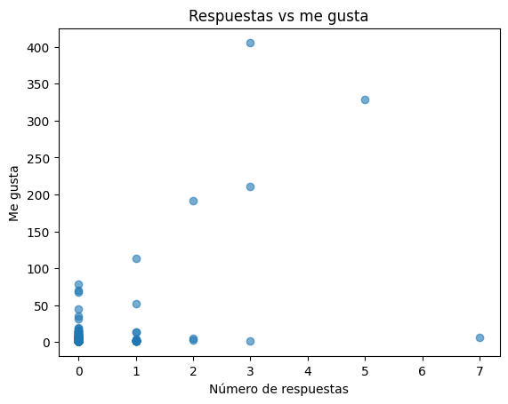

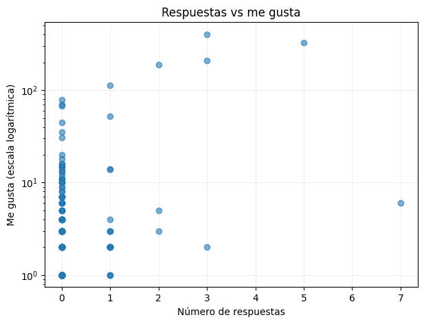

## 4. Armar la primera red

Con todo ese contexto ya construimos la primera red: una red bipartita no dirigida, con dos tipos de nodo, autores y videos, y una arista entre un autor y un video cuando ese autor comentó al menos una vez en ese video. El peso de la arista es cuántos comentarios publicó ese autor específico en ese video específico.

Una decisión que tuvimos que tomar con cuidado fue qué videos incluir como nodos. Decidimos no meter los 293 videos del catálogo, solo los 19 que efectivamente tenían al menos un comentario. Si hubiéramos metido los 293, un video sin comentarios habría aparecido como un nodo aislado con "cero participación", cuando en realidad simplemente nunca estuvo cubierto por el conjunto de comentarios que recolectamos. Son dos cosas distintas y no queríamos mezclarlas.

Para evitar que un `author_channel_id` coincidiera por accidente con un `video_id`, prefijamos los identificadores de nodo como `autor::...` y `video::...`.

La red terminó con 332 nodos de tipo autor, 19 de tipo video, 351 nodos en total, y 343 aristas (la suma de los pesos de esas aristas da exactamente 406, el número de comentarios, así que cuadraba). Validamos que la red efectivamente fuera bipartita, que los identificadores fueran únicos, que todos los pesos fueran positivos y que ninguna arista conectara dos nodos del mismo tipo.

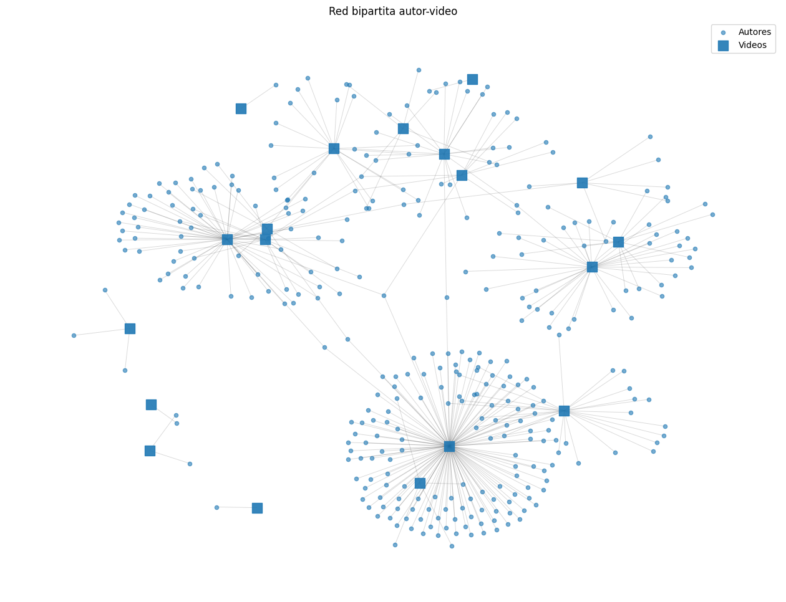

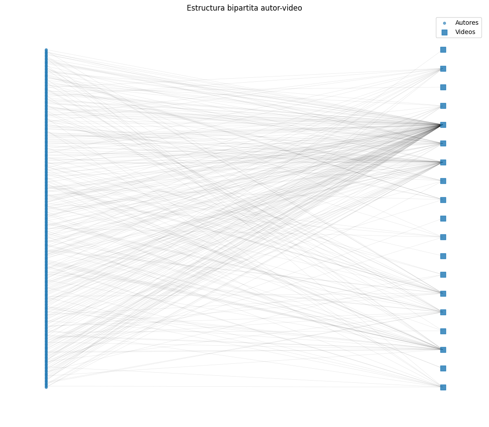

La interpretación de una arista quedó clara desde este punto y la repetimos varias veces a lo largo del laboratorio porque nos parecía el punto más fácil de malinterpretar: una arista solo dice que hubo **participación observada**, un autor comentó en ese video. No dice nada sobre amistad, aprobación, ni comunicación directa entre personas. Tampoco usamos `reply_count` para conectar autores entre sí, porque esa variable solo cuenta cuántas respuestas recibió un comentario, no identifica quién las escribió.

## 5. Ver la red desde otros dos ángulos

Con la red bipartita lista, en el segundo notebook construimos dos proyecciones. La proyección autor-autor conecta a dos autores cuando comentaron en el mismo video, y el peso es cuántos videos comparten. La proyección video-video conecta a dos videos cuando comparten al menos un autor, y el peso es cuántos autores comparten. Fuimos cuidadosos en no arrastrar el peso original de la red bipartita: comentar varias veces en el mismo video no genera vecinos compartidos adicionales, eso lo validamos explícitamente comparando el peso de cada arista proyectada contra la intersección real de vecinos.

La proyección autor-autor quedó con 332 nodos y 10,732 aristas. La proyección video-video, en cambio, quedó pequeñita: 19 nodos y solo 11 aristas.

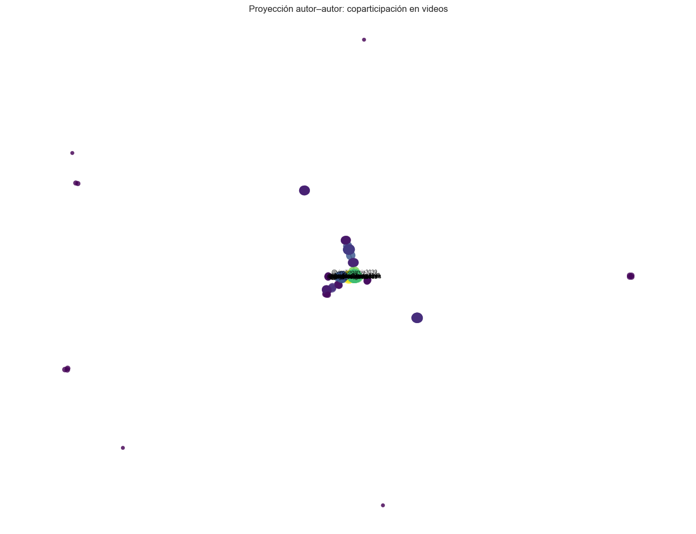

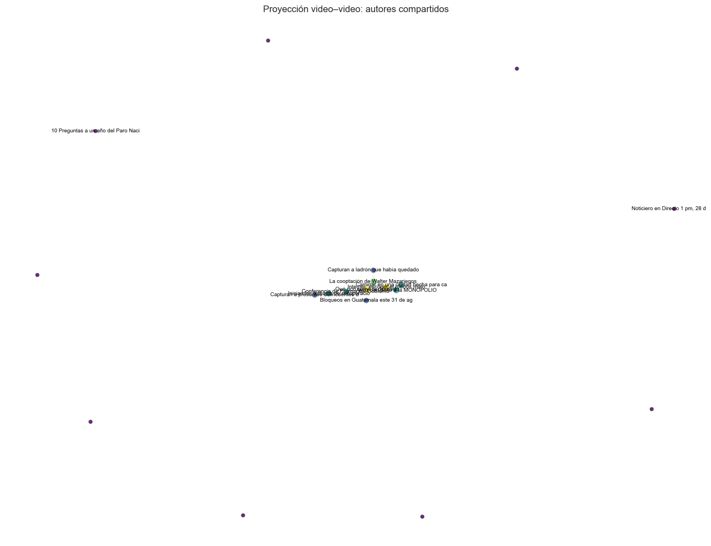

Entendimos que estas dos redes cuentan historias distintas. La autor-autor muestra coincidencia de consumo: una zona densa puede aparecer simplemente porque mucha gente comentó el mismo video, aunque cada uno solo haya comentado una vez ahí. La video-video muestra circulación de audiencia: una arista fuerte significa que varios autores se movieron entre esos dos videos específicos. Por eso terminamos usando la segunda para detectar comunidades más adelante, la primera se infla fácilmente con videos muy comentados y puede dar una falsa sensación de agrupamiento.

## 6. Qué tan conectada estaba realmente esta red

Aquí es donde empezamos a confirmar, con números, lo que ya sospechábamos desde la sección 3: esta red está muy poco conectada y muy concentrada.

| red | nodos | aristas | densidad | grado medio | componentes | % en componente mayor | transitividad |
|---|---|---|---|---|---|---|---|
| Bipartita | 351 | 343 | 0.0056 | 1.95 | 10 | 81.5% | 0.0000 |
| Autor-autor | 332 | 10,732 | 0.1953 | 64.65 | 10 | 83.1% | 0.9840 |
| Video-video | 19 | 11 | 0.0643 | 1.16 | 10 | 52.6% | 0.3158 |

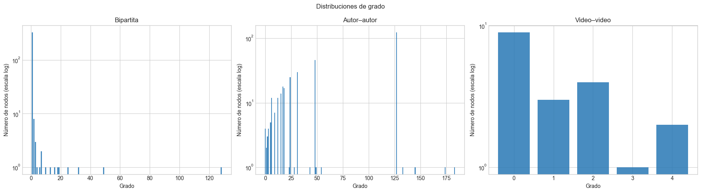

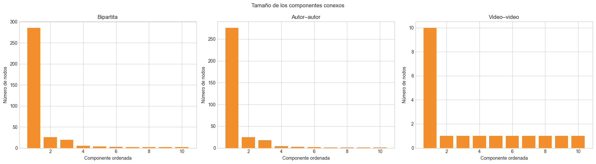

En la red bipartita, el 93.2% de los nodos tiene grado 0 o 1, y el 10% de mayor grado concentra el 54.1% de todas las conexiones. Es casi un bosque: eliminar casi cualquier arista desconecta algo, y de hecho la transitividad es exactamente 0, lo cual es esperado en una bipartita porque sus aristas solo unen tipos distintos, nunca puede cerrarse un triángulo ahí.

La proyección autor-autor tiene una transitividad altísima (0.984), pero entendimos que ese número no significa lo que uno pensaría a primera vista. No es que los autores formen comunidades sociales muy cohesionadas, es que cuando proyectamos, todos los autores que comentaron el mismo video quedan conectados entre sí formando un bloque casi completo (un clique). Es un artefacto de cómo se construye la proyección, no evidencia de relación social real.

La proyección video-video resultó la más fragmentada de las tres: 9 de los 19 videos quedaron completamente aislados (sin compartir ningún autor con otro video), hay 10 componentes distintos, y solo el 52.6% de los nodos está en la componente más grande. Eso nos dijo que la circulación de audiencia entre videos, en esta muestra, es bastante limitada.

## 7. Buscar comunidades

Para detectar comunidades elegimos trabajar sobre la proyección video-video, no la autor-autor. La razón fue evitar que un grupo grande de autores que solo coincidieron en un único video muy comentado se presentara como si fuera una "comunidad temática", cuando en realidad nunca comparó contenidos distintos. Aplicamos Louvain con peso, resolución 1 y semilla fija (42) para que el resultado fuera reproducible, aunque dejamos anotado que Louvain es heurístico y la partición puede cambiar si se cambia la resolución o la semilla.

El algoritmo encontró 12 comunidades, con una modularidad ponderada de 0.4053. Nueve de esas comunidades tenían un solo video (porque ese video estaba aislado en la proyección), así que el análisis sustantivo se concentró en las tres comunidades más grandes.

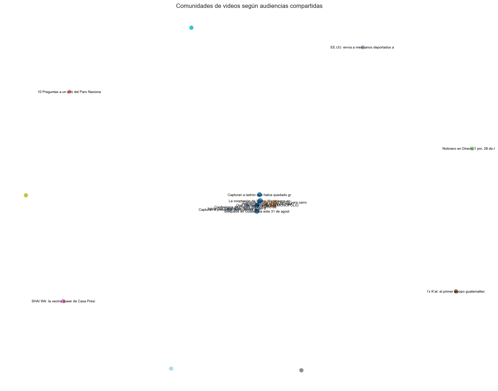

Para caracterizar cada comunidad combinamos videos, canales, autores únicos, número de comentarios, términos frecuentes y una primera estimación de sentimiento con un léxico propio en español (25 términos positivos, 32 negativos, 5 negadores, con negación por ventana de dos palabras hacia atrás).

- **Comunidad 1**: 4 videos, 3 canales, 187 autores únicos, 225 comentarios, dominada por Quorum. Vocabulario sobre pueblo, dinero, diputados, sueldo, corruptos, sugiriendo discusión crítica sobre política y recursos públicos. 74.2% neutral.
- **Comunidad 2**: 3 videos, 2 canales, 62 autores, 84 comentarios, girando alrededor del gobierno, la presidencia y el Puente Belice II. Términos como presidente, Arévalo, puente, gobierno. 65.5% neutral.
- **Comunidad 3**: 3 videos de Quorum, 29 autores, 34 comentarios, con un eje distinto sobre empresas, internet, ley, competencia, mercado. Fue la comunidad con más proporción positiva, 44.1%, casi empatada con la neutral (47.1%).

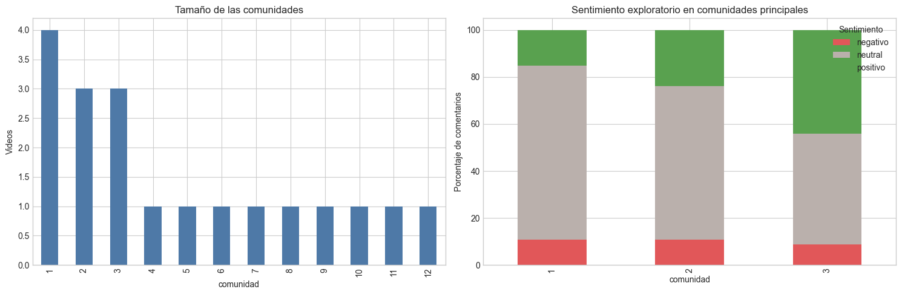

En este punto ya notamos algo que nos pareció importante: 282 de los 406 comentarios (69.5%) quedaron clasificados como neutral con ese primer léxico. Eso no necesariamente significa que la gente no tenía opinión, más probablemente significaba que el léxico era demasiado corto para cubrir todo el vocabulario real de los comentarios. Dejamos esa duda anotada explícitamente en el notebook, y terminó siendo exactamente el punto de partida del tercer notebook.

Cerramos esta parte con una idea que nos costó aceptar al principio pero que fuimos entendiendo mejor con cada sección: la modularidad nos dice cuánto peso quedó dentro de las comunidades comparado con lo que esperaríamos al azar, pero no demuestra que existan grupos sociales estables, y una comunidad pequeña o unitaria puede deberse simplemente a que ese contenido no compartió audiencia con nada más en nuestra muestra, no a que sea irrelevante.

## 8. Quién sostiene esta red

El tercer notebook empezó reconstruyendo exactamente la misma red y las mismas comunidades del segundo, sin depender de ninguna variable en memoria, solo leyendo lo que ya habíamos guardado en `data_processed/` y `output/`. Nos pareció importante que este notebook pudiera correr solo, de principio a fin, sin depender de haber corrido los otros dos primero en la misma sesión.

Acá calculamos varias medidas de centralidad sobre las tres redes: grado, grado ponderado, grado de centralidad bipartito (que normaliza correctamente comparando autores contra videos), intermediación (betweenness), cercanía, PageRank y centralidad de vector propio.

Con esta última tuvimos un tropiezo que nos enseñó algo. Intentamos calcularla directamente sobre las tres redes completas y `eigenvector_centrality_numpy` nos tiró un error, `AmbiguousSolution`, porque las tres redes están desconectadas (tienen 10 componentes cada una) y esa medida solo está matemáticamente bien definida dentro de una sola componente conexa. La solución fue calcularla solo sobre la componente conexa más grande de cada red, y dejar el resto de los nodos documentados como valor faltante en vez de forzar un número que no tendría sustento.

También decidimos que betweenness y closeness se calcularan sin usar el peso de las aristas. La razón es que en esta red un peso alto significa una relación más fuerte (más comentarios o vecinos compartidos), no una distancia más larga, así que usar el peso como si fuera una distancia habría invertido el sentido de la medida. PageRank sí usa el peso, porque ahí un peso mayor representa más flujo transferido por esa conexión, que es la lectura correcta en ese algoritmo.

Separamos la interpretación de autores y videos, porque son ejes distintos. Para autores distinguimos recurrencia (cuántos comentarios publicó) de diversidad (en cuántos videos, canales y comunidades distintas participó), un autor puede ser muy recurrente en un solo lugar sin ser diverso, y viceversa. Para videos comparamos alcance real (autores únicos que comentaron) contra visibilidad pasiva (`view_count`), y encontramos una correlación de Spearman de 0.812 entre ambas, sorprendentemente alta considerando que solo teníamos 19 videos con comentarios. Nos pareció importante no sobreinterpretar esto: con una muestra tan chica, un par de videos atípicos podrían mover bastante esa correlación.

La parte que más nos gustó de esta sección fue calcular puntos de articulación, nodos cuya sola eliminación aumenta el número de componentes de la red, que es exactamente la definición formal de "si lo quitáramos, la red se rompe". Encontramos 22 puntos de articulación de 351 nodos, y 335 de las 343 aristas resultaron ser puentes críticos (su eliminación también desconecta algo). El caso más extremo fue, otra vez, el video "Qué rico come tu diputado": quitarlo de la red agregaría 126 componentes nuevos y reduciría la componente más grande en 198 nodos. No es que ese video sea estructuralmente importante en YouTube en general, es que concentra casi el 40% de toda nuestra muestra de comentarios, así que sostiene buena parte de la conectividad que observamos.

Entre los 9 autores que comentaron en más de un video, el que resultó con mayor intermediación fue `@virgiliogarcia3039`, con apenas 3 comentarios mientras que otros autores tenían más volumen. Eso nos confirmó la separación que veníamos haciendo entre recurrencia y diversidad: lo que lo vuelve un puente no es cuánto comentó, es en qué lugares de la red quedó ubicado.

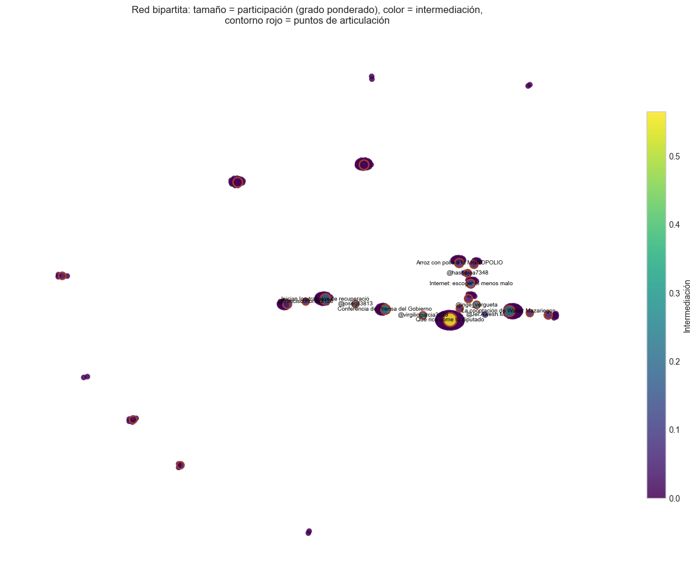

## 9. Volver al problema del sentimiento

Como dijimos en la sección 7, nos quedamos con la duda de si el 69.5% de comentarios "neutral" era real o era simplemente que el léxico original era corto. Así que en esta sección lo retomamos directamente.

Ampliamos el léxico manteniendo la misma arquitectura (normalización de acentos, ventana de negación de dos palabras, score como promedio de polaridades) pero agregando tres cosas: vocabulario del dominio que no estaba cubierto (`inseguridad`, `impunidad`, `injusticia`, `transparencia`, `justicia`, entre otros), intensificadores como `muy`, `super`, `bastante`, `sumamente`, que escalan la magnitud de un término cercano en vez de solo sumar ±1, y polaridad de emojis, que el léxico original ignoraba por completo porque su forma de tokenizar solo capturaba letras.

Con esto la cobertura del léxico (proporción de comentarios con al menos un término reconocido) subió de 32.0% a 43.1%, y la proporción de comentarios neutrales bajó de 69.5% a 58.4%. Fue una mejora real, pero también aprendimos algo más importante: seguía siendo mayoría neutral. Ampliar un léxico manual tiene rendimientos decrecientes, hay ironía, jerga local y formas de escribir que ningún diccionario de palabras sueltas va a captar bien.

Para no quedarnos solo con nuestra propia palabra de que el léxico mejoró, armamos una validación: exportamos una muestra aleatoria de 70 comentarios a `output/muestra_anotada.csv` con una columna vacía llamada `etiqueta_manual`, pensada para completarse a mano revisando cada comentario uno por uno. Decidimos que esa columna no la íbamos a llenar automáticamente ni a fingir una anotación humana, porque eso habría invalidado por completo la métrica. Al momento de cerrar este informe esa anotación seguía pendiente, así que el `classification_report` y la matriz de confusión quedaron como un paso siguiente, no como un resultado que ya tuviéramos.

También comparamos el sentimiento por video, canal, categoría, consulta de búsqueda y comunidad, exigiendo un mínimo de 15 comentarios por grupo para no leer proporciones ruidosas como si fueran una tendencia real. El canal con mayor proporción de comentarios negativos fue Gobierno de la República de Guatemala (15.7%), y el de mayor proporción positiva fue Municipalidad de Guatemala (36.0%). Nos pareció una diferencia interesante, contenido de gobierno central generando más negatividad que contenido municipal, pero con apenas cuatro canales comparables en este umbral, lo dejamos anotado como una observación puntual de esta muestra, no como un patrón que podamos afirmar sobre las instituciones guatemaltecas en general.

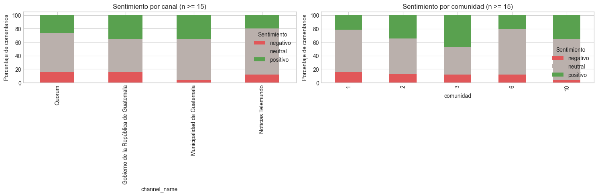

## 10. Lo que nos llevamos de todo esto

Cerramos el laboratorio tratando de unir las cuatro piezas que hasta ese punto habíamos ido tratando por separado: la estructura de la red, el contenido, el sentimiento y las limitaciones del propio procedimiento.

En cuanto a la red, la centralidad terminó confirmando lo que la topología ya insinuaba desde la sección 6, es una red dominada por muy pocos nodos. Los 22 puntos de articulación y las 335 aristas críticas muestran que la conectividad depende de muy poco, y el caso del video más comentado (removerlo fragmentaría la red en 126 componentes adicionales) es la manifestación más directa de esa concentración.

En cuanto a contenido y sentimiento, ampliar el léxico ayudó (11.1 puntos porcentuales más de cobertura, 11.1 puntos porcentuales menos de neutrales) pero no resolvió el problema de fondo, más de la mitad de los comentarios sigue sin una clasificación de tono clara, y la validación contra una anotación humana real quedó pendiente.

Con todo esto en la mesa, escribimos también las limitaciones que nos parecieron más importantes de dejar explícitas:

- Solo 19 de los 293 videos del catálogo (6.5%) tienen algún comentario asociado, así que la red bipartita describe una fracción pequeña del catálogo completo.
- `source_query` y `source_group` describen cómo se buscó el contenido, no el universo real de contenido sobre estos temas en YouTube.
- `published_time` y `published_text` son tiempos relativos ("hace 2 días"), no fechas exactas.
- `view_count` y `like_count` son una fotografía del momento de la recolección, no un valor estable.
- La proyección autor-autor representa co-presencia (comentar en el mismo video), no interacción directa, no hay respuestas, menciones ni "me gusta" entre autores en los datos.
- Un solo video concentra cerca del 40% de todos los comentarios, y un solo canal cerca del 63%, así que cualquier promedio agregado sobre "los videos" o "los canales" está fuertemente influido por muy pocos casos.

Y quisimos ser explícitos también sobre qué tipo de afirmación estábamos haciendo en cada parte. La mayoría de nuestros resultados son descriptivos, cuentan lo que pasó en esta muestra específica. Algunos son asociativos, como la correlación entre alcance y visibilidad, o las diferencias de sentimiento entre canales, esos muestran que dos cosas se mueven juntas, no que una cause la otra. Y ninguno de nuestros resultados debe leerse como inferencia hacia una población más grande: no estamos hablando de "los usuarios de YouTube" ni de "la población de Guatemala", solo de los autores y videos que efectivamente aparecieron en esta recolección puntual.

Si tuviéramos que resumir en una frase lo que más aprendimos haciendo este laboratorio, sería que estructura y contenido no se pueden analizar por separado en un caso como este. Los mismos videos que dominan la red por centralidad son los que concentran el volumen de comentarios, y eso a su vez condiciona qué tono de sentimiento termina siendo visible cuando uno mira el conjunto completo. Si hubiéramos dejado los tres notebooks completamente aislados, como empezamos haciéndolo, probablemente no habríamos notado esa dependencia con la misma claridad. Juntarlos al final, como hicimos en este informe, fue lo que nos permitió verla.
