# Laboratorio 3 — Reconocimiento del alfabeto ASL

>- Ricardo Godinez -23247
>- Vianka Castro -23201
>- Sebastian Bustamante -22291

El reconocimiento automático del alfabeto de la lengua de señas estadounidense (ASL) es un
problema de clasificación de imágenes en el que pequeñas diferencias visuales —la posición de un
dedo, un cruce de dos falanges— pueden cambiar por completo el significado de una seña. A
diferencia de conjuntos como MNIST, cuyas observaciones son imágenes simples y estandarizadas, el
dataset *ASL Alphabet* de Kaggle contiene fotografías reales de manos, por lo que además de la
forma de los dedos intervienen la iluminación, el fondo, la escala y la nitidez de cada captura.

Este informe recorre todo el trabajo del laboratorio de manera continua: primero exploramos y
entendimos los datos, después definimos un preprocesamiento y una partición propia de
entrenamiento/validación/prueba, luego entrenamos y comparamos dos CNN, una red fully-connected,
un Random Forest y versiones con *data augmentation*, y finalmente sometimos al mejor modelo a una
prueba que el dataset original no contempla: fotografías tomadas por los propios integrantes del
equipo. Cerramos con una reflexión sobre accesibilidad y sesgo, pensando en qué le faltaría a este
prototipo para acercarse a un producto real como SignBridge.

## El dataset y las primeras letras

El inventario completo confirmó **87,000 imágenes de entrenamiento** distribuidas en **29 clases**:
las 26 letras A–Z más `del`, `nothing` y `space`, que representan comandos o estados necesarios
para una aplicación de escritura en tiempo real. Cada clase contiene exactamente 3,000 imágenes.
Como primer contacto visual con los datos, se tomó un ejemplo aleatorio de cada una de las 29
clases:

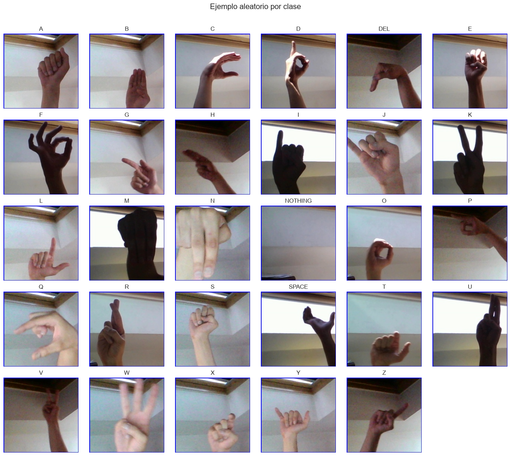

Esta vista general ya deja ver que las manos aparecen sobre fondos y condiciones de iluminación
con cierto grado de variación, y que cada letra tiene una configuración de dedos claramente
distinta a simple vista para la mayoría de los casos. Para cumplir con el requisito de observar
variabilidad *dentro* de una misma clase, se estudiaron seis ejemplos de cada una de siete letras
—A, M, N, S, U, V y R—, sumando 42 fotografías, muy por encima del mínimo de cinco letras
distintas con varias muestras cada una:

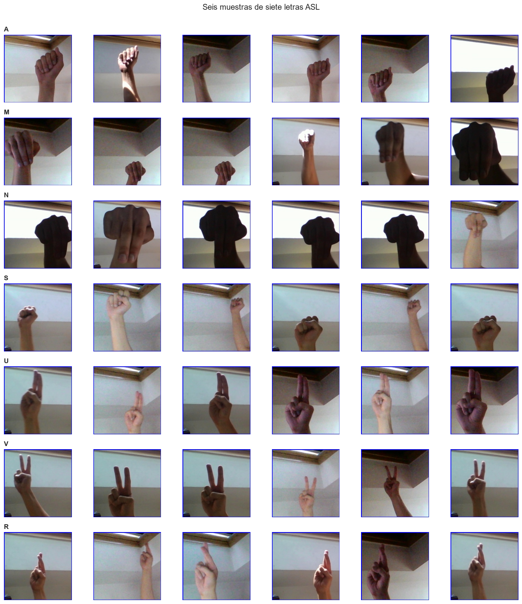

Las imágenes demuestran que una misma letra no ocupa siempre una posición idéntica: hay cambios de
escala, rotación, encuadre, iluminación y apertura de los dedos. Esta variabilidad es justamente lo
que un sistema útil debe aprender a tolerar, en lugar de memorizar una ubicación exacta de la mano.
También se descompuso una fotografía en sus tres canales de color para entenderla como lo que
realmente es para un modelo: un arreglo numérico.

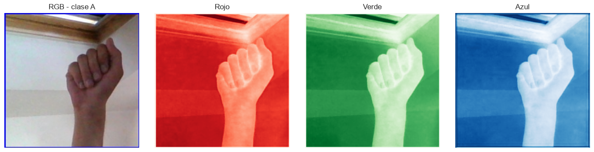

## ¿Qué tan balanceado y limpio está el dataset?

La razón entre la clase de mayor tamaño y la de menor tamaño fue **1.000**: el dataset está
perfectamente balanceado en cantidad de imágenes por clase.

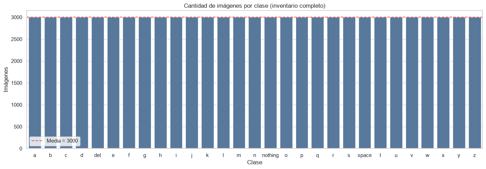

Este balance es favorable porque evita que un futuro modelo encuentre más ejemplos de unas letras
que de otras. Sin embargo, tener el mismo número de imágenes no garantiza que todas las clases
presenten la misma dificultad: algunas señas poseen diferencias muy evidentes, mientras que otras
se distinguen únicamente por la posición de uno o dos dedos, así que en las etapas de modelado no
bastó con reportar una exactitud global y también se revisaron métricas por clase y matrices de
confusión.

La inspección técnica de una submuestra de 17,400 imágenes (600 por clase, el 20% del total, un
tamaño dentro del rango recomendado de 500-800 imágenes por clase) confirmó que **el 100% de las
imágenes estaba en formato JPEG, en modo RGB y con una resolución de 200×200 píxeles**, sin
archivos dañados. Si las 87,000 fotografías se cargaran sin comprimir como arreglos RGB de
200×200, ocuparían aproximadamente **9.72 GiB**. El conjunto oficial de prueba de Kaggle, por su
parte, contiene solamente 28 imágenes y ni siquiera incluye la clase `del`, por lo que se descartó
como prueba principal y se conservó únicamente para comprobaciones cualitativas puntuales.

## Variabilidad dentro de cada clase y letras que se confunden entre sí

Para medir qué tan dispersa es cada clase, se calculó la distancia de cada imagen respecto de la
imagen promedio de su propia clase:

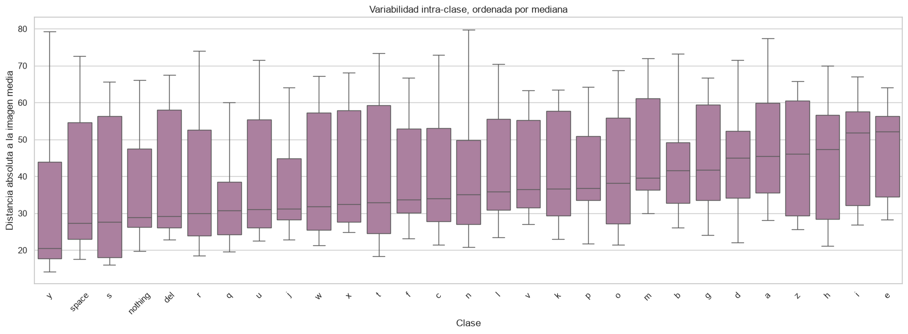

Según esta métrica, **E, I y H** fueron las letras con mayor variabilidad en la submuestra. Esto no
implica necesariamente que sean las más difíciles de clasificar —la distancia alta puede originarse
en cambios genuinos de postura, iluminación, fondo o encuadre—, pero sí indica que merecían atención
especial y que el modelo necesitaría tolerar variaciones razonables de captura. Al promediar todas
las imágenes de cada clase se obtiene además una silueta representativa que resume su forma típica:

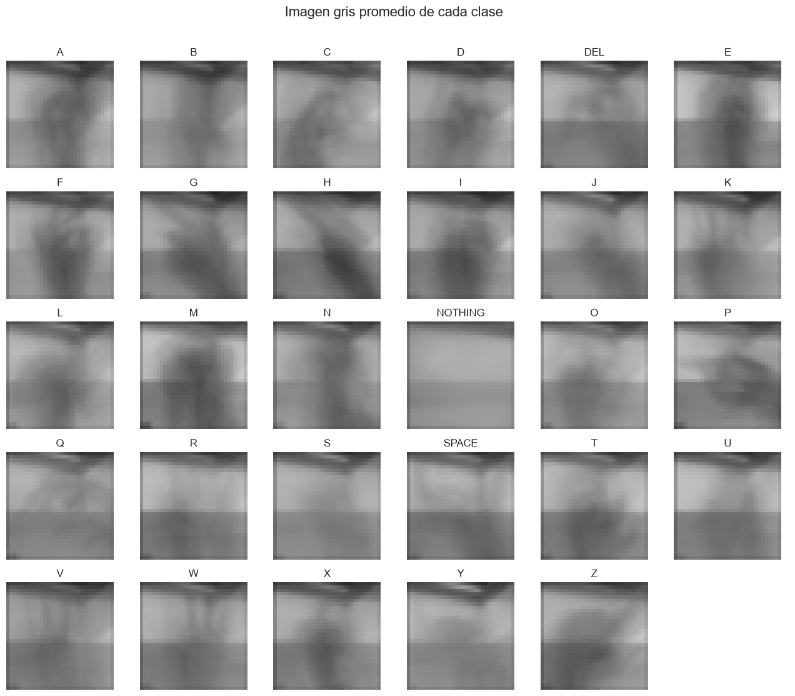

Estas imágenes promedio muestran que existe una estructura espacial común dentro de cada letra: la
silueta principal del gesto permanece visible mientras las regiones variables se difuminan. Se
usaron también para comparar clases entre sí mediante similitud coseno:

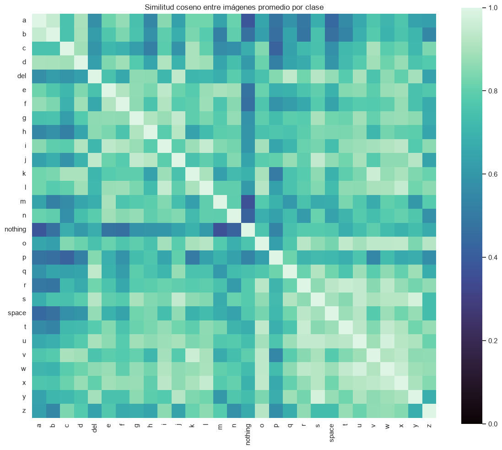

Los pares con mayor semejanza global fueron **S–Y, U–W y K–V**. Este análisis funciona como
generador de hipótesis, no como evidencia definitiva de errores de clasificación: solo después de
entrenar un modelo real fue posible comprobar cuáles pares se confunden de verdad. La inspección
puramente visual, en paralelo, señaló otros dos grupos como los más delicados:

- **M/N/S**: comparten la apariencia general de un puño cerrado. La diferencia se concentra en la
  ubicación del pulgar y en cuántos dedos lo cubren, detalles pequeños que pueden perderse si la
  resolución es demasiado baja o si hay sombra u oclusión parcial.
- **U/V/R**: usan principalmente dos dedos extendidos —en U van juntos, en V separados y en R
  cruzados—, y la orientación de la mano puede hacer que esa separación o cruce sea menos evidente.

Como se verá más adelante, estos dos grupos (M/N/S y U/V/R) sí resultaron ser, en efecto, los que
más confundió el modelo entrenado, confirmando la hipótesis del EDA.

## Brillo, contraste y color por clase

Las variables globales de brillo y contraste también se cruzaron contra la clase:

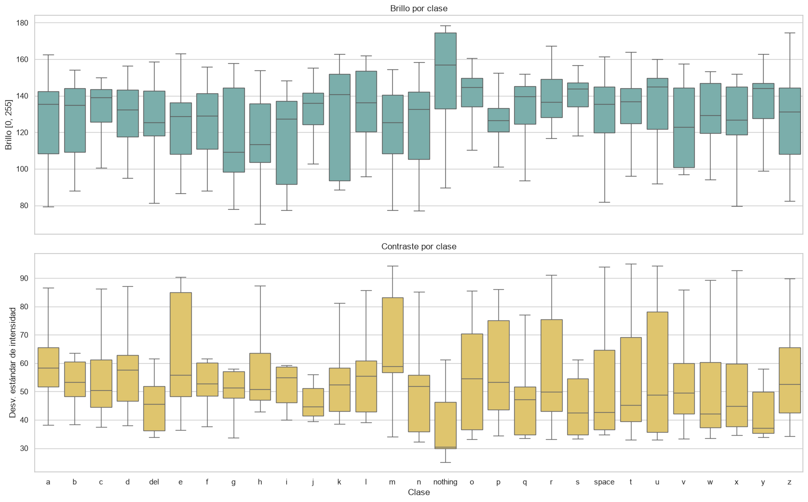

Las medias de brillo abarcaron un rango de 32.5 niveles y las de contraste uno de 23.7 puntos, pero
las distribuciones se solapan ampliamente entre clases, así que brillo y contraste por sí solos no
bastan para separar las letras. Un cruce adicional entre brillo, contraste y los tres canales de
color por clase confirma el mismo patrón: la única clase que se separa con claridad es `nothing`
(fondo vacío, brillante y de bajo contraste), mientras que las letras se mezclan entre sí:

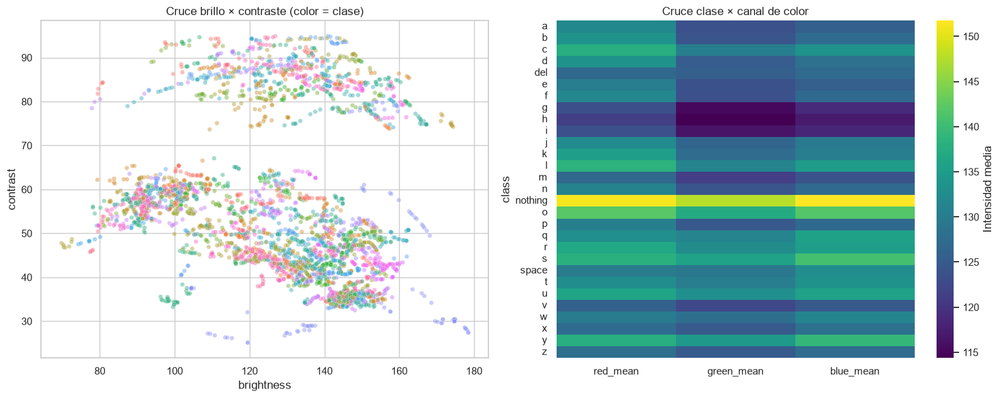

Esto es una buena noticia: la señal principal para distinguir letras debería encontrarse en la
estructura espacial de la mano y no en atajos de iluminación o color. El análisis de correlación
entre brillo, contraste, nitidez, los tres canales RGB y el peso del archivo confirma además que
brillo y los tres canales de color están casi perfectamente correlacionados entre sí (>0.97), y que
contraste y nitidez comparten una correlación moderada (0.73):

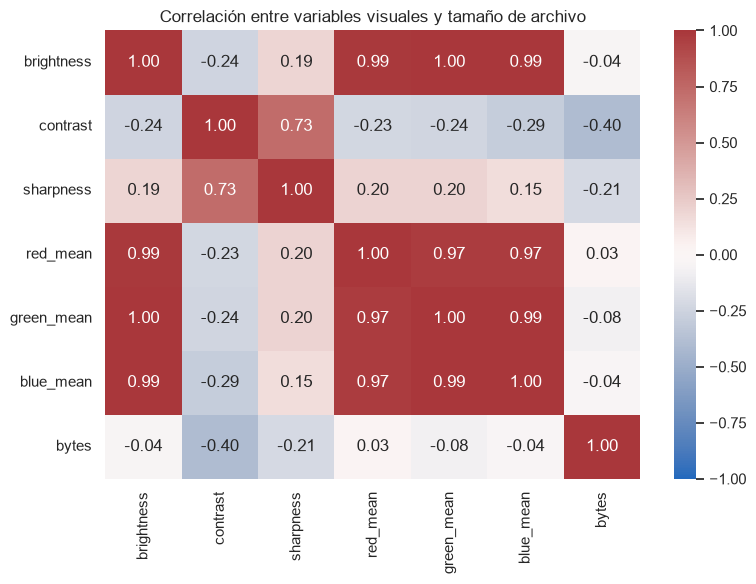

Si algunas condiciones de captura estuvieran asociadas con etiquetas específicas, un modelo podría
aprender atajos relacionados con el fondo o la iluminación en vez de con la forma de la mano; por
eso más adelante se puso especial atención a evaluar el sistema con personas y ambientes distintos
a los del dataset de entrenamiento.

## Cómo se definió el conjunto propio de entrenamiento, validación y prueba

La submuestra de 17,400 imágenes se dividió en **70% entrenamiento, 15% validación y 15% prueba**:

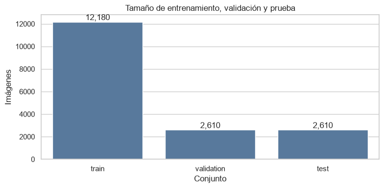

| Conjunto | Imágenes por clase | Total | Uso |
|---|---:|---:|---|
| Entrenamiento | 420 | 12,180 | Ajuste de parámetros |
| Validación | 90 | 2,610 | Selección de configuración |
| Prueba | 90 | 2,610 | Evaluación final |

La división **no** se hizo asignando fotografías individuales al azar. Los nombres de archivo
tienen índices consecutivos que probablemente corresponden a capturas realizadas en momentos
cercanos, y una separación puramente aleatoria podría dejar imágenes casi idénticas repartidas
entre entrenamiento y prueba, inflando artificialmente el desempeño medido. Para reducir ese riesgo
se agruparon los archivos en bloques de 30 consecutivos y, con semilla fija 42, se asignaron 14
bloques por clase a entrenamiento, 3 a validación y 3 a prueba; ningún bloque quedó presente en más
de un conjunto y no se encontraron rutas repetidas entre particiones. Esta estrategia mejora la
independencia entre los datos, aunque no garantiza una separación real por persona o sesión, porque
el dataset no trae identificadores de sujeto — una limitación que se retoma en la sección de
accesibilidad.

## Preprocesamiento antes de entrenar

El preprocesamiento definido conserva la información visual esencial y reduce el costo
computacional: primero se corrige la orientación EXIF si existe y cada imagen se convierte
explícitamente a RGB; después se reduce la resolución de 200×200 a 64×64 con interpolación
bilineal; finalmente el arreglo se convierte a `float32` y se normaliza al rango `[0, 1]`
dividiendo entre 255.

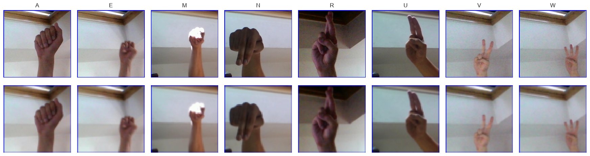

La reducción a 64×64 disminuye en **89.8%** la cantidad de valores por fotografía (la submuestra
completa a esa resolución ocuparía apenas ~0.20 GiB frente a los 9.72 GiB del dataset original), y
la comparación visual confirma que a 64×64 todavía se conservan la silueta de la mano y —lo más
importante— los espacios entre los dedos que distinguen letras como M de N o U de V. El pipeline
completo (EXIF + RGB + resize + normalización) se verificó de punta a punta sobre varias clases:

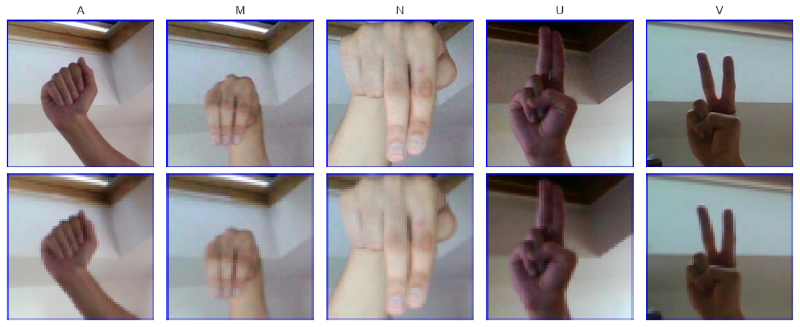

No se aplicaron filtros de desenfoque, enfoque artificial ni segmentación de fondo: un filtro
agresivo podría borrar precisamente las pequeñas separaciones entre dedos que distinguen a las
letras más parecidas entre sí. Tampoco se sobrescribieron los JPEG originales — todas las
transformaciones ocurren al cargar las imágenes. Como control de calidad final se revisaron
también los casos extremos de brillo, contraste y nitidez detectados en la submuestra, para
confirmar que no correspondían a archivos corruptos sino a condiciones de captura genuinamente
distintas:

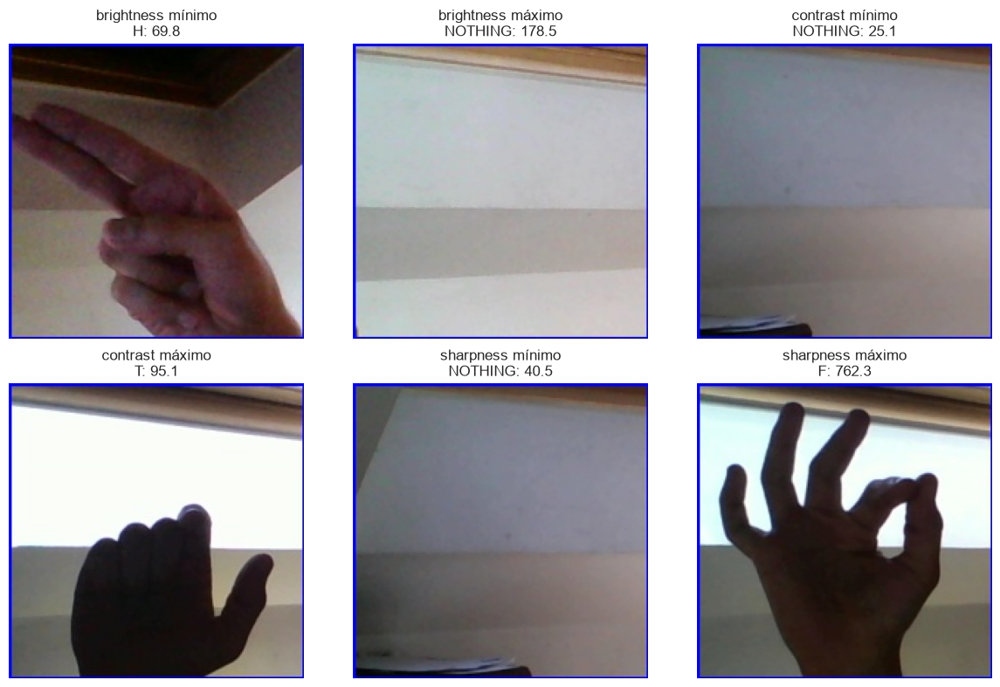

Validación y prueba reciben únicamente estas transformaciones deterministas (EXIF, RGB, resize,
normalización); cualquier aumento de datos aleatorio, como se explica más adelante, se reserva
exclusivamente para entrenamiento.

## Primeros modelos de deep learning: dos CNN y una red fully-connected

Con los datos preparados, se exportaron los arreglos `.npy` de entrenamiento, validación y prueba y
se cargaron para entrenar. Un primer chequeo visual, tomando muestras al azar de los arreglos ya
cargados, confirmó que ninguna clase se perdió en el camino y que las etiquetas correspondían a las
imágenes correctas:

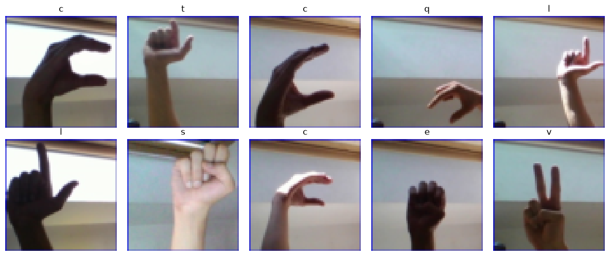

Se entrenaron y compararon dos arquitecturas convolucionales y una red fully-connected, todas bajo
la misma función de entrenamiento y evaluación para garantizar comparaciones justas. **CNN1** es una
arquitectura convolucional base con tres capas convolucionales, aplanado (`Flatten`) y capas densas.
Con 1,145,693 parámetros alcanzó 42.38% de accuracy y 41.24% de F1 macro en prueba (sin
augmentation); para 29 clases, un accuracy de 0.424 está claramente por encima del azar (3.4%), con
un f1_macro algo menor que revela un rendimiento un poco menos parejo entre clases.

**CNN2** usa las mismas tres capas convolucionales que CNN1, pero regularizada: `BatchNormalization`,
`Dropout` y `GlobalAveragePooling2D` en vez de `Flatten` + `Dense`. Con solo 97,885 parámetros —una
décima parte de los de CNN1— superó a CNN1 en todas las métricas (67.89% val / 61.34% test / 58.64%
F1 macro), porque al estar regularizada mantuvo el `val_loss` mejorando por más tiempo antes de
estancarse y así entrenó de verdad varias épocas más.

La red **fully-connected** aplanó la imagen desde el inicio y usó 6,430,749 parámetros —65 veces más
que CNN2— para rendir peor que el azar ajustado: apenas 10.61% de accuracy en test (3× el nivel de
adivinar al azar, contra las 18× que alcanzó CNN2) y un F1 macro de 0.076, aún más revelador: un
valor tan bajo sugiere que el modelo probablemente colapsó hacia predecir bien solo un puñado de
clases —quizás las más fáciles, como `nothing` o `space`, que tienen fondos más distintivos— e
ignoró casi todas las demás.

| Modelo | acc. validación | acc. prueba | F1 macro |
|---|---:|---:|---:|
| CNN2 regularizada | 67.89% | 61.34% | 58.64% |
| CNN1 baseline | 45.02% | 42.38% | 41.24% |
| Fully-connected | 15.79% | 10.61% | 7.56% |

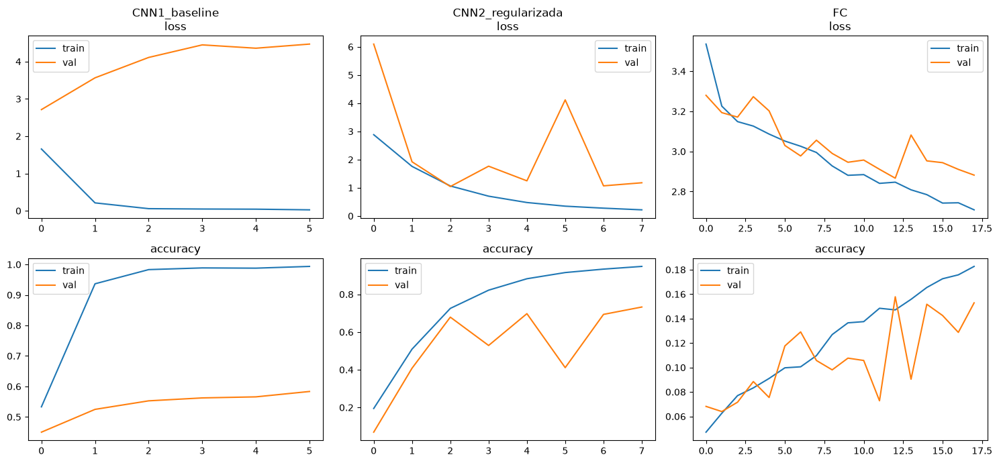

Los gráficos de pérdida y accuracy resumen visualmente lo mismo: CNN2, con las mismas tres capas
convolucionales que CNN1 pero regularizada, obtuvo el mejor desempeño con 11.7 veces menos
parámetros que CNN1. CNN1 memorizó el conjunto de entrenamiento pero no generalizó bien en
validación. La FC aprendió, pero muy lento, y obtuvo el peor rendimiento de las tres.

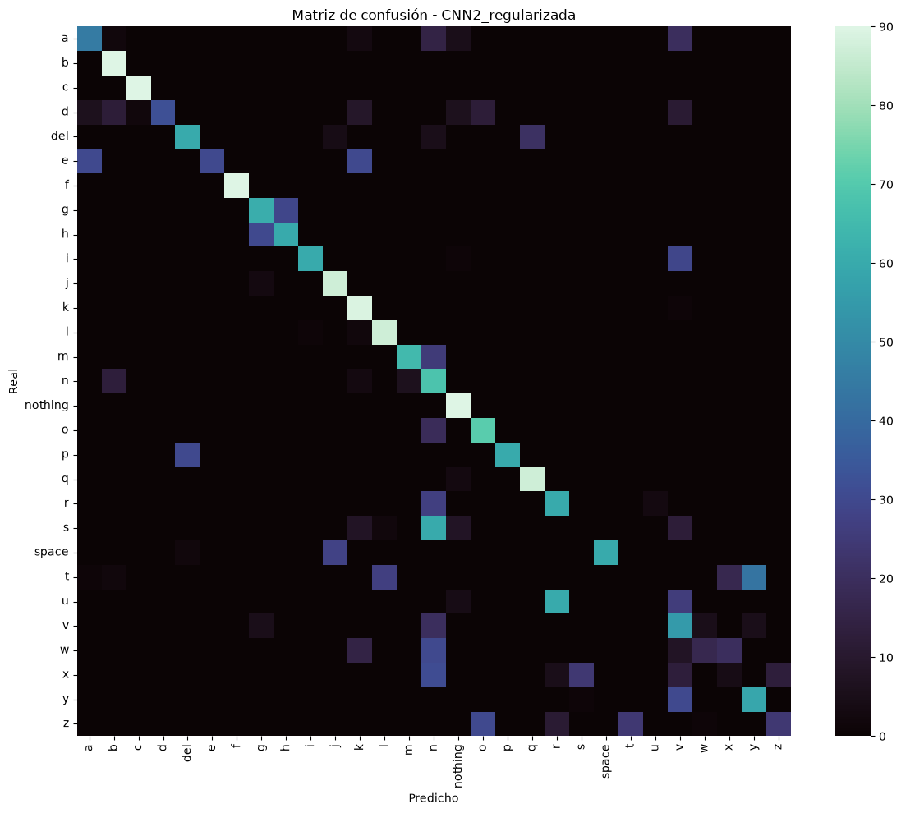

La matriz de confusión de CNN2 (el mejor modelo sin augmentation) confirma que las letras marcadas
como problemáticas en el EDA —M/N/S y U/V/R— efectivamente se confunden entre sí. Los casos más
extremos son S y U, ambas con recall de 0: el modelo nunca las predice correctamente. S es la más
crítica —nunca aparece como predicción en todo el test set—, y sus 90 imágenes reales se reparten
entre N (60) y V (12); U tampoco es identificada nunca, cayendo en R (60) y V (26). En ambos casos
el error se mantiene dentro del mismo clúster visual que predijo el EDA, no se dispersa hacia
letras no relacionadas.

## Augmentation: qué tiene sentido para señas y qué no

Con la mejor arquitectura identificada, se reentrenaron los tres modelos usando *data
augmentation* —rotaciones pequeñas, traslación, zoom y cambios leves de brillo/contraste—
aplicado únicamente sobre el conjunto de entrenamiento:

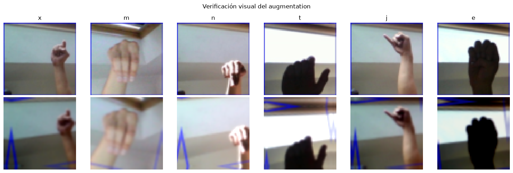

Deliberadamente **no se incluyó flip horizontal**, y vale la pena explicar por qué, ya que es una
transformación estándar en visión por computadora que aquí puede ser contraproducente: en ASL las
señas se hacen con una mano dominante y la orientación de los dedos también es parte del
significado. Un flip horizontal puede convertir una seña en una completamente distinta, produciendo
una imagen que se parece a otra letra real del alfabeto o a una configuración de mano que no existe
en ASL — el modelo aprendería que dos formas espejo son la misma clase, lo cual no es cierto. En
cambio, sí tienen sentido las transformaciones que simulan condiciones reales de captura sin
alterar la forma de la mano: rotación ligera (la mano nunca está perfectamente vertical),
traslación (la mano no siempre está centrada en el encuadre), zoom (la distancia a la cámara varía)
y cambios de brillo/contraste (la iluminación del entorno cambia). Ninguna de estas modifica la
configuración de los dedos que define la seña.

Con augmentation, la tabla completa de seis combinaciones (2 CNN + FC, con y sin augmentation)
quedó así:

| Modelo | Augmentation | Parámetros | Accuracy prueba | F1 macro |
|---|---:|---:|---:|---:|
| CNN2 regularizada | Sí | 97,885 | **84.90%** | **84.86%** |
| CNN1 baseline | Sí | 1,145,693 | 64.94% | 64.01% |
| CNN2 regularizada | No | 97,885 | 61.34% | 58.64% |
| CNN1 baseline | No | 1,145,693 | 42.38% | 41.24% |
| Fully-connected | Sí | 6,430,749 | 17.55% | 13.81% |
| Fully-connected | No | 6,430,749 | 10.61% | 7.56% |

El augmentation mejoró a los tres modelos de forma sustancial (CNN2 pasó de 61.34% a 84.90%), lo
que confirma que exponer al modelo a variaciones realistas de captura durante el entrenamiento
ayuda a generalizar mejor, sin necesidad de alterar la configuración real de la mano. **CNN2 con
augmentation** es, con estos resultados, el mejor modelo de todo el laboratorio.

## Random Forest como comparación clásica

Además de las redes neuronales, se entrenó un **Random Forest** como algoritmo de comparación. La
elección se basó en que, en proyectos anteriores, Random Forest ha dado buenos resultados en
problemas de clasificación no lineales: es estable, combina muchos árboles para reducir la
dependencia de una sola regla, y permite probar configuraciones sin el costo de entrenar otra red
profunda, aportando además una comparación útil entre un algoritmo clásico y las CNN.

Un árbol, sin embargo, no conoce por sí mismo la geometría de una imagen. Usar directamente los
12,288 píxeles RGB como variables sería pesado y no expresaría de forma directa la orientación de
los dedos, así que se construyeron 2,004 características a mano:

- **HOG** (Histogram of Oriented Gradients) con 9 orientaciones, celdas de 8×8 y bloques de 2×2,
  para resumir bordes y direcciones locales.
- **Promedios de color por región**, para conservar información espacial gruesa.
- **Histogramas RGB**, para representar la distribución global de color e iluminación.

Se probaron cuatro configuraciones de hiperparámetros y se escogió la mejor por accuracy de
validación (con F1 macro como criterio secundario):

| Configuración | Árboles | Profundidad | Variables por corte | Hoja mínima | Acc. validación | F1 macro validación |
|---|---:|---:|---|---:|---:|---:|
| RF_200_full_sqrt | 200 | Sin límite | sqrt | 1 | **70.61%** | **70.04%** |
| RF_100_depth20_sqrt | 100 | 20 | sqrt | 1 | 70.31% | 69.71% |
| RF_300_depth30_sqrt | 300 | 30 | sqrt | 1 | 69.85% | 69.07% |
| RF_300_full_log2_leaf2 | 300 | Sin límite | log2 | 2 | 67.39% | 66.55% |

Todas las configuraciones alcanzaron 100% de accuracy en entrenamiento pero solo 67-71% en
validación — una señal clara de sobreajuste: los árboles pueden memorizar la submuestra, aunque el
ensamble conserva parte de la capacidad de generalización. Aumentar el número de árboles más allá
de 200 no corrigió ese problema.

## Comparación final entre todos los modelos

Evaluando los tres mejores representantes sobre el mismo conjunto de prueba:

| Modelo | Accuracy prueba | F1 macro prueba |
|---|---:|---:|
| CNN2 con augmentation | **84.90%** | **84.86%** |
| Random Forest HOG + color | 65.94% | 64.96% |
| CNN2 sin augmentation | 61.34% | 58.64% |

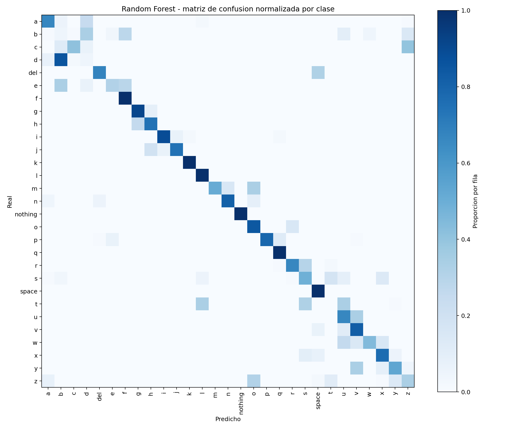

Random Forest superó a la mejor CNN sin augmentation por 4.60 puntos porcentuales de accuracy, pero
la CNN con augmentation lo superó por 18.97 puntos. Esto sugiere que las características HOG/color
son una base clásica razonable, pero la CNN aprende representaciones espaciales más útiles cuando
ve variaciones realistas durante el entrenamiento. La matriz de confusión de Random Forest muestra
además que **no reconoció correctamente ninguna imagen de T** y solo alcanzó 4.44% de recall en B y
D (31.11% en E) — errores que explican por qué su F1 macro queda por debajo de su accuracy y
confirman que los contornos HOG no separan bien todas las configuraciones de mano.

Como comprobación adicional se evaluó un subconjunto de solo cinco letras (A-E), tanto sobre las
450 imágenes internas de prueba como sobre las cinco imágenes oficiales A-E de Kaggle:

| Modelo | Accuracy A-E (interno) | F1 macro A-E (interno) | Aciertos en las 5 oficiales de Kaggle |
|---|---:|---:|---:|
| CNN2 con augmentation | 84.67% | 88.73% | 5/5 |
| CNN2 sin augmentation | 63.78% | 69.36% | 4/5 |
| Random Forest HOG + color | 29.56% | 37.58% | 2/5 |

Las cinco imágenes oficiales de Kaggle sirven como *sanity check* rápido, pero cinco observaciones
producen una estimación demasiado inestable como para sustituir la evaluación interna o las fotos
propias que se describen a continuación.

## Puesta a prueba con fotos propias del equipo

Ningún conjunto de Kaggle mide si el sistema funciona con manos, fondos e iluminación que nunca vio
durante el entrenamiento. Para eso, los tres integrantes del equipo capturaron sus propias fotos:
**150 fotografías de 15 letras distintas**, con cada integrante aportando exactamente 50 imágenes y
cinco letras, cumpliendo de forma equilibrada el mínimo de cinco letras por integrante que pide la
rúbrica:

| Integrante | Letras aportadas | Fotos | Letras distintas |
|---|---|---:|---:|
| Ricardo | I, J, K, L, R | 50 | 5 |
| Sebastian | M, N, S, U, X | 50 | 5 |
| Vianka | O, V, W, Y, Z | 50 | 5 |

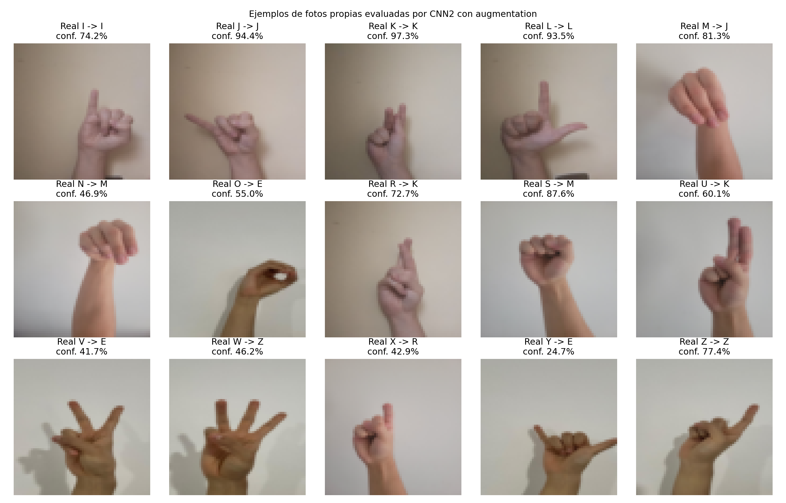

Los resultados globales sobre las 150 fotos, para los tres modelos principales, fueron:

| Modelo | Correctas | Accuracy | Confianza media |
|---|---:|---:|---:|
| CNN2 con augmentation | 54/150 | **36%** | 64.70% |
| CNN2 sin augmentation | 9/150 | 6% | 60.22% |
| Random Forest HOG + color | 0/150 | 0% | 18.55% |

La caída de 84.90% (interno) a 36% (externo) para el mismo modelo, CNN2 con augmentation, es
evidencia clara de **cambio de dominio**: el dataset de entrenamiento no representa suficientemente
manos, fondos e iluminación fuera de sus propias condiciones de captura. Aun así, el augmentation
siguió siendo valioso — obtuvo **seis veces** la exactitud de la CNN sin augmentation en las fotos
propias (36% contra 6%). Random Forest, por su parte, no acertó ninguna foto externa y predijo
sobre todo clases del entorno de entrenamiento con confianza muy baja (18.55%), mostrando que sus
características HOG/color son especialmente sensibles al cambio de dominio.

Desglosando el mejor modelo (CNN2 + augmentation) por integrante:

| Integrante | Correctas | Accuracy | Confianza media |
|---|---:|---:|---:|
| Ricardo | 35/50 | 70% | 75.98% |
| Sebastian | 9/50 | 18% | 60.46% |
| Vianka | 10/50 | 20% | 57.66% |

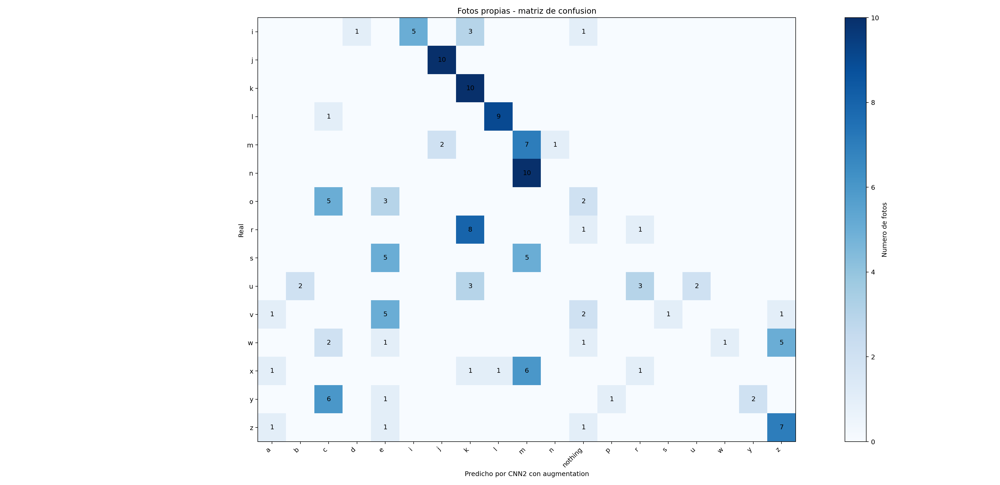

Y por letra: I 50%, J 100%, K 100%, L 90%, R 10%, M 70%, N 0%, S 0%, U 20%, X 0%, O 0%, V 0%, W 10%,
Y 20%, Z 70%. Las confusiones más claras fueron **N→M**, **R→K**, **S→M/E** y varias letras del
tercer bloque de contribuciones (O, V, W, Y, Z) cayendo hacia C, E o Z. Es interesante notar que las
letras J y K, que Ricardo aportó, obtuvieron 100% de recall — muy por encima del resto —, mientras
que letras del grupo M/N/S/U/V que el EDA ya había señalado como visualmente confundibles
(recordando la hipótesis de M/N/S y U/V/R) volvieron a fallar en el mundo real, esta vez con manos,
fondos y cámaras completamente distintos a los del dataset de entrenamiento. Las tres
contribuciones incorporan personas y condiciones de captura distintas, y es justamente por eso que
constituyen la prueba que revela si el sistema generaliza de verdad: los cambios de tono de piel,
fondo, resolución, distancia, encuadre y orientación entre integrantes explican buena parte de la
variación en el desempeño individual.

## Accesibilidad y sesgo: limitaciones para un producto real

El dataset ASL Alphabet no documenta de forma suficiente tono de piel, edad, tamaño de mano,
discapacidad motora, mano dominante o identidad de la persona. Muchas imágenes comparten fondo y
condiciones de captura, por lo que un modelo puede aprender atajos visuales en vez de la forma real
de la mano. La partición por bloques que se definió en este laboratorio reduce la fuga entre
fotografías consecutivas, pero no garantiza una separación real por persona, porque el dataset no
trae identificadores de sujeto.

Además, **J y Z son señas dinámicas** en ASL — se hacen con movimiento — mientras que aquí se
representan con fotografías estáticas. Un clasificador de una sola imagen puede acertar una pose
puntual del dataset sin resolver el problema real de reconocimiento temporal que un producto real
necesitaría.

La caída de desempeño observada con las fotos propias del equipo (de 84.90% interno a 36% externo)
es, en pequeña escala, exactamente el tipo de brecha que un producto de accesibilidad real no puede
permitirse. Para acercar este prototipo a un caso de uso real como SignBridge haría falta, como
mínimo:

1. Recolectar datos con consentimiento de muchas personas y condiciones de cámara, fondo,
   distancia e iluminación variadas — en particular, representando distintos tonos de piel y
   tamaños de mano.
2. Separar entrenamiento y prueba por persona, no solo por archivo o por bloque de capturas.
3. Reportar métricas por subgrupo (tono de piel, mano dominante, dispositivo, entorno), no
   solamente un promedio global que puede esconder fallas sistemáticas en ciertos grupos.
4. Usar secuencias de video y un modelo temporal para J, Z y señas continuas, en vez de clasificar
   fotogramas aislados.
5. Incorporar calibración de confianza y una opción de "no estoy seguro" en vez de forzar siempre
   una letra cuando la confianza del modelo sea baja.
6. Probar con usuarios de la comunidad sorda y diseñar mecanismos de corrección y privacidad antes
   de desplegar el sistema.

## Conclusión general

El mejor modelo del laboratorio es **CNN2 con augmentation**: logra la mayor efectividad interna
(84.90% accuracy, 84.86% F1 macro) con la arquitectura más liviana de las tres redes probadas, y
aunque su desempeño cae a 36% sobre las 150 fotos propias del equipo, sigue siendo seis veces mejor
que la misma arquitectura sin augmentation. Random Forest resultó una comparación clásica válida
—incluso superó a la CNN sin augmentation dentro del dataset—, pero su fracaso total fuera de él
(0% sobre las fotos propias) confirma que las características HOG/color, y los datos de
entrenamiento actuales, no cubren la variación que existe en el mundo real. La red fully-connected,
por su parte, demostró por qué perder la estructura espacial de la imagen tiene un costo alto: con
65 veces más parámetros que CNN2, rindió peor que las dos CNN combinadas.

La conclusión principal no es solamente que el augmentation mejora el accuracy: también mejora la
capacidad del modelo de reconocer manos y condiciones que nunca vio durante el entrenamiento. Aun
así, 36% de accuracy en fotos propias está lejos de ser suficiente para un producto de
accesibilidad real. Se necesitan datos recolectados de muchas más personas, evaluación explícita de
equidad entre subgrupos, y modelado temporal para señas dinámicas como J y Z, antes de que un
sistema como este pueda acercarse a un caso de uso real.
