# Laboratorio 4, Parte 2 — Análisis de modelos usando datos geoespaciales

**CC3084 — Data Science · Laboratorio 4**
**Universidad del Valle de Guatemala · Semestre II, 2026**

> Vianka Castro -23201
>
> Ricardo Godinez -23247
>
> Sebastian Bustamante -22291

Los lagos Atitlán y Amatitlán son cuerpos de agua de gran importancia ecológica, económica y cultural para Guatemala. Sin embargo, ambos han presentado episodios de proliferación de cianobacterias que pueden afectar los ecosistemas, el turismo y la salud pública. Como el muestreo físico frecuente es costoso y tiene una cobertura espacial limitada, en este laboratorio se evaluó si las imágenes multiespectrales Sentinel-2 pueden utilizarse para identificar zonas con presencia elevada de cianobacteria.

La primera parte del laboratorio produjo, para 11 fechas de cada lago, bandas espectrales, NDVI, NDWI y mapas de clorofila-a estimada mediante el índice NDCI. En esta segunda parte se transformaron esos productos en un conjunto de datos geoespacial, se construyó una respuesta binaria, se entrenaron tres modelos de clasificación y se evaluaron con particiones aleatorias, validación espacial y transferencia entre lagos. Finalmente, se interpretó el mejor modelo y se generaron mapas predictivos para comparar sus probabilidades con los mapas de cianobacteria de la Parte I.

El objetivo no fue sustituir las mediciones de campo, sino determinar si un modelo de aprendizaje automático puede funcionar como herramienta de apoyo para priorizar zonas de inspección. Esta diferencia es importante: la referencia disponible también es una estimación satelital de biomasa y no una medición directa de especies, células o toxinas.

## 1. Preparación de los datos para aprendizaje automático

Las 22 escenas fueron alineadas en el sistema **WGS 84 / UTM zona 15N (EPSG:32615)** y trabajadas sobre una cuadrícula de 10 m. Cada fila del conjunto final representa un píxel válido dentro de la máscara persistente de uno de los lagos. Para cada observación se conservaron el lago, la fecha, fila y columna del ráster, coordenadas UTM, bandas Sentinel-2, NDVI, NDWI, clorofila-a estimada, nubosidad, satélite y variables temporales derivadas.

La limpieza eliminó áreas fuera del lago, valores NoData, índices fuera de su intervalo físico, reflectancias extremas y nubes brillantes residuales. No se imputaron valores: interpolar bandas podría suavizar artificialmente una floración e imputar la respuesta inventaría presencia o ausencia. Las estimaciones negativas de clorofila-a se truncaron a cero porque no tienen interpretación física. Después de estos controles quedaron **13,689,403 observaciones válidas**, sin valores faltantes.

| Lago | Observaciones válidas | Positivos | Porcentaje positivo |
|---|---:|---:|---:|
| Atitlán | 12,189,045 | 2,798 | 0.023% |
| Amatitlán | 1,500,358 | 134,910 | 8.992% |
| **Total** | **13,689,403** | **137,708** | **1.006%** |

Las distribuciones de los predictores muestran el comportamiento esperado para agua: `b07` y `b8a` se concentran en reflectancias bajas y presentan una cola hacia valores altos. Esa cola es relevante porque allí aparece gran parte de la señal asociada con biomasa elevada. Las coordenadas tienen distribuciones bimodales porque representan dos lagos geográficamente separados, mientras que las variables temporales presentan escalones debido a que solo existen 11 fechas por lago.

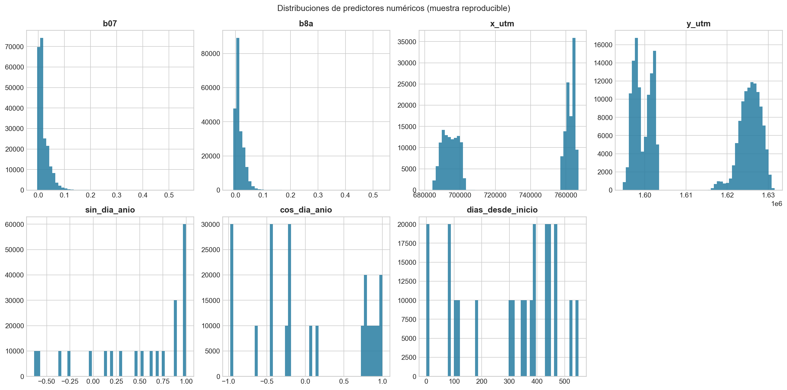

La matriz de correlación mostró una asociación de aproximadamente 0.97 entre `b07` y `b8a`. Esta redundancia es razonable porque son bandas espectralmente cercanas. También se observaron asociaciones entre las variables espectrales y temporales, pero deben interpretarse con cautela: las fechas no cubren uniformemente el calendario y una condición particular de una escena puede parecer un patrón estacional.

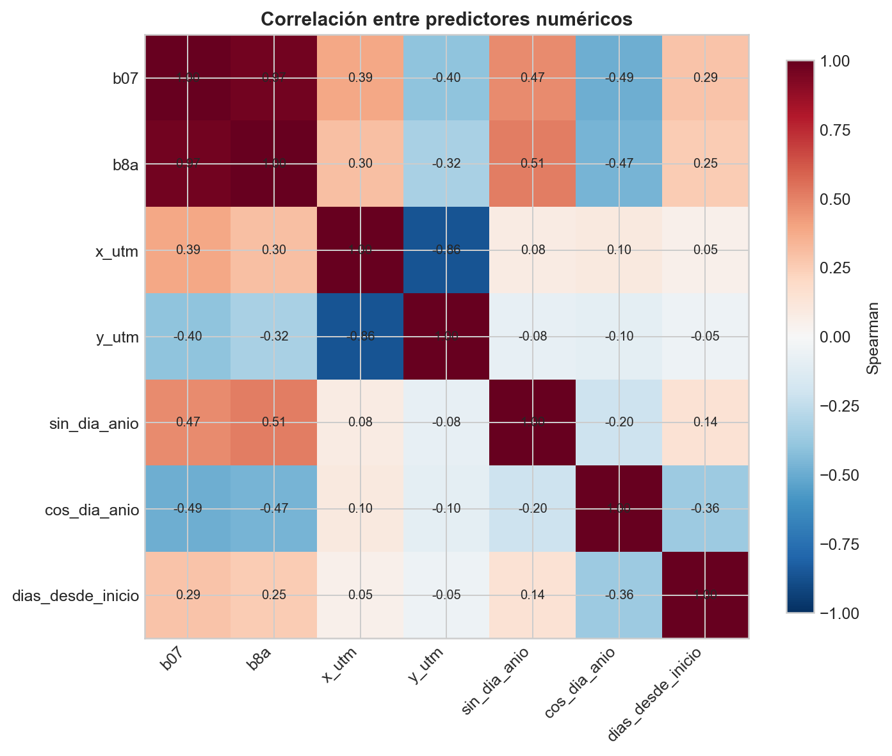

El análisis temporal preliminar confirmó que Amatitlán mantiene niveles promedio de clorofila-a superiores a Atitlán y que la señal crece fuertemente hacia las últimas fechas de 2026. Este comportamiento motivó la creación de `dias_desde_inicio` para representar tendencia y de `sin_dia_anio` y `cos_dia_anio` para representar estacionalidad sin introducir discontinuidad entre diciembre y enero.

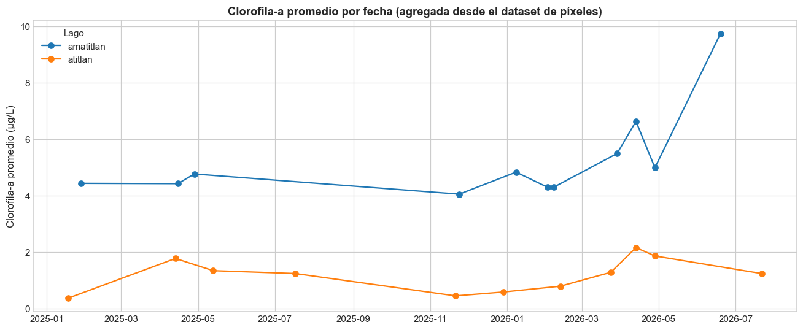

## 2. Construcción de la variable respuesta

La respuesta se definió como:

- `alta_cyano = 0` cuando la clorofila-a estimada es menor que 12 µg/L.
- `alta_cyano = 1` cuando la clorofila-a estimada es mayor o igual que 12 µg/L.

El corte de **12 µg/L** se basó en las guías de la Organización Mundial de la Salud de 2021 para aguas recreativas dulces con dominancia de cianobacterias. Ese valor separa el intervalo de vigilancia de 1–12 µg/L del inicio del nivel de alerta 1, de 12–24 µg/L. La etiqueta representa biomasa elevada que amerita verificación, pero no confirma toxicidad: NDCI estima clorofila-a, no concentración de microcistinas, biovolumen ni recuento celular.

La respuesta presenta un desbalance severo: solo **1.006%** de los píxeles son positivos y la razón entre clases es aproximadamente **98.41:1**. Además, el desbalance no se distribuye por igual: casi todos los positivos pertenecen a Amatitlán. Un clasificador que siempre predijera la clase negativa obtendría cerca de 99% de exactitud sin detectar floraciones. Por esta razón, la evaluación no se basó únicamente en accuracy; se dio prioridad a precision, recall, F1, F2 y PR-AUC.

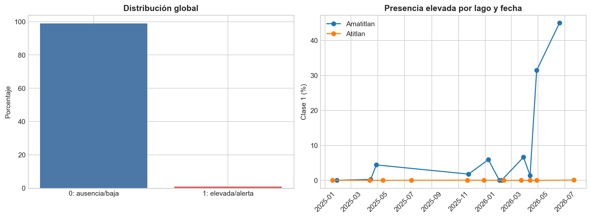

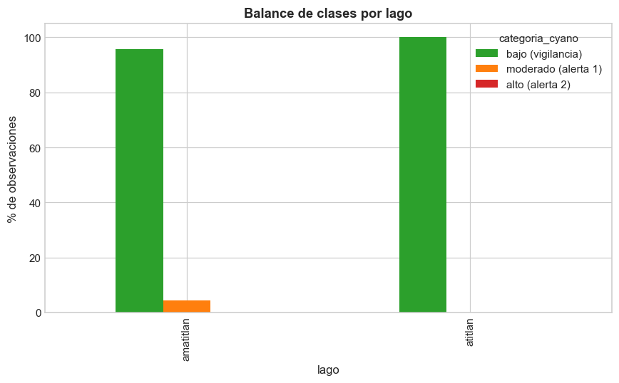

También se auditó la fuga de información. `chl_cyano`, `B04` y `B05` no podían utilizarse porque NDCI y la transformación polinómica que construyeron la etiqueta dependen de ellas. Se excluyeron además `B02`, `B03`, `B08`, `B11`, `B12`, NDVI y NDWI porque intervinieron en la máscara de agua de la Parte I. Aunque estas variables permanecen guardadas para trazabilidad y visualización, no ingresaron a los modelos.

## 3. Selección y construcción de predictores

El conjunto final incluyó diez predictores:

| Familia | Variables | Función esperada |
|---|---|---|
| Espectral | `b07`, `b8a` | Capturar cambios red-edge y NIR asociados con biomasa y propiedades ópticas del agua. |
| Espacial | `x_utm`, `y_utm` | Representar heterogeneidad y focos recurrentes dentro de cada lago. |
| Temporal | `sin_dia_anio`, `cos_dia_anio`, `dias_desde_inicio` | Modelar estacionalidad y tendencia entre 2025 y 2026. |
| Contexto | `lago`, `nubosidad_pct`, `satelite` | Controlar diferencias entre cuerpos de agua, calidad de escena y plataforma Sentinel-2. |

Los boxplots de NDVI y NDWI mostraron un fuerte solapamiento entre las categorías de cianobacteria. NDWI presenta una separación ligeramente mayor, pero ninguno de los índices discrimina por sí solo las observaciones. Esto apoyó la decisión de usar `b07` y `b8a`, las únicas bandas disponibles que no participaron en la construcción directa o indirecta de la respuesta, y permitir que los modelos no lineales aprendieran sus interacciones.

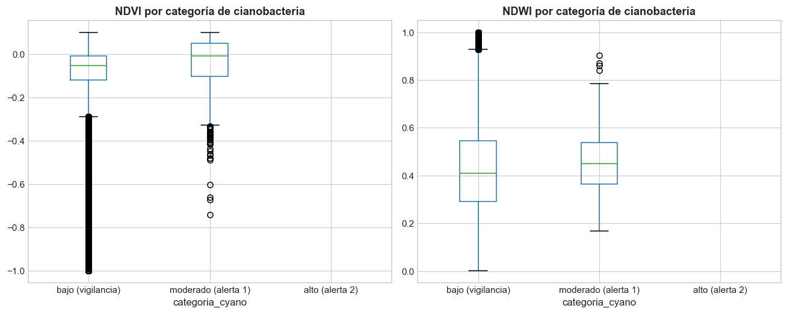

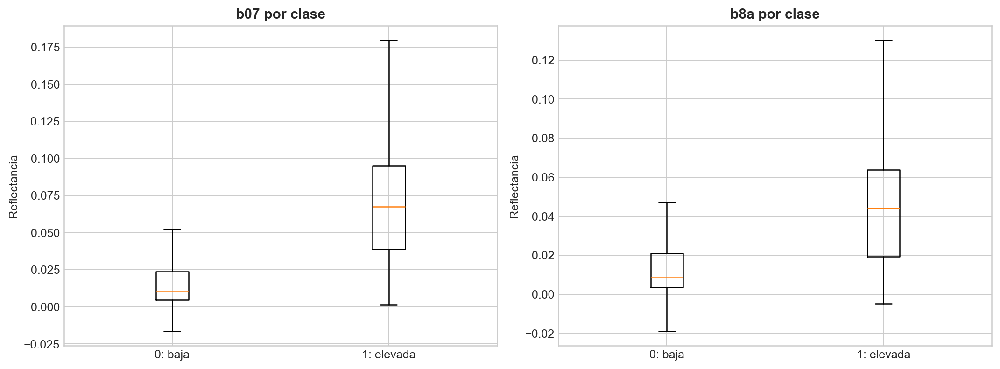

Las coordenadas y la identidad del lago podían mejorar el ajuste local, pero también podían convertirse en atajos. Por ello su uso solo es defendible si el desempeño se comprueba mediante validación espacial y generalización entre lagos, no únicamente con una partición aleatoria de píxeles.

## 4. Construcción de los modelos

Se tomó una muestra proporcional y reproducible de **600,000 observaciones** para hacer viable el ajuste: 420,000 se asignaron a entrenamiento y 180,000 a una prueba común. La división fue estratificada y se utilizó la misma prueba para Regresión Logística, Random Forest y XGBoost. Dentro del entrenamiento se reservó una validación interna para elegir hiperparámetros por PR-AUC, con F2 como desempate. El conjunto de prueba permaneció intacto hasta la comparación final.

Para tratar el desbalance, la Regresión Logística empleó pesos balanceados, Random Forest utilizó `balanced_subsample` y XGBoost usó `scale_pos_weight=98.7`. Los parámetros finales fueron:

| Modelo | Configuración elegida |
|---|---|
| Regresión Logística | `C=10`, solver `lbfgs`, máximo 600 iteraciones. |
| Random Forest | 240 árboles, profundidad 20, mínimo 3 observaciones por hoja y `max_features=sqrt`. |
| XGBoost | 260 árboles, profundidad 6, tasa de aprendizaje 0.08, `min_child_weight=5`, `subsample=0.85` y `colsample_bytree=0.80`. |

Además del umbral convencional de 0.5, para cada modelo se seleccionó en validación interna un umbral que maximiza F2. F2 asigna más peso al recall porque, en este contexto, no detectar una zona realmente elevada puede retrasar una alerta sanitaria o ambiental. Un falso positivo implica una inspección adicional; un falso negativo puede dejar una floración sin atención.

## 5. Evaluación con división aleatoria

Con los umbrales operativos, Random Forest fue el mejor modelo nominal en la prueba aleatoria. Alcanzó PR-AUC de 0.967, recall de 0.975, precision de 0.804 y F2 de 0.935. XGBoost obtuvo el mayor recall, 0.977, aunque con más falsas alertas. La Regresión Logística fue menos precisa, pero proporcionó una referencia lineal útil.

| Modelo | Umbral | Precision | Recall | F1 | F2 | PR-AUC | ROC-AUC |
|---|---:|---:|---:|---:|---:|---:|---:|
| Regresión Logística | 0.952 | 0.653 | 0.920 | 0.764 | 0.851 | 0.821 | 0.998 |
| Random Forest | 0.429 | **0.804** | 0.975 | **0.881** | **0.935** | **0.967** | **0.9996** |
| XGBoost | 0.817 | 0.763 | **0.977** | 0.857 | 0.925 | 0.959 | 0.9996 |

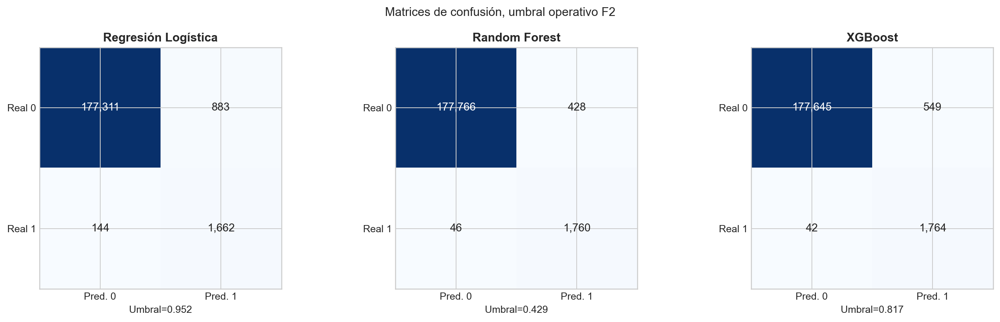

En los 180,000 píxeles de prueba, Random Forest dejó 46 falsos negativos y produjo 428 falsos positivos. XGBoost dejó solo 42 falsos negativos, pero generó 549 falsos positivos. La Regresión Logística dejó 144 falsos negativos y 883 falsos positivos. Estos resultados confirman por qué accuracy y ROC-AUC, ambas cercanas a uno, son insuficientes en un problema con prevalencia de 1%.

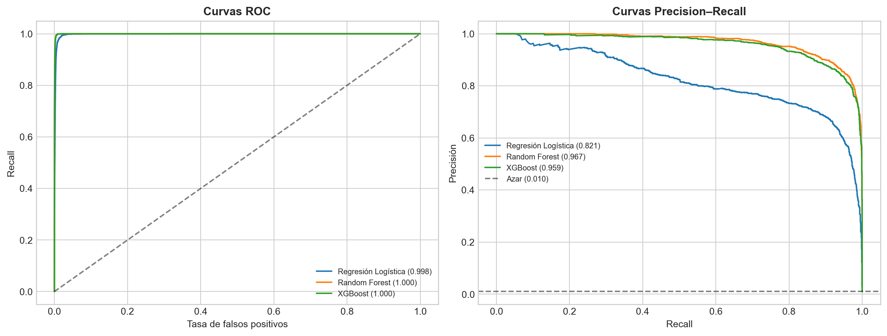

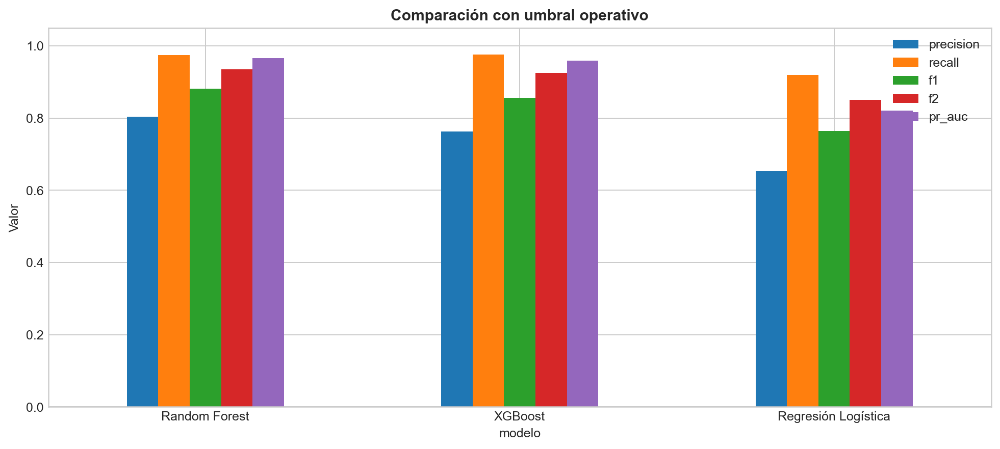

El desempeño también varió por lago. En Amatitlán, XGBoost obtuvo PR-AUC de 0.962 y recall de 0.979. En Atitlán alcanzó PR-AUC de 0.659 y recall de 0.865, pero esta estimación se basa en solo 37 positivos dentro de 160,235 píxeles de prueba. Por lo tanto, las métricas de Atitlán son mucho más inestables que las de Amatitlán.

## 6. Validación espacial

Los píxeles cercanos suelen tener reflectancias parecidas. Si se distribuyen aleatoriamente entre entrenamiento y prueba, el modelo puede evaluar un píxel teniendo vecinos casi idénticos en entrenamiento. Para evitar esta forma de optimismo espacial, cada lago se dividió en bloques de aproximadamente 1 km × 1 km en EPSG:32615.

Se obtuvieron **211 bloques en Atitlán** y **45 en Amatitlán**. Los bloques de Atitlán concentran muy pocos positivos, mientras que en Amatitlán una fracción mayor contiene observaciones elevadas. Las observaciones pertenecientes al mismo bloque se mantuvieron juntas mediante `StratifiedGroupKFold` con cinco folds.

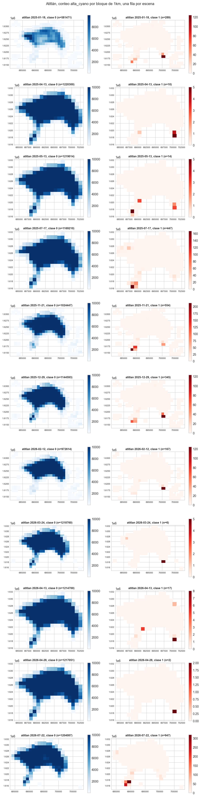

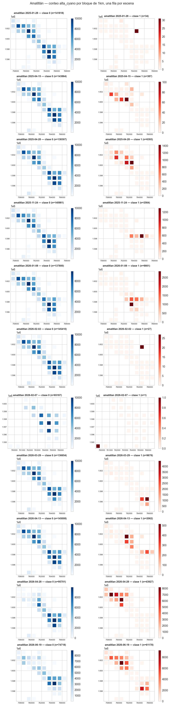

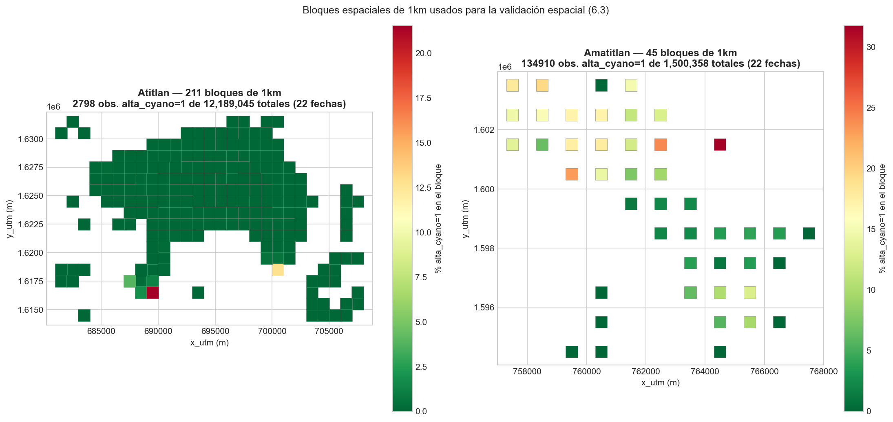

Los tres modelos empeoraron al separar regiones completas, demostrando que la división aleatoria era optimista. La caída fue especialmente fuerte para Random Forest: su PR-AUC bajó 9.4 puntos porcentuales y su recall 14.3. XGBoost se degradó menos y quedó como el modelo más robusto.

| Modelo | PR-AUC aleatoria → espacial | Recall aleatorio → espacial | F2 aleatorio → espacial |
|---|---|---|---|
| Regresión Logística | 0.821 → 0.803 | 0.920 → 0.911 | 0.851 → 0.841 |
| Random Forest | 0.967 → 0.872 | 0.975 → 0.832 | 0.935 → 0.815 |
| XGBoost | **0.959 → 0.901** | **0.977 → 0.916** | **0.925 → 0.876** |

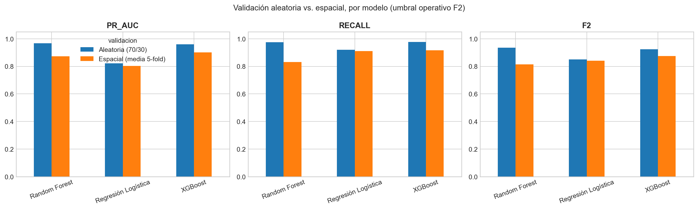

Random Forest tenía más capacidad para memorizar patrones locales, por lo que perdió su ventaja cuando los vecinos dejaron de mezclarse entre entrenamiento y prueba. XGBoost mostró una reducción moderada y menor variabilidad entre folds. Aunque la Regresión Logística fue la que menos cayó, su desempeño absoluto permaneció por debajo de XGBoost. Por ello se adoptó **XGBoost como modelo final**: no fue el ganador de la prueba aleatoria, pero sí el mejor compromiso bajo la evaluación más realista para zonas nuevas.

## 7. Generalización entre lagos

La transferencia se evaluó en ambas direcciones. Al entrenar con Atitlán y probar con Amatitlán, XGBoost obtuvo PR-AUC de 0.272 y recall de 0.124. Atitlán aportaba apenas 136 positivos a ese entrenamiento, por lo que el modelo casi no había observado el fenómeno que debía reconocer en un lago con prevalencia mucho mayor.

Al entrenar con Amatitlán y probar con Atitlán, XGBoost alcanzó recall de 0.801, pero precision de solo 0.073. El modelo aprendió la floración con miles de positivos de Amatitlán, pero produjo demasiadas alertas al aplicarse en Atitlán, donde la presencia elevada es aproximadamente 390 veces menos frecuente en el conjunto completo.

| Dirección de transferencia, XGBoost | Precision | Recall | PR-AUC |
|---|---:|---:|---:|
| Entrena Atitlán → prueba Amatitlán | 0.660 | 0.124 | 0.272 |
| Entrena Amatitlán → prueba Atitlán | 0.073 | 0.801 | 0.295 |

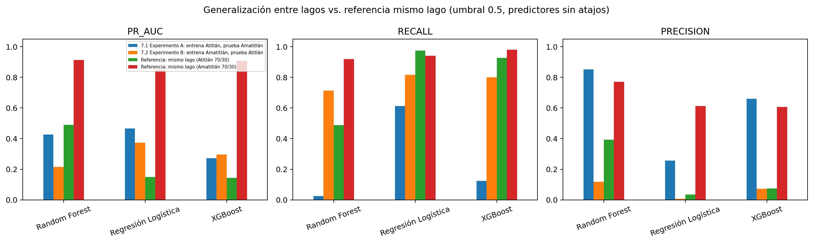

Ningún modelo generalizó adecuadamente en ambas direcciones. Las diferencias pueden explicarse por la prevalencia, profundidad, altitud, turbidez, sedimentos, materia orgánica, uso del suelo y carga de nutrientes. En aguas ópticamente complejas, una misma reflectancia no necesariamente representa la misma concentración en dos cuerpos de agua. También existe una limitación metodológica: los pesos de clase se calibraron para la prevalencia global, no para la distribución particular de cada lago.

## 8. Interpretación y explicabilidad

La importancia nativa de XGBoost estuvo dominada por la identidad del lago. Esta variable produce divisiones con gran reducción de pérdida porque separa dos poblaciones con prevalencias muy distintas. Sin embargo, la importancia por ganancia no describe por sí sola cuánto cambia cada predicción; por eso se complementó con SHAP.

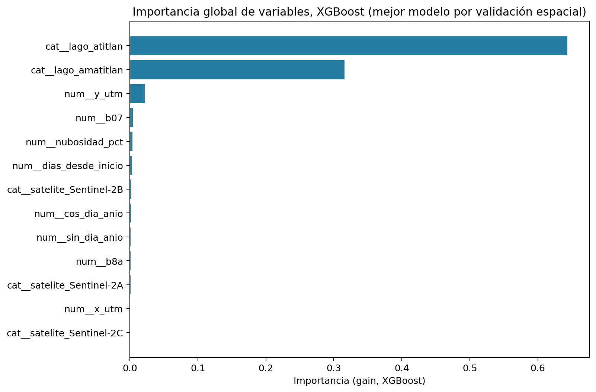

El resumen SHAP cambió el orden: `b07` fue la variable con mayor impacto medio absoluto, seguida por `y_utm`, `x_utm`, la categoría Amatitlán y `b8a`. Los valores altos de `b07` empujan fuertemente la predicción hacia presencia elevada; los valores bajos la reducen. Esta relación es no lineal y se satura: después de cierto nivel de reflectancia, el píxel ya es suficientemente característico de la clase positiva y aumentos adicionales cambian poco la decisión.

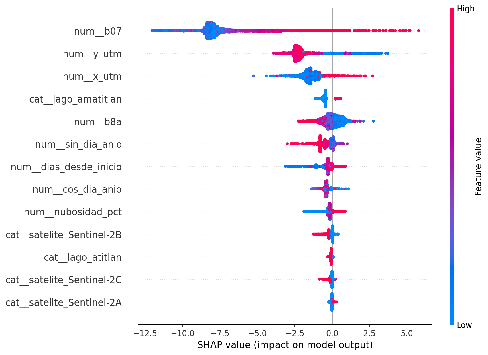

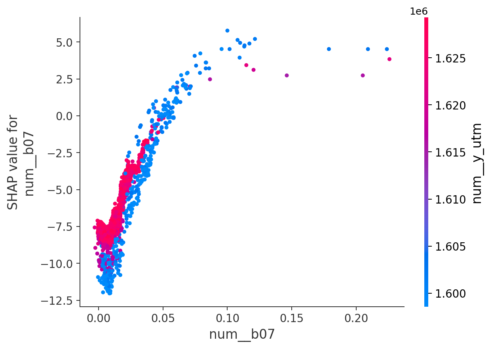

La influencia de `b07` es alentadora porque representa una señal espectral físicamente relacionada con las propiedades ópticas de la biomasa. En cambio, la importancia de las coordenadas es una advertencia: el modelo aprende ubicaciones con riesgo histórico dentro de los lagos. Esto ayuda a predecir dentro del dominio observado, pero explica parte del fracaso al transferir el modelo a otro lago o a regiones espaciales no representadas.

Los gráficos de `x_utm` y `y_utm` muestran nubes claramente separadas por lago. Estar en Atitlán suele reducir la predicción, coherente con su prevalencia extremadamente baja, mientras que dentro de Amatitlán existe mayor variación espacial. La explicabilidad, la validación espacial y la generalización cruzada cuentan así una historia consistente: el modelo combina una señal espectral transferible con información geográfica local que limita su portabilidad.

## 9. Generación de mapas predictivos

El XGBoost final se aplicó a las **13,689,403 observaciones válidas de las 22 escenas**. Para cada píxel se calculó la probabilidad de `alta_cyano=1` y la clasificación operativa usando el umbral 0.817 seleccionado por F2. Para la visualización, las probabilidades se dividieron en cuatro niveles:

- Muy baja: 0.00–0.25.
- Baja: 0.25–0.50.
- Alta: 0.50–0.75.
- Muy alta: 0.75–1.00.

Estas categorías sirven para leer el mapa; no sustituyen el umbral operativo. Se eligió para cada lago la fecha con mayor número de positivos observados, de modo que el diagnóstico incluyera suficientes casos relevantes.

### 9.1 Mapa predictivo de Atitlán

Para Atitlán se seleccionó el 22 de julio de 2026. En 1,205,034 píxeles válidos se observaron 947 positivos y se predijeron 1,800. El modelo identificó correctamente 769 positivos, dejó 178 falsos negativos y produjo 1,031 falsos positivos. Esto corresponde a precision de **0.427**, recall de **0.812** y PR-AUC de **0.548**.

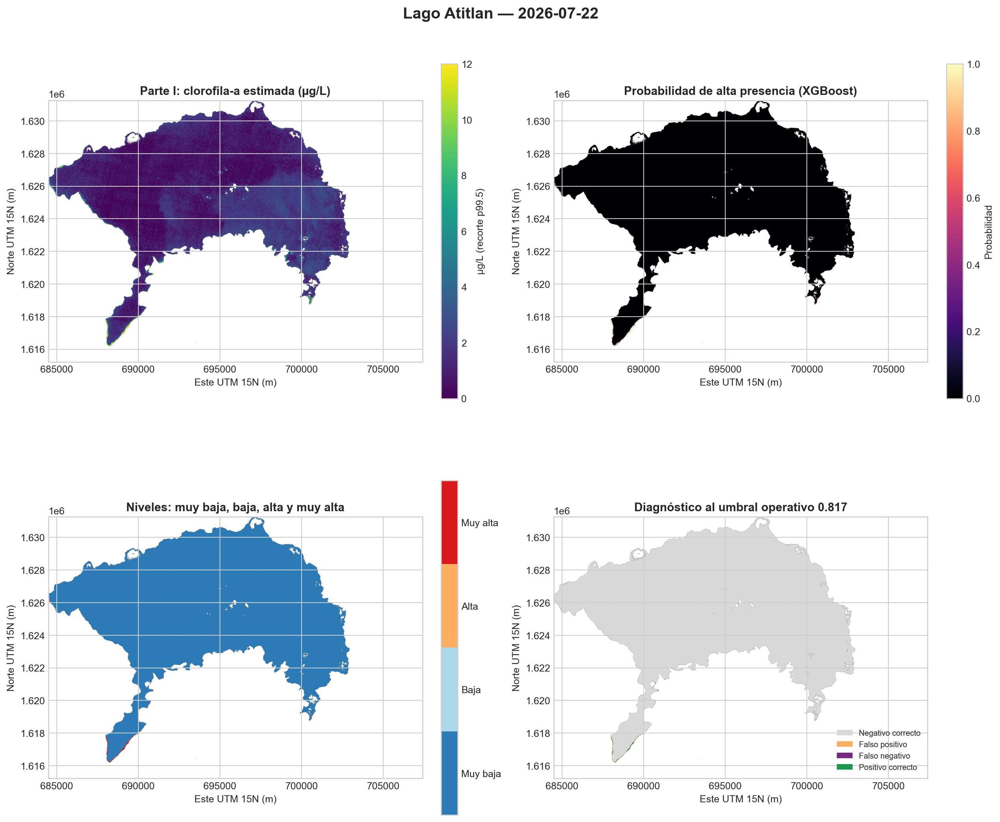

La figura compara cuatro productos. El primer panel reconstruye la clorofila-a de la Parte I usando los mismos valores ráster por píxel; el segundo presenta la probabilidad de XGBoost; el tercero separa las cuatro categorías de probabilidad; y el cuarto localiza negativos correctos, falsos positivos, falsos negativos y positivos correctos. Por tanto, la comparación con la Parte I no se limita a observar dos PNG: utiliza la referencia original de clorofila-a sobre las mismas posiciones y fecha.

Atitlán aparece casi completamente en probabilidad muy baja, con focos pequeños en orillas y sectores específicos. Este patrón concuerda con la baja prevalencia del lago, pero también explica la precision moderada: cuando el evento es extremadamente raro, incluso pocos falsos positivos pueden superar el número de positivos reales. Los errores se concentran en zonas puntuales y no se distribuyen uniformemente por toda la superficie.

### 9.2 Mapa predictivo de Amatitlán

Para Amatitlán se seleccionó el 19 de junio de 2026. Entre 135,896 píxeles válidos había 61,178 positivos y el modelo predijo 78,394. Se obtuvieron 60,318 verdaderos positivos, 860 falsos negativos y 18,076 falsos positivos: precision de **0.769**, recall de **0.986** y PR-AUC de **0.955**.

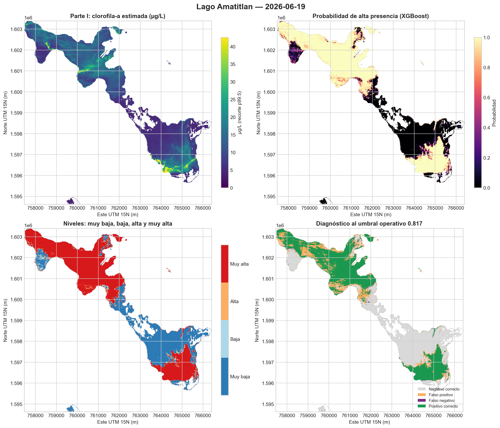

El mapa reproduce correctamente la gran extensión de la señal alta observada en la Parte I, especialmente en los sectores norte y central y en parte del extremo sur. La mayoría de las zonas positivas son detectadas, pero el modelo expande la alerta alrededor de algunos bordes y transiciones, produciendo falsos positivos. Los falsos negativos son escasos y aparecen como fragmentos dentro de áreas más amplias, coherente con el recall cercano a uno.

### 9.3 Patrones espaciales de error

Los errores de las 22 fechas se acumularon en los mismos bloques de 1 km utilizados en la validación espacial. Esto permitió separar errores aislados de regiones donde el modelo falla repetidamente.

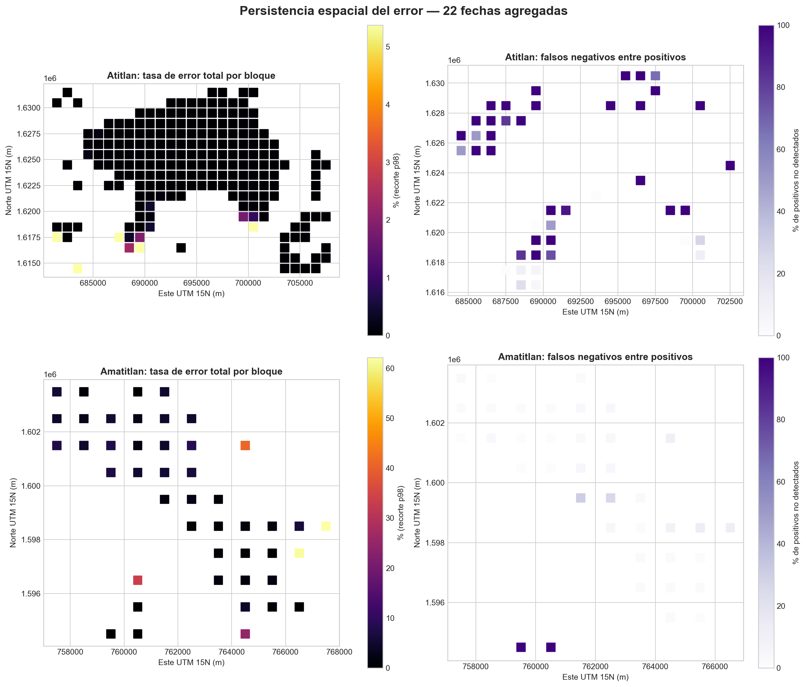

En Atitlán, el mayor error total entre bloques con al menos 1,000 observaciones apareció aproximadamente en la coordenada UTM **(700,500; 1,618,500)**, con 8.92% de desacuerdos. Otro bloque alrededor de **(688,500; 1,616,500)** acumuló 22.3% de falsos negativos entre sus positivos. En Amatitlán, el mayor error total se ubicó aproximadamente en **(762,500; 1,601,500)**, con 8.64%, mientras que bloques del sector oriental y de transición presentaron omisiones o falsas alertas más frecuentes.

La dificultad no es uniforme. Se concentra en pocos bloques, bordes de parches y regiones donde la reflectancia puede cambiar por mezcla de agua, costa, sedimentos, vegetación o nubosidad residual. Este resultado coincide con SHAP: las coordenadas aportan información importante y algunos sectores tienen patrones locales que el modelo aprende mejor que otros.

## 10. Análisis final y conclusiones

El modelo tiene capacidad suficiente para utilizarse como **herramienta de apoyo para priorizar inspecciones**, pero no como sistema autónomo de alerta ni como sustituto del muestreo físico. La evidencia principal es que XGBoost conservó PR-AUC de **0.901**, recall de **0.916** y F2 de **0.876** bajo validación espacial. Esta evaluación es más exigente y realista que la división aleatoria porque obliga al modelo a predecir bloques completos que no aparecieron en entrenamiento.

Su recall alto es valioso ambientalmente: reduce el riesgo de dejar sin detectar una zona con presencia elevada. El umbral F2 acepta más falsos positivos porque una inspección innecesaria suele ser menos grave que omitir una floración potencialmente dañina. Los mapas demuestran además que la salida puede convertirse en un producto espacial útil para dirigir campañas de campo.

No obstante, la recomendación se limita a los lagos, fechas y condiciones representadas. La transferencia entre lagos fue deficiente; la prueba aleatoria sobreestimó el rendimiento; Atitlán contiene muy pocos positivos; y el modelo depende de coordenadas e identidad del lago. Por ello, una probabilidad alta debe interpretarse como una prioridad de verificación y no como evidencia definitiva de toxicidad.

### Principales limitaciones

- **Referencia indirecta:** la etiqueta proviene de clorofila-a estimada por NDCI, no de muestras de laboratorio. Modelo y referencia comparten un origen satelital.
- **Desbalance extremo:** solo 1.006% de las observaciones son positivas y casi todas pertenecen a Amatitlán.
- **Pocas fechas:** 11 observaciones temporales por lago no permiten caracterizar completamente estacionalidad, eventos extremos ni variación interanual.
- **Autocorrelación espacial:** los píxeles vecinos no son independientes; la caída bajo validación espacial demuestra el optimismo de la división aleatoria.
- **Diferencias entre lagos:** profundidad, turbidez, estado trófico, sedimentos, uso del suelo y cargas de nutrientes modifican la relación espectral.
- **Resolución efectiva:** aunque la cuadrícula es de 10 m, las bandas red-edge B07 y B8A tienen resolución nativa de 20 m y fueron remuestreadas. En orillas y parches pequeños existe mezcla de píxeles.
- **Nubes y atmósfera:** pueden persistir nubes delgadas, sombras, bruma, destello solar o errores de corrección atmosférica.
- **Dependencia geográfica:** coordenadas e identidad del lago mejoran el ajuste local, pero reducen la capacidad de transferir el modelo.
- **Calibración temporal:** el umbral y los pesos de clase reflejan la prevalencia de estas escenas; cambios futuros pueden provocar deriva.

### Datos que mejorarían el modelo

La mejora prioritaria sería contar con **muestreos físicos georreferenciados y sincronizados con el paso de Sentinel-2**. Deberían incluir clorofila-a, ficocianina, densidad y taxonomía de cianobacterias, microcistinas, turbidez, transparencia Secchi, oxígeno disuelto, pH, nitrógeno y fósforo. Esto proporcionaría una referencia independiente y permitiría pasar de predecir una estimación satelital a predecir riesgo ambiental medido.

También serían útiles temperatura del agua y del aire, radiación solar, viento, lluvia acumulada y variables con rezagos; caudal y carga de nutrientes de tributarios; nivel y tiempo de residencia del agua; corrientes; distancia a desembocaduras y descargas; y una serie temporal más extensa que incluya varios años y más fechas de floración.

Una futura evaluación debería reservar fechas completas y campañas posteriores al entrenamiento, además de lagos nunca vistos si se pretende ampliar el alcance. También convendría calibrar probabilidades por lago, incorporar incertidumbre, mejorar la corrección atmosférica específica para agua y reducir la dependencia de coordenadas absolutas en favor de variables ambientales transferibles.

## Conclusión general

El laboratorio demostró que es posible transformar productos Sentinel-2 en un sistema reproducible que identifica zonas con señal elevada de cianobacteria. Random Forest obtuvo el mejor resultado en una prueba aleatoria, pero perdió gran parte de su ventaja cuando se separaron regiones completas. XGBoost fue más estable y se convirtió en el modelo final por su desempeño espacial, no por el resultado más favorable bajo la partición más sencilla.

La señal espectral de `b07` fue el principal motor de las predicciones, mientras que las coordenadas explicaron parte del ajuste local y de la limitada transferencia entre lagos. En Amatitlán, donde existen suficientes positivos, los mapas alcanzaron alta sensibilidad y reprodujeron la extensión general observada en la Parte I. En Atitlán, la rareza del evento hizo que la precision fuera menor y que las estimaciones fueran más inciertas.

En consecuencia, el modelo puede reducir el área que requiere inspección y ayudar a ordenar campañas de monitoreo, pero todavía no debe utilizarse para emitir alertas ambientales o sanitarias sin confirmación. Antes de una implementación operacional se necesitan datos de campo, más fechas positivas, calibración por lago y validación prospectiva.

## Referencias

- Mishra, S., & Mishra, D. R. (2012). *Normalized difference chlorophyll index: A novel model for remote estimation of chlorophyll-a concentration in turbid productive waters*. Remote Sensing of Environment, 117, 394–406. https://doi.org/10.1016/j.rse.2011.10.016
- World Health Organization. (2021). *Guidelines on recreational water quality. Volume 1: Coastal and fresh waters*. ISBN 978-92-4-003130-2. https://www.who.int/publications/b/58742
- World Health Organization. (2021). *Compendium of WHO and other UN guidance on health and environment*, tabla 3.2. https://cdn.who.int/media/docs/default-source/who-compendium-on-health-and-environment/who_compendium_chapter3_27082021_pdf.pdf

