# Monitoreo temporal de cianobacterias en los lagos Atitlán y Amatitlán

**CC3084 — Data Science · Laboratorio 4**
**Universidad del Valle de Guatemala · Semestre II, 2026**

> Vianka Castro -23201
>
> Ricardo Godinez -23247
>
> Sebastian Bustamante -22291

Este informe utiliza imágenes **Sentinel-2** y la API de **openEO** para estimar la señal asociada con cianobacterias en los lagos Atitlán y Amatitlán, e incluye el cálculo de **NDVI** y **NDWI** con las bandas mínimas requeridas.

**Resultado principal:** se construye una serie temporal de clorofila-a estimada por lago y fecha, se identifican los valores máximos y se comparan los patrones observados entre ambos cuerpos de agua.

**Objetivos y flujo de trabajo:**

1. Conectarse al catálogo Sentinel-2 de Copernicus Data Space mediante openEO.
2. Delimitar ambos lagos y utilizar exclusivamente las 11 fechas oficiales de cada uno.
3. Definir NDVI, NDWI y el estimador de clorofila-a basado en NDCI.
4. Aplicar una máscara espectral de agua y descargar un GeoTIFF por lago y fecha.
5. Calcular estadísticas descriptivas, visualizar la evolución temporal e identificar fechas críticas.

La descarga se limita a las bandas utilizadas por cada cálculo, para minimizar el tiempo de descarga y el volumen de datos.

---

## 1. Área y período de estudio

Se utilizan cajas delimitadoras en coordenadas geográficas (EPSG:4326) y únicamente las fechas oficiales proporcionadas para el laboratorio.

| Lago | Fecha | Nubosidad (%) | Satélite |
|---|---:|---:|---|
| Atitlán | 2025-01-18 | 0.02 | Sentinel-2B |
| Atitlán | 2025-04-13 | 0.54 | Sentinel-2C |
| Atitlán | 2025-05-13 | 4.37 | Sentinel-2C |
| Atitlán | 2025-07-17 | 3.57 | Sentinel-2A |
| Atitlán | 2025-11-21 | 3.15 | Sentinel-2A |
| Atitlán | 2025-12-29 | 3.17 | Sentinel-2C |
| Atitlán | 2026-02-12 | 0.04 | Sentinel-2B |
| Atitlán | 2026-03-24 | 3.17 | Sentinel-2B |
| Atitlán | 2026-04-13 | 0.01 | Sentinel-2B |
| Atitlán | 2026-04-28 | 4.96 | Sentinel-2C |
| Atitlán | 2026-07-22 | 4.02 | Sentinel-2B |
| Amatitlán | 2025-01-28 | 0.06 | Sentinel-2B |
| Amatitlán | 2025-04-15 | 0.09 | Sentinel-2A |
| Amatitlán | 2025-04-28 | 1.03 | Sentinel-2B |
| Amatitlán | 2025-11-24 | 0.50 | Sentinel-2B |
| Amatitlán | 2026-01-08 | 0.77 | Sentinel-2C |
| Amatitlán | 2026-02-02 | 0.39 | Sentinel-2B |
| Amatitlán | 2026-02-07 | 0.02 | Sentinel-2C¹ |
| Amatitlán | 2026-03-29 | 0.01 | Sentinel-2C |
| Amatitlán | 2026-04-13 | 0.09 | Sentinel-2B |
| Amatitlán | 2026-04-28 | 4.96 | Sentinel-2C |
| Amatitlán | 2026-06-19 | 13.00 | Sentinel-2A |

La escena del 7 de febrero de 2026 tiene cobertura válida parcial (aproximadamente 57.1 %).

---

## 2. Metodología

Para estimar la señal de cianobacteria y los índices espectrales se trabajó con tres definiciones, cada una aplicada únicamente sobre las bandas mínimas necesarias.

**NDVI y NDWI.** Para estos índices se usa el producto **Sentinel-2 L2A** (reflectancia de superficie):

- NDVI = (B08 − B04) / (B08 + B04)
- NDWI = (B03 − B08) / (B03 + B08)

La consulta solicita solamente `B03`, `B04` y `B08`, con un intervalo de un día para aislar cada fecha oficial.

**Estimación de cianobacterias.** El flujo reproduce el componente cuantitativo del **CyanoLakes Script** mediante el índice NDCI y una relación polinómica para estimar clorofila-a:

NDCI = (B05 − B04) / (B05 + B04)

Chl = 826.57·(NDCI)³ − 176.43·(NDCI)² + 19·(NDCI) + 4.071

Se trabaja con **Sentinel-2 L1C** y solo con las siete bandas que intervienen en la estimación o en la máscara de agua: `B02`, `B03`, `B04`, `B05`, `B08`, `B11` y `B12`.

**Máscara espectral de agua.** La máscara combina MNDWI, NDWI, NDVI, AWEI y DBSI para conservar posibles píxeles de agua y excluir áreas urbanas o suelo desnudo. Aplicarla antes del resumen evita mezclar la señal del lago con la superficie circundante.

Con estas tres piezas definidas, el siguiente paso fue procesar las 22 escenas oficiales (11 por lago) y construir la serie temporal de cianobacteria.

---

## 3. Análisis temporal de cianobacteria

Para cada fecha se descarga el GeoTIFF enmascarado y se calculan estadísticas sobre los píxeles válidos; las estimaciones negativas se truncan a cero porque no representan concentraciones físicamente interpretables. Cada fila resume la distribución de la clorofila-a estimada dentro de la máscara de agua para una fecha oficial; los resultados de ambos lagos se unen y ordenan en una única serie temporal.

### Evolución comparativa

El promedio por fecha permite comparar la intensidad y variabilidad de la señal estimada en ambos lagos.

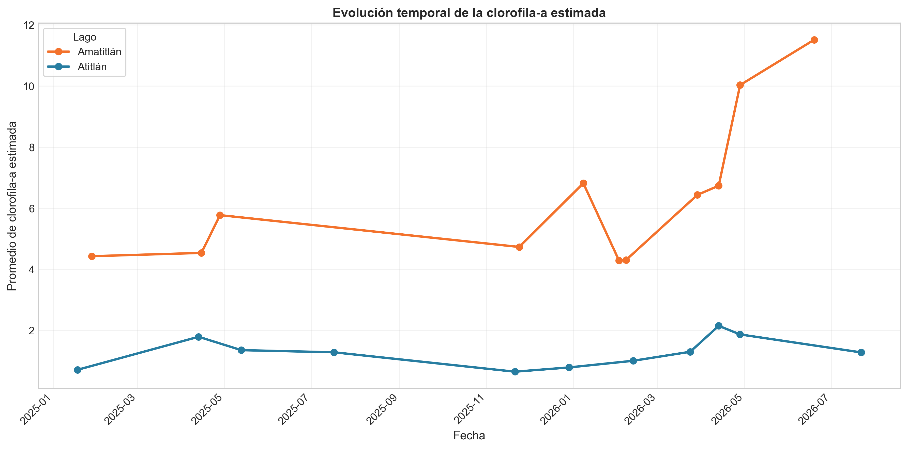

### Picos y fechas críticas

Se seleccionan los tres promedios más altos de cada lago. Este criterio identifica máximos dentro de las fechas observadas; no constituye por sí solo un umbral sanitario de floración.

| lago | fecha | promedio_cyano |
|---|---|---|
| amatitlan | 2026-06-19 | 11.5135 |
| amatitlan | 2026-04-28 | 10.0309 |
| amatitlan | 2026-01-08 | 6.8169 |
| atitlan | 2026-04-13 | 2.1501 |
| atitlan | 2026-04-28 | 1.8684 |
| atitlan | 2025-04-13 | 1.7919 |

El máximo absoluto de cada lago:

| lago | fecha | promedio_cyano |
|---|---|---|
| amatitlan | 2026-06-19 | 11.5135 |
| atitlan | 2026-04-13 | 2.1501 |

### Interpretación de resultados

**Atitlán.** Presenta valores promedio relativamente bajos y fluctuaciones moderadas. El máximo se observa el **13 de abril de 2026** (aproximadamente **2.1501**), seguido por el 28 de abril de 2026 (1.8684) y el 13 de abril de 2025 (1.7919). Que los tres valores más altos se concentren en abril sugiere un posible comportamiento recurrente, aunque 11 observaciones no permiten establecer una estacionalidad definitiva.

**Amatitlán.** Alcanza valores considerablemente mayores y muestra una variación temporal más pronunciada. El máximo ocurre el **19 de junio de 2026** (aproximadamente **11.5135**); también destacan el 28 de abril de 2026 (10.0309) y el 8 de enero de 2026 (6.8169). La serie indica un aumento importante de la señal durante parte de 2026, con fluctuaciones entre fechas.

**Comparación.** La diferencia de magnitud entre ambos lagos es consistente a lo largo de la serie: Amatitlán presenta una señal estimada de cianobacterias más intensa que Atitlán. Entre los factores plausibles se encuentran temperatura, nutrientes, precipitación, escorrentía y condiciones de mezcla o estancamiento. Como estas variables no fueron medidas en este análisis, la asociación es interpretativa y no causal.

### Consideraciones y limitaciones

- La estimación satelital es un **indicador indirecto** y debe validarse con mediciones de campo antes de tomar decisiones ambientales o sanitarias.
- La nubosidad reportada corresponde a la escena; aun con nubosidad baja puede haber nubes, sombras o cobertura parcial sobre el lago.
- La escena de Amatitlán del **7 de febrero de 2026** tiene cobertura válida parcial (~57.1 %), por lo que no es directamente equivalente a las escenas completas.
- Los máximos por píxel pueden ser sensibles a valores extremos; para comparar fechas, el análisis utiliza principalmente el promedio, acompañado de la mediana y el número de píxeles válidos.
- Las fechas son discretas e irregulares; los segmentos de línea facilitan la lectura, pero no implican observaciones continuas entre adquisiciones.

---

## 4. Análisis espacial de cianobacteria

Con la serie temporal ya establecida, el siguiente paso fue observar cómo se distribuye espacialmente esta señal dentro de cada lago. Se usan los 22 GeoTIFF generados en el análisis temporal. Cada mapa muestra la clorofila-a estimada únicamente para el componente continuo más grande de agua, eliminando píxeles aislados clasificados erróneamente como agua fuera del lago.

| lago | fecha_baja | fecha_pico | vmax (p99) | % área persistente | ubicación persistencia |
|---|---|---|---|---|---|
| atitlan | 2025-11-21 | 2026-04-13 | 4.04 | 98.7% | sector centro-centro |
| amatitlan | 2026-02-02 | 2026-06-19 | 26.84 | 20.9% | sector norte-centro |

### Atitlán

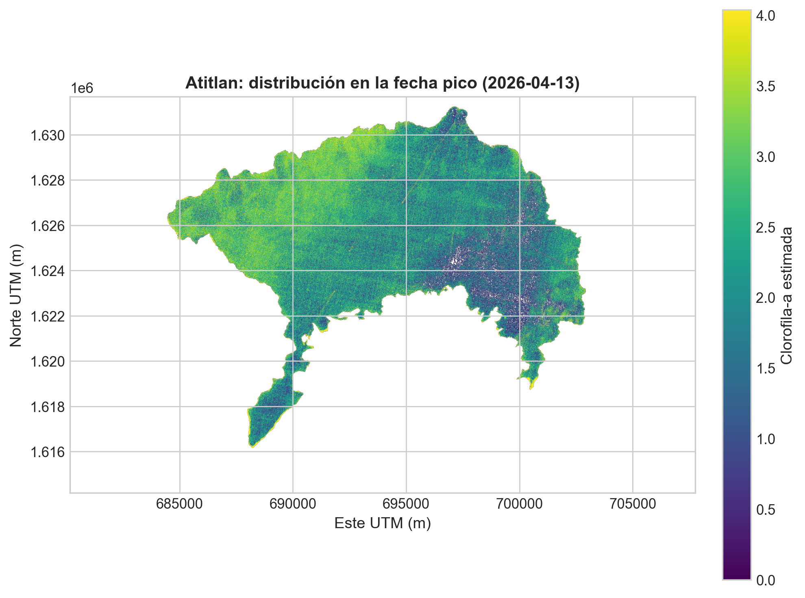

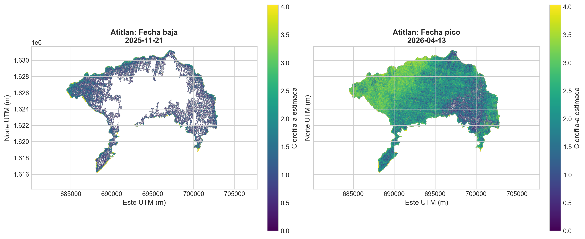

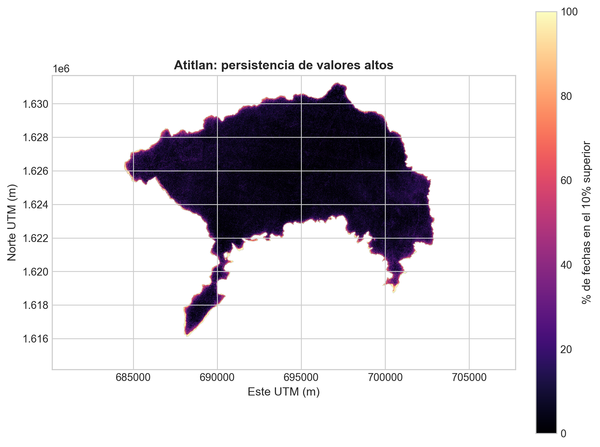

### Amatitlán

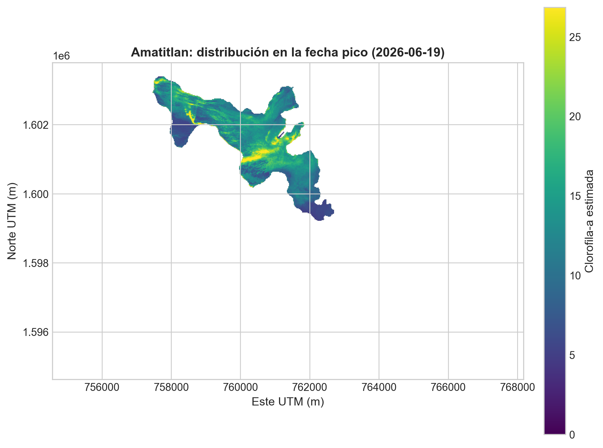

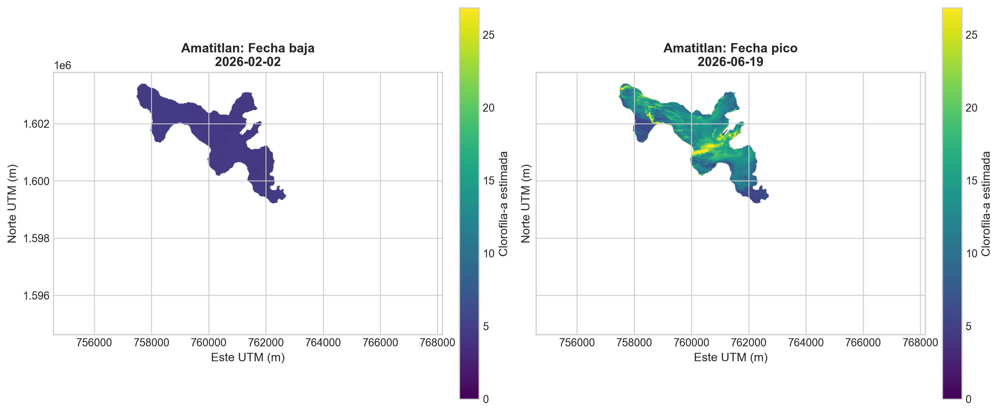

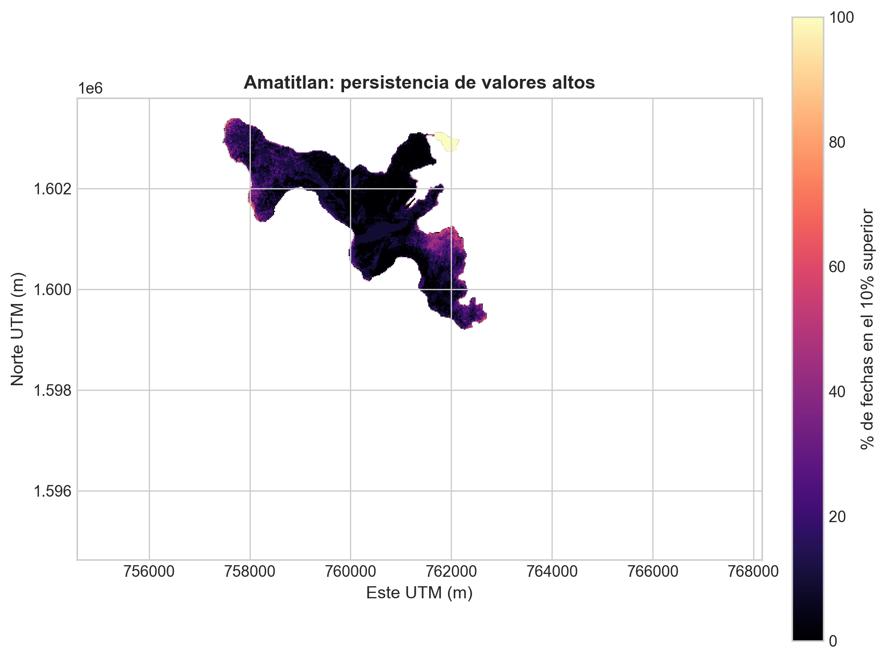

### Interpretación de los patrones espaciales

Los mapas comparativos usan la misma escala de colores dentro de cada lago, por lo que los cambios de color entre sus dos fechas representan cambios reales de la estimación, no un cambio de escala. Para Atitlán se compara la fecha baja del 21 de noviembre de 2025 con el pico del 13 de abril de 2026. En la fecha pico se aprecia una señal más extendida, con valores altos principalmente hacia el sector occidental y central del lago; la fecha baja presenta una señal débil y espacialmente más fragmentada.

En Amatitlán se compara el 2 de febrero de 2026 con el pico del 19 de junio de 2026. Durante el pico aumenta claramente la intensidad y la extensión de las zonas con valores altos, mientras que en la fecha baja predominan valores menores. La frecuencia de píxeles ubicados en el 10% superior de cada fecha permite distinguir focos relativos persistentes: el resumen espacial indica una concentración hacia el sector norte-central de Amatitlán y hacia el centro de Atitlán.

La persistencia se calcula como el porcentaje de fechas en que cada píxel estuvo dentro del 10% superior de ese lago; se reporta como persistente cuando supera el 50% de las fechas. Es un criterio relativo útil para comparar localizaciones dentro del mismo lago, no un umbral clínico o de riesgo sanitario. Las diferencias entre fechas pueden estar influenciadas por mezcla del agua, nutrientes, lluvia, nubosidad residual y las limitaciones del algoritmo satelital; por ello deben interpretarse como evidencia de patrones espaciales y no como prueba causal.

---

## 5. Correlación entre cianobacteria, NDVI y NDWI

Además de la señal de cianobacteria, se calculó la correlación píxel a píxel para cada fecha entre esta señal y los índices NDVI/NDWI, usando solamente celdas con cianobacteria e índice válidos. Se informa la mediana de Pearson entre las 11 fechas de cada lago para reducir la influencia de una escena atípica.

| lago | índice | pearson mediano | pearson promedio | mínimo | máximo | interpretación |
|---|---|---|---|---|---|---|
| amatitlan | NDVI | 0.602 | 0.549 | 0.102 | 0.938 | positiva fuerte |
| amatitlan | NDWI | -0.307 | -0.341 | -0.882 | -0.001 | negativa moderada |
| atitlan | NDVI | 0.149 | 0.122 | -0.108 | 0.303 | positiva débil |
| atitlan | NDWI | -0.320 | -0.291 | -0.517 | 0.093 | negativa moderada |

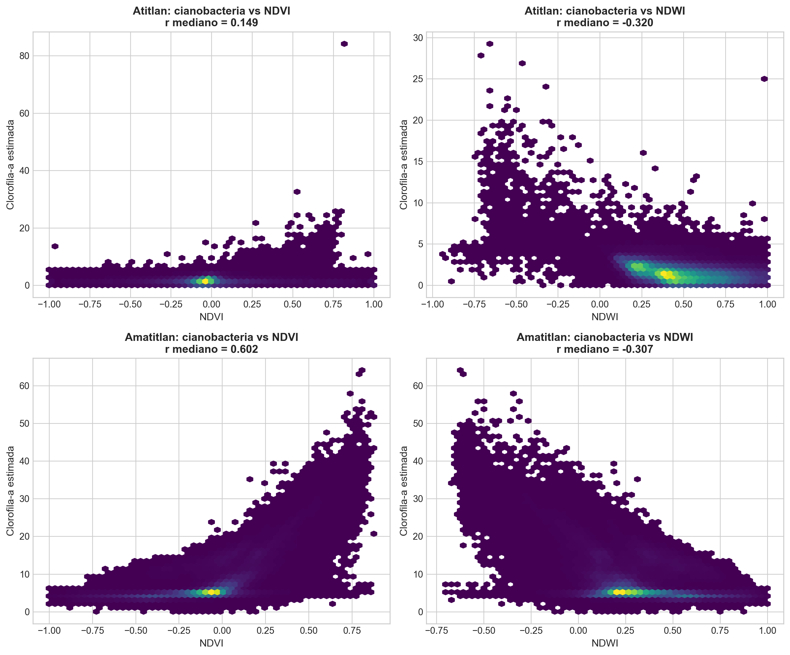

### Interpretación

La relación se resume con la mediana del coeficiente de Pearson de las 11 fechas. En Atitlán, la correlación con **NDVI** es positiva débil (`r = 0.149`): la variación de NDVI explica poco de la variación espacial de cianobacteria. En cambio, la correlación con **NDWI** es negativa moderada (`r = -0.320`), es decir, los píxeles con mayor señal de cianobacteria tienden a mostrar valores de NDWI menores.

En Amatitlán, la relación con **NDVI** es positiva fuerte (`r = 0.602`), por lo que las zonas con una señal mayor de cianobacteria tienden a coincidir espacialmente con mayor respuesta NIR respecto a rojo. Esto puede ser compatible con acumulaciones de material algal o vegetación flotante, pero no debe interpretarse como vegetación terrestre dentro del lago. La correlación con **NDWI** es negativa moderada (`r = -0.307`), patrón consistente con una modificación de la respuesta espectral del agua cuando aumenta la señal asociada a clorofila-a.

Estas correlaciones describen asociación espectral y no causalidad. Pueden intervenir turbidez, vegetación acuática, píxeles cercanos a orilla, condiciones atmosféricas y limitaciones del algoritmo; la fuerza y el signo también cambian entre fechas.

---

## 6. Análisis de los lagos y comparación entre ellos

En esta sección se compararon y analizaron los dos lagos a lo largo de las fechas que abarca el estudio: los niveles de cianobacteria y las floraciones de cada uno.

### 6.1 Proliferación de la cianobacteria en el período estudiado

Para ver cómo la cianobacteria ha proliferado en ambos lagos a lo largo del período estudiado, se armó una galería con todas las fechas oficiales de cada lago, agrupadas por año.

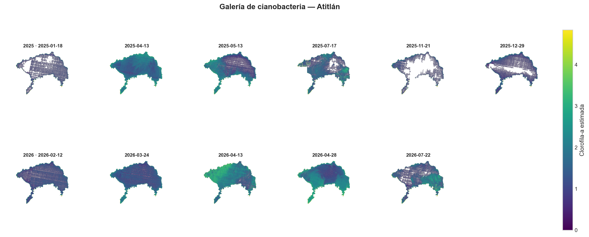

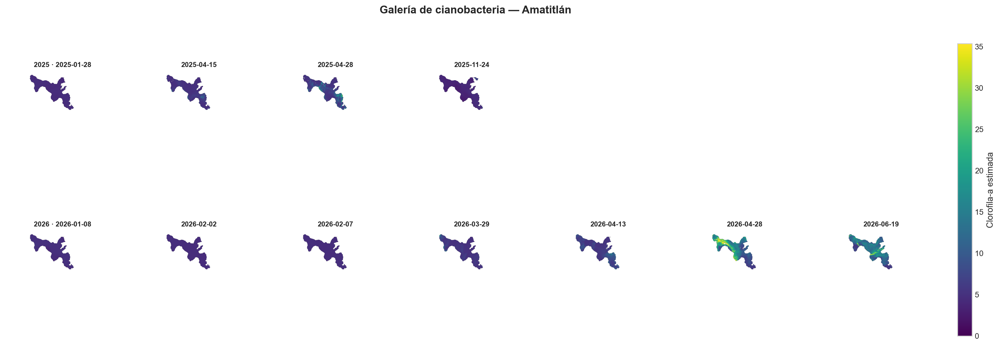

**Atitlán.** Gracias a la galería de fotos, podemos ver que los meses donde proliferan más cianobacterias es en: abril. Abril normalmente es un mes de cambio de estación, por lo que puede estar relacionado esto a la proliferación de más bacterias.

A finales y principios de año (noviembre, diciembre, enero) es donde menos proliferación de cianobacterias podemos encontrar. Esto puede deberse a las bajas temperaturas de la época, que hace que la reproducción de estas bacterias sea menos veloz.

**Amatitlán.** Podemos observar que en el historial no se reporta un gran número de cianobacterias en este lago. La clorofila es muy baja, por lo que podemos ver que las cianobacterias no se han desarrollado en este lago.

Sin embargo, durante los meses de abril y junio del presente año (2026) la proliferación de cianobacterias **ha crecido de forma descontrolada**, alcanzando picos que no se veían anteriormente.

### 6.2 Intensidad y frecuencia de las floraciones entre lagos

Para comparar la intensidad y frecuencia de las floraciones de los lagos a lo largo del tiempo, se armó una galería lado a lado. Como las fechas oficiales no coinciden entre lagos, se emparejaron por orden cronológico (1ra fecha de Atitlán con 1ra de Amatitlán, etc.), usando una escala de color compartida entre ambos lagos para que la intensidad visual refleje la diferencia real de magnitud entre lagos.

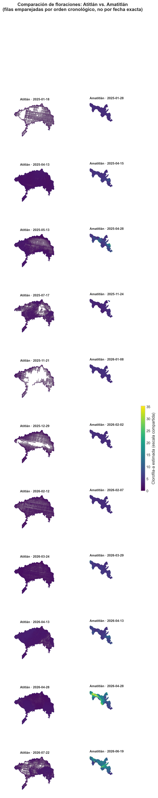

**Comparación de floraciones.** Comparando las floraciones entre ambos lagos podemos ver que las floraciones son muy desiguales. Amatitlán tiene muchas más floraciones que Atitlán. Esto es conocido debido al estado de contaminación que tiene el lago.
Amatitlán tiene muchas más floraciones en los años recientes, mientras que las floraciones de Atitlán tienden más a la estacionalidad. En los meses de marzo a abril es donde más floraciones dejan ver las gráficas.

### 6.3 Posibles causas de estas diferencias

- **Por geografía:** La diferencia de volumen en los lagos puede ser esencial para explicar por qué las bacterias no proliferan de la misma manera en ambos lagos. Amatitlán, al ser un lago pequeño y somero, hace que los nutrientes se diluyan mucho menos que en un lago de más magnitud como lo es Atitlán. Por lo que las bacterias tienen más alimento para alimentarse en Amatitlán, ya que estos se diluyen menos.

- **Uso de suelo:** El uso de suelo en ambos lagos es muy distinto. En Amatitlán, el uso de suelo corresponde más a cómo se usa en áreas metropolitanas. Ahí desembocan muchos ríos que alimentan de contaminantes el lago debido a la actividad industrial del área. Por otro lado, el uso de suelo de Atitlán corresponde a una zona mucho menos urbanizada, en donde hay poblados pequeños alrededor del área. La asimetría a nivel poblacional es tan importante como la densidad que discutimos anteriormente.

- **Causas específicas:** Ambos lagos reportan casi las mismas fuentes de contaminación:
    - Aguas residuales sin tratar (en Amatitlán se estima que entran ~2,000 litros/segundo de aguas negras).
    - Detergentes con fosfatos.
    - Fertilizantes agrícolas (nitrógeno y fósforo).
    - Mal manejo de desechos sólidos/basura orgánica.

- **Temperatura y clima:** Ambos lagos coinciden en señalar que las altas temperaturas son catalizadores para que las floraciones se reproduzcan de mayor manera. Esto coincide en que Amatitlán mostró su pico más alto en junio y Atitlán en abril.

> Por lo que un lago de **menor tamaño**, con una densidad poblacional **mucho más grande**, con un uso de suelo de **una metrópoli** y diferentes fuentes de contaminantes como **aguas residuales, químicos y mal manejo de desechos**, hace la diferencia entre cómo se proliferan o florecen los cultivos de bacterias entre estos lagos.

**Fuentes:**
- Contaminación acosa al lago de Amatitlán en Guatemala (https://udgtv.com/noticias/contaminacion-acosa-al-lago-de-amatitlan-en-guatemala/253488)
- Alertan por la alta toxicidad del agua del Lago de Amatitlán y los riesgos que conlleva (https://www.prensalibre.com/guatemala/justicia/alertan-por-la-alta-toxicidad-del-agua-del-lago-de-amatitlan-y-los-riesgos-que-conlleva/)
- ¿Por qué recomiendan no sumergirse en el Lago de Atitlán? Amsclae alerta por cianobacterias (https://www.prensalibre.com/guatemala/por-que-recomiendan-no-sumergirse-en-el-lago-de-atitlan-amsclae-alerta-por-cianobacterias/)
- Cianobacteria en el Lago de Atitlán – AMSCLAE (https://www.amsclae.gob.gt/2013/09/05/cianobacteria-en-el-lago-de-atitlan/)
- Florecimiento de cianobacterias en el lago Atitlán (boletín AMSCLAE) (https://www.amsclae.gob.gt/wp-content/uploads/2022/01/boletinIII.pdf)
- La contaminación del Lago Atitlán amenaza la subsistencia y la salud de los habitantes (https://globalpressjournal.com/americas/guatemala/contamination-of-guatemalas-lake-atitlan-threatens-livelihoods-health-of-residents/es/)
- Batimetría de las condiciones de profundidad del Lago de Amatitlán - AMSA (https://amsa.gob.gt/batimetria-de-las-condiciones-de-profundidad-del-lago-de-amatitlan-guatemala/)
- Cuenca de Amatitlán - AMSA (https://amsa.gob.gt/cuenca-lago-de-amatitlan/)
- Lago Amatitlán - Wikipedia (https://es.wikipedia.org/wiki/Lago_de_Amatitl%C3%A1n)
- Lago de Atitlán - Wikipedia (https://es.wikipedia.org/wiki/Lago_de_Atitl%C3%A1n)
- Amatitlán y Atitlán: Dos lagos que languidecen - Revista Crónica (https://cronica.com.gt/amatitlan-y-atitlan-dos-lagos-que-languidecen/)

### 6.4 Conclusiones de investigación de gráficos y de fuentes

Para sustentar estas causas con evidencia (no solo con descripciones generales), se compararon el área de agua detectada, la distribución completa de valores por lago y el contexto geográfico de ambos cuerpos de agua.

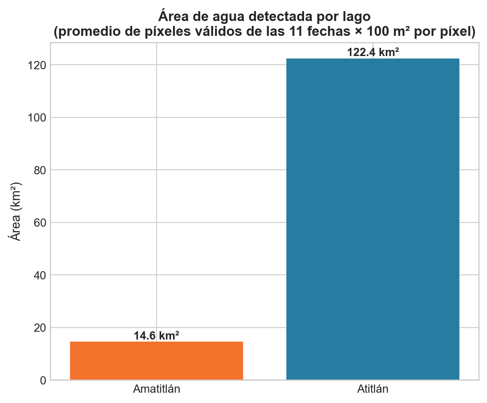

Como vimos en la investigación, las extensiones de los lagos son muy diferentes. El lago de Amatitlán tiene aproximadamente $100\ km^2$ de extensión, por lo que los nutrientes para las floraciones o las cianobacterias se diluyen mucho menos. Por lo que el alimento de estos seres se concentra más y pueden proliferar de una mayor manera.

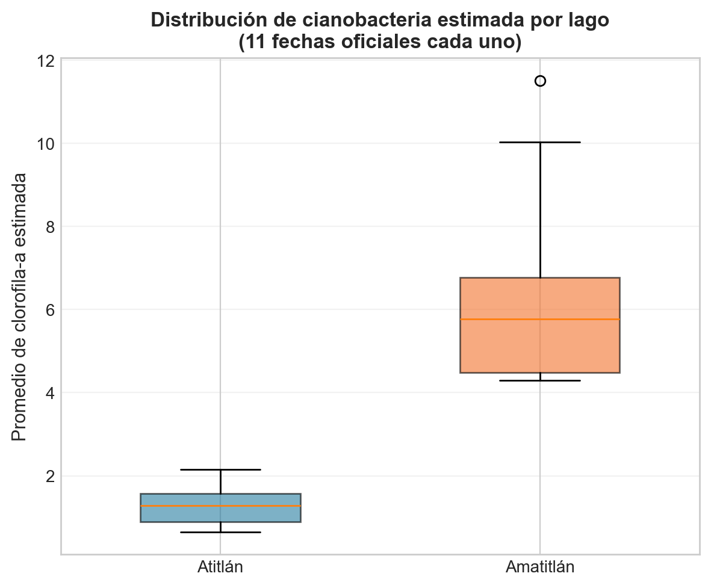

Gracias a diferentes factores como el clima o los usos de suelo que tiene cada lago, podemos ver que la concentración de cianobacterias y floraciones tienen una gran diferencia entre sí. Amatitlán tiene outliers más controlados, mientras que el punto mínimo de cianobacterias en Amatitlán no está tan lejos de la mayoría de los puntos, y su outlier mayor es muy superior a la media. Por lo que investigar qué pasó en ese punto puede ser vital para entender el problema de la contaminación del lago.

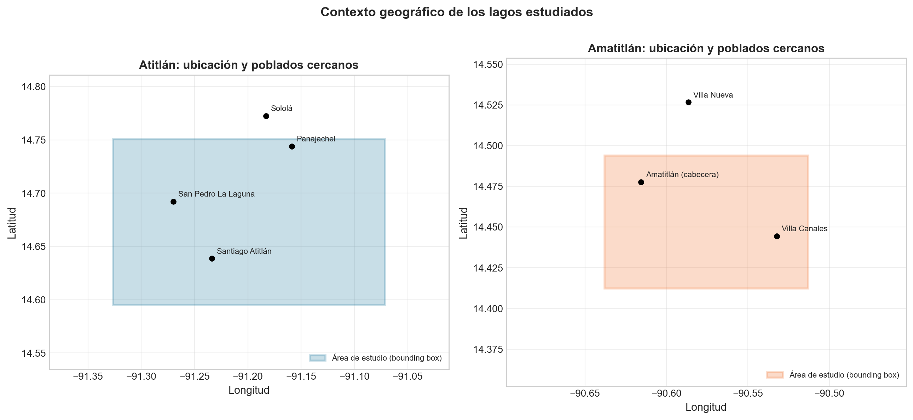

Como podemos ver, aunque el lago de Atitlán, al ser más grande, tiene más poblaciones anidadas, el uso de suelo que le dan estas no corresponde al de una gran metrópoli; su uso de suelo corresponde más al de una comunidad dedicada a diferentes actividades como agricultura, pesca, etc. Mientras que el de Amatitlán, aunque es menos grande y tiene menos poblaciones a sus alrededores, la concentración de personas en lugares como Villa Canales o Villa Nueva es mucho mayor a poblaciones como San Pedro La Laguna. Y su uso de suelo, al ser una metrópoli, tiene más actividad química y de desechos, lo que hace que la contaminación sea mucho mayor en uno que en otro.

---

## 7. Análisis exploratorio adicional

Dado los resultados y descubrimientos hechos anteriormente, se consideró necesario realizar un análisis exploratorio adicional para terminar de resolver incertidumbres que el equipo tenía sobre las cianobacterias, floraciones y cómo estas se comportan, además de verificar si la estacionalidad afecta a estas métricas, para llegar a conclusiones contundentes.

### 7.1 Extensión espacial de la floración

Evaluaremos la porción de espacio que ocupan las floraciones de cianobacterias en el lago durante diferentes fechas, para determinar la severidad de la aparición de estas floraciones y en dónde es que se concentran más.

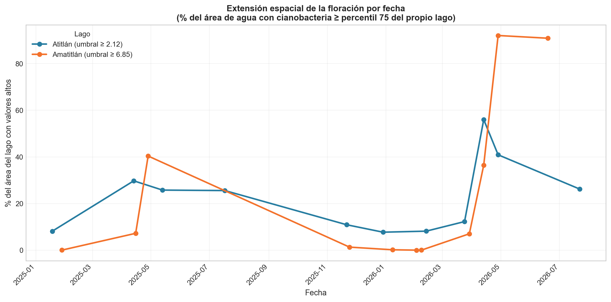

Podemos ver que los lagos tenían cubierta por cianobacterias no más de un 40% de su superficie total. Sin embargo, a partir del mes de abril del año 2026, estos porcentajes se dispararon alarmantemente. El lago de Amatitlán llega a tener casi el 90% de su superficie total cubierta por floraciones de cianobacterias. De igual manera, el lago de Atitlán presentó un pico histórico, alcanzando aproximadamente el 50% de su superficie total cubierta por estas bacterias. Lo cual resulta preocupante y alarmante el saber qué pasó ese mes que hizo que se proliferaran de gran manera estas floraciones.

### 7.2 Zonas persistentes de acumulación

Evaluaremos, gracias a los mapas del lago, dónde es que se concentran más estas bacterias y cómo es que se van esparciendo desde los puntos donde empiezan, para ver qué es lo que pasa con estos puntos críticos. A diferencia de la sección 4, aquí las fechas se ordenan de menor a mayor severidad (no cronológicamente), para ver si las zonas de acumulación ya son visibles desde las fechas más leves.

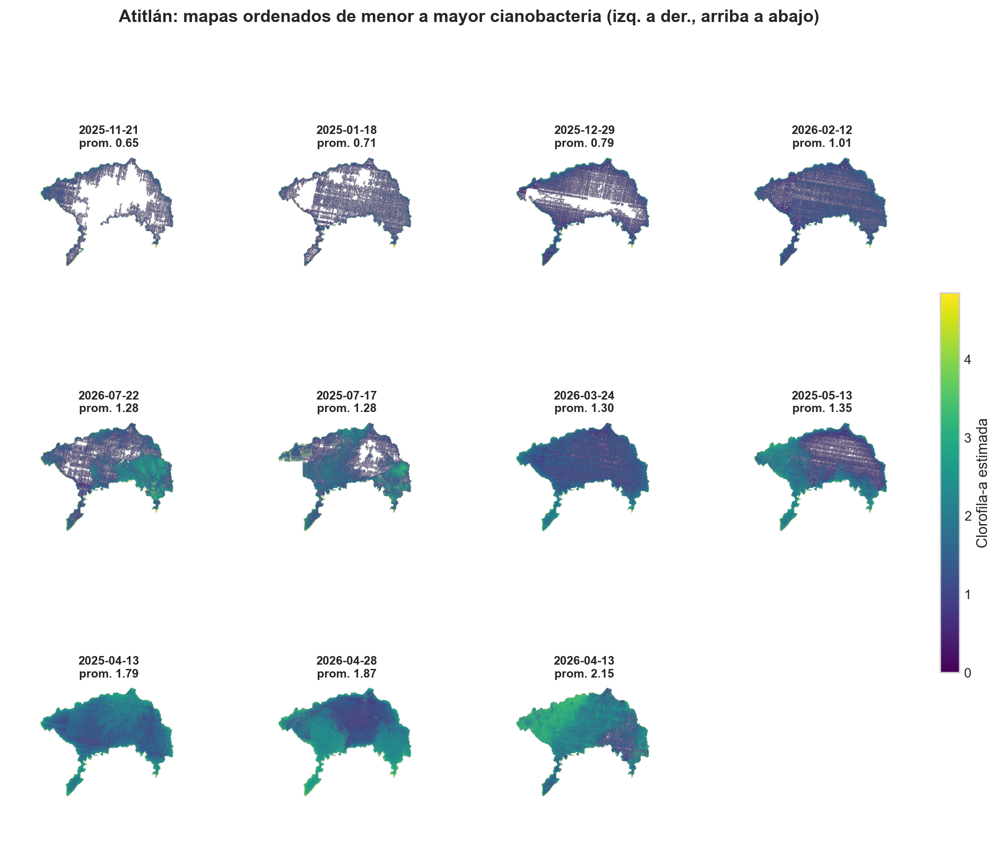

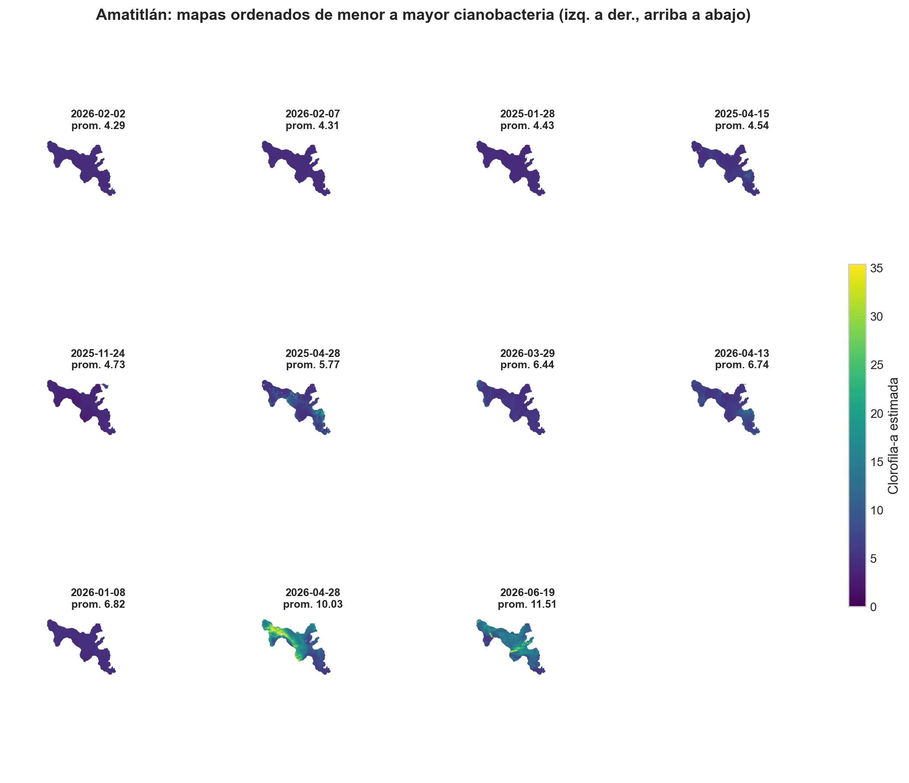

Aquí podemos sacar conclusiones muy interesantes viendo los mapas de cómo es que se generan las floraciones de cianobacterias.

**Atitlán:** Podemos ver cómo es que las floraciones empiezan a proliferar a las orillas del lago, y cómo, mientras más se contamina, más se va adentrando al lago hasta llegar a puntos muy altos de estas bacterias. Esto nos puede dar el indicio de varias cosas, pero en especial la siguiente: los ríos que desembocan en el lago son los principales causantes de esta contaminación.

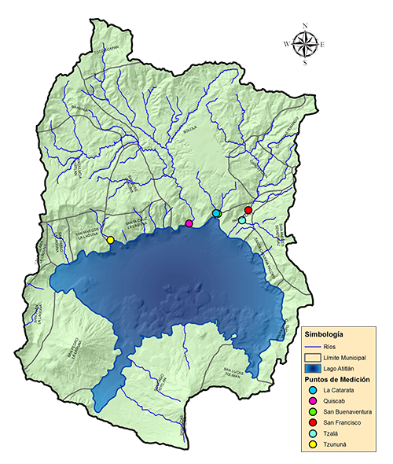

Podemos observar cómo donde desembocan los ríos es donde empiezan las floraciones de cianobacterias. Por lo que los ríos contaminados por diferentes desechos, como ganaderos, químicos, etc., de las poblaciones, son los principales causantes de que estas bacterias empiecen a reproducirse.

**Amatitlán:** En este caso, la diferencia en cómo empieza la proliferación de bacterias es alarmante, ya que en el punto donde nos encontramos el lago está casi totalmente cubierto por las bacterias. No se vislumbra dónde llega a empezar esta proliferación, debido a que ya es parte del lago. Lo cual enciende las alarmas en que el lago de por sí está demasiado contaminado.

### 7.3 Comparación de la distribución de valores entre fechas

Veremos cómo es que se comporta la distribución de los valores entre las fechas, mediante mapas de diferencia (fecha actual menos fecha anterior), para empezar a reconocer ciertos patrones que puedan existir en el comportamiento de los lagos. El rojo indica que la cianobacteria subió respecto a la fecha anterior, y el azul que bajó.

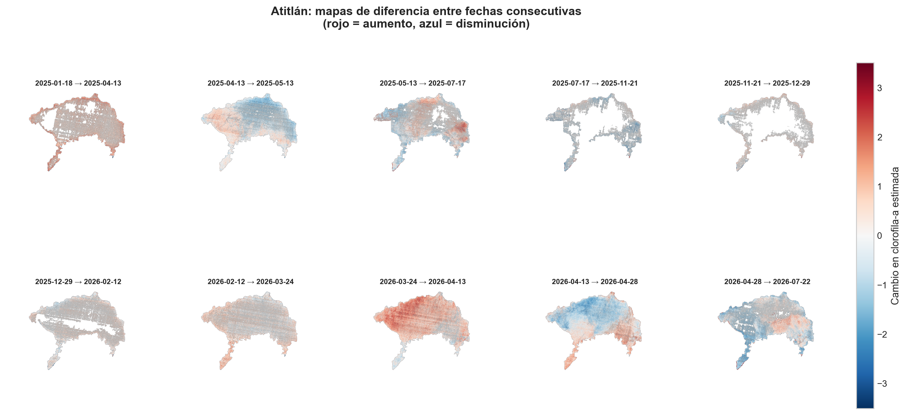

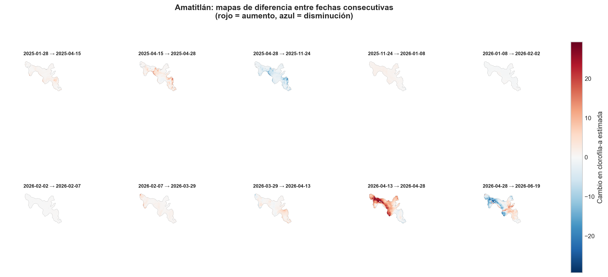

**Atitlán:** Para Atitlán, lo que podemos ver es que hay ciertas fechas en donde la población de cianobacterias sube demasiado. Por ejemplo, el cambio del veintiséis cero tres al veintiséis cero cuatro es el mayor aumento que se reporta en las fechas dadas para el estudio. Esto puede reportar cierta estacionalidad debido a que, como vimos anteriormente, gracias a todo este análisis que hemos hecho, abril es cuando en Atitlán se reportan las floraciones de cianobacterias, por lo que no resulta nada escandaloso poder ver esta gran floración. Sin embargo, entre las fechas del cero cuatro del veintiséis y el cero cuatro igualmente del veintiséis, esa misma fecha, podemos ver que hubo una reducción un poco considerable de estas cianobacterias. Entonces, podemos ver que en abril es una fecha en donde estas bacterias son mucho más prolíficas y tienen cambios mucho más rápidos.

**Amatitlán:** Por otro lado, en Amatitlán pasa algo también muy particular, dado que, de igual manera, en el mes de abril es donde más floraciones de cianobacterias hay. Vemos que el cambio del trece de abril al veintiocho de abril tuvo un gran aumento significativo en el porcentaje de cianobacterias, denotado por un color rojo en el mapa de este cambio de fechas. Es algo curioso ver que tanto para Amatitlán como Atitlán hay un cambio de una gran población de cianobacterias crecientes en el mes de abril, y esto nos puede dar la pauta para entender cómo es que funcionan las floraciones de cianobacterias y encontrar un cierto tipo de patrón o estacionalidad en estos datos.

### 7.4 Estacionalidad

Exploraremos para ver si es que existe estacionalidad en este conjunto de datos, para terminar de entender el comportamiento de estos en Guatemala.

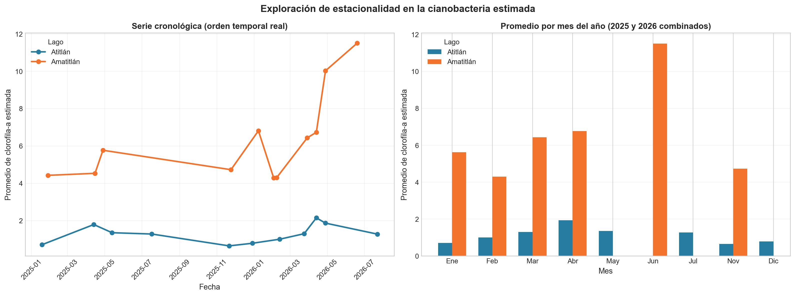

Gracias a estas gráficas, podemos ver algo muy interesante: que aunque para Atitlán el mes con mayor floración de cianobacterias sí sea el mes de abril, para el lado de Amatitlán no es así, ya que en junio es donde más floraciones de cianobacteria se producen. Sin embargo, el mes de abril sí es un mes determinante para Atitlán, con su máxima producción de floraciones, como para Amatitlán, que es el punto bisagra en donde la generación de floración de cianobacterias empieza a despegarse.

Investigando sobre el mes de abril, podemos ver que en Guatemala es el final de la época seca, y suele ser el mes más caliente del año. La razón es que el sol pasa por el cenit, y todavía no hay nubosidad ni lluvia que enfría el ambiente. Así que la radiación del sol queda directa, por lo que este es el mes más caliente antes de que llegue la época de lluvias, que es mayo. Por lo que puede ser que para el lago de Atitlán, este calor haga que llegue el punto máximo de cianobacterias, y para el mes de abril en Amatitlán puede ser que, gracias a esto, haya más producción de alimento para las cianobacterias, y gracias a las lluvias, las corrientes del río traigan mucha contaminación, y ahí es donde las cianobacterias realmente despuntan.

### 7.5 Interpretación de todos los resultados

Este análisis exploratorio adicional ha sido de gran ayuda para entender, más que todo, cómo es que llega la contaminación que produce las cianobacterias a los lagos, cómo es que se distribuye la extensión dentro del lago de las cianobacterias, y cómo es que podemos entender o ver cierta estacionalidad en cómo se distribuyen las cianobacterias entre fechas.

Esto es algo muy importante, ya que se llegó a las siguientes conclusiones: el lago de Atitlán es un lago en donde las floraciones empiezan a aparecer en las orillas del lago. Esto quiere decir en donde desembocan los ríos, que son los que traen la mayor parte de la contaminación al lago. El lago de Amatitlán, por otro lado, tiene una floración de bacterias ya establecida, lo cual sugiere que es un lago en donde la contaminación ya es un hecho que está muy arraigado a este lago.

También, otro descubrimiento realizado es que el mes de abril es un mes en donde despunta la floración de cianobacterias, tanto para el lago de Amatitlán como para Atitlán. Esto puede ser por las grandes temperaturas que se experimentan durante esas épocas, y que son el presagio de las lluvias, en donde las lluvias son las que atraen la mayor cantidad de contaminación por parte de los ríos, por lo que para el lago de Amatitlán, que es un lago donde está establecida una metrópoli, llega a ser bastante negativo para el lago la combinación de un ambiente muy caluroso como lo es abril, como las lluvias que vienen después, que atraen todos los contaminantes.

Es por esto que este análisis exploratorio adicional llega a ser bastante beneficioso para entender cómo es que los lagos llegan a tener estos niveles de contaminación de cianobacterias, amarrando estas conclusiones con las investigaciones hechas por el equipo, y que pueden servir como base para tomar acción para recuperar nuestros lagos.

---

## Conclusiones generales

A lo largo de este laboratorio se construyó, para dos lagos con historias muy distintas, una serie temporal, un mapa espacial, una correlación con índices espectrales y un análisis exploratorio adicional de la señal de cianobacteria estimada a partir de Sentinel-2. La evidencia converge en un mismo relato: **Amatitlán** es un lago pequeño, rodeado de una metrópoli de millones de habitantes, y su señal de cianobacteria es sistemáticamente más alta, más variable y ya cubre casi la totalidad de su superficie en los momentos más críticos, sin un punto de origen claro dentro del lago. **Atitlán**, por su enorme volumen y su cuenca menos urbanizada, mantiene una señal más baja y más contenida, con floraciones que nacen visiblemente en las desembocaduras de los ríos y avanzan hacia el centro del lago.

Ambos lagos comparten, sin embargo, un mismo patrón estacional: abril —el mes más caluroso y el final de la época seca en Guatemala— es un punto de inflexión, ya sea como pico absoluto (Atitlán) o como el momento en que la floración empieza a despegar hacia su pico posterior en junio (Amatitlán). Esto sugiere que la temperatura y el inicio de las lluvias, sobre un fondo de aguas residuales, fertilizantes y mal manejo de desechos, son el mecanismo compartido detrás de ambas crisis — solo que la geografía y la presión urbana de cada lago determinan qué tan severas y persistentes llegan a ser.
